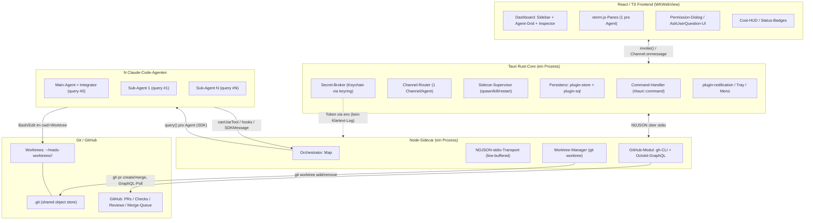
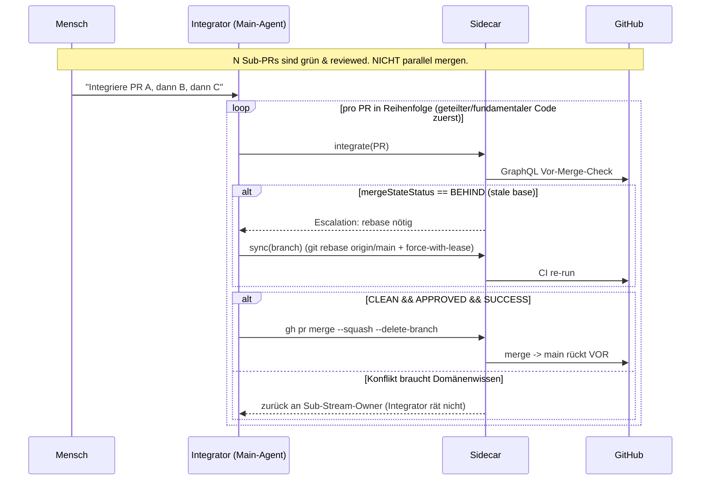
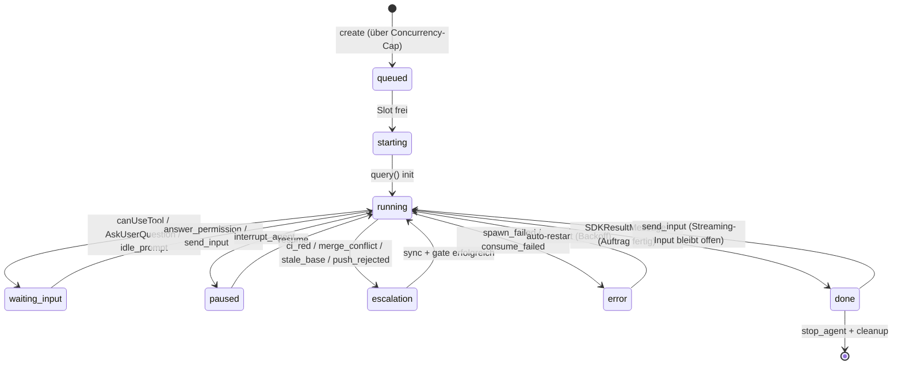

# 01 — Gesamtarchitektur (mads)

> Status: Design, implementierungsreif. Stand: 2026-06-19.
> Sprache: Deutsch (Code/Identifier englisch). Versionsbezüge sind gegen die
> installierten Pakete zu verifizieren (siehe [[tauri2-stack]] und
> [[sidecar-orchestration]], jeweils Caveats-Sektion).

## 0. Zusammenfassung & Einordnung

**mads** (*multi-agent development studio*) ist eine native macOS-Desktop-App, in
der **ein Mensch parallel mit vielen Claude-Code-Agenten** arbeitet. Genau **ein**
Main-Agent fungiert als **Integrator**, daneben laufen **Sub-Agents 1..N**, jeder auf
**eigener Git-Branch in eigenem Worktree**, mit voller GitHub-Nutzung (PR-Lifecycle,
Checks, Reviews, Merge-Queue). Der Nutzer definiert selbst Anzahl und Art der
parallelen Streams.

Technisch besteht mads aus vier Schichten: **React/TS-Frontend** ↔ **Tauri-Rust-Core**
(IPC, Fenster, Persistenz, Notifications, Secret-Vermittlung) ↔ **Node-Sidecar**
(Orchestrator + offizielles Claude Agent SDK) ↔ **N Claude-Code-Agenten** ↔
**Git/Worktrees + GitHub**.

Diese Architektur **operationalisiert die paix-Invarianten** (siehe
[[_paix-multi-agent-reference]]), insbesondere:

1. **Only `main` merges** — kein Sub-Stream landet je selbst auf `main`.
2. **`main` is always runnable** — jeder Merge passiert deterministisches, grünes CI.
3. **Subs never self-merge** — außen-sichtbare Aktionen brauchen explizite Anweisung.

mads widerspricht diesen Invarianten nicht, sondern macht sie **mechanisch
ausführbar und im UI sichtbar**.

**Einordnung in die übrige Doku (Querverweise):**

| Dokument | Inhalt | Beziehung zu diesem Dok |
|---|---|---|
| [[01-architecture]] (**dieses**) | Schichten, Prozessmodell, Datenmodell, Sicherheit, Tech-Stack, Roadmap | Das Dach: definiert Komponenten + Invarianten, auf die alle anderen aufbauen |
| [[02-dashboard]] | Dashboard-UI (Sidebar/Grid/Inspector, Live-Terminal, Inbox, Integrator-Panel) | Die UI-Schicht über dem Event-Bus aus §1/§2 hier |
| [[03-main-agent]] | Integrator-Rolle, `IntegratorEngine`, Merge-Prozedur, Gates, Cron-Jobs | Detailliert die Integrator-Mechanik aus §4 hier |
| [[04-sub-agents]] | Sub-Agent-Lebenszyklus, Worktree-Stream, Rückfrage-Protokoll, Crash-Recovery | Detailliert die Sub-Stream-Schicht aus §3 hier |
| [[05-update-area]] | Update-Monitor, Relevanz-Agent, Issue-Erstellung, Self-Update, Versions-Pinning | Detailliert den Update-Job aus §10 hier |
| [[06-ownership-and-coordination]] | Region-Ownership (`OwnershipRule`, `CoordinationArtifact`), Trespass-Erkennung (`detectTrespass`), `EscalationKind: "ownership_trespass"` | Verfeinert die datei-grobe Ownership-Map aus §5.1/§8 hier auf Sub-Datei-Ebene |
| [[sidecar-orchestration]] | Node-Sidecar, `AgentSession`-Pool, NDJSON-Protokoll-Details, State-Maschine, Backpressure | Recherche-Input zur Sidecar-Schicht aus §2/§6 hier |
| [[github-multiagent]] | gh/Octokit, Eskalations-Signale, Branch-Protection, Merge-Queue, Auth | Recherche-Input zur GitHub-/Integrator-Mechanik aus §3/§7 hier |
| [[claude-code-capabilities]] | Agent SDK, `canUseTool`, Hooks, Permission-Modes, Modelle, Auth | Recherche-Input zur Agenten-Schicht + Permission-Gating aus §2/§7 hier |
| [[tauri2-stack]] | Channels vs. Events, Multi-Window, Plugins, Signing/Notarization | Recherche-Input zur Tauri-Core-Schicht aus §2/§5/§8 hier |
| [[macos-design]] | HIG, Sidebar+Content+Inspector, Vibrancy, Update-Monitoring | Recherche-Input zur Frontend-/UX-Schicht aus §1/§2 hier |

---

## 1. Zielbild & Anforderungen

### 1.1 Funktionale Anforderungen (aus dem Nutzer-Brief)

| # | Anforderung | Architektur-Konsequenz |
|---|---|---|
| **A1** | **Parallele Entwicklungs-Streams**, Anzahl/Art vom Nutzer bestimmt | Pool aus N `AgentSession`s im Sidecar; ein Worktree + Branch pro Sub-Stream (§2, §6) |
| **A2** | **Integrator-Modell**: ein Main-Agent merged, Sub-Agents schlagen vor | Architektur-Invariante (§4); Merge-Capability **nur** für Main-Agent |
| **A3** | **Volle GitHub-Nutzung** (PRs, Checks, Reviews, Merge-Queue, Auth) | gh-CLI (Mutationen) + Octokit-GraphQL (Polling) im Sidecar (§7, [[github-multiagent]]) |
| **A4** | **Sauberer & sicherer Code** | Quality-Gate-Pipeline + `security-review`-Subagent + frozen-lockfile-CI (§9) |
| **A5** | **Live-Status** pro Agent (Output, „braucht Input", Schritt, Kosten) | `tauri::ipc::Channel` pro Agent + Status-Maschine (§2, §6) |
| **A6** | **Mac-Feel** (native HIG, Notifications, Menüleiste, Tray) | Tauri-Plugins + Vibrancy + Sidebar-Layout ([[macos-design]]) |
| **A7** | **Up-to-date mit Claude Code** | SDK-Version + gebündeltes Claude-Code-Binary pinnen; Update-Job (§10) |

### 1.2 Nicht-funktionale Anforderungen

- **Isolation:** Kein Sub-Stream kontaminiert einen anderen (paix §1/§4: keine zwei
  Agenten im selben Working-Tree). → ein Worktree pro Agent, hart erzwungen.
- **Determinismus:** „grün auf Branch == grün auf main" (paix §9). → committetes
  Lockfile (JS **und** Rust) + frozen Installs in CI.
- **Robustheit:** Crash-Recovery, Reconnect nach App-Neustart (Session-Resume).
- **Sicherheit:** Tauri-Capabilities, restriktive CSP, Secrets nur im Keychain,
  Permission-Gating jeder riskanten Agenten-Aktion.
- **Performance:** N parallele Output-Streams ohne UI-Stall (Channels + Backpressure).
- **Auditierbarkeit:** Koordination über committete Artefakte (paix §8), lokale
  Event-Historie in SQLite.

### 1.3 Explizite Nicht-Ziele (MVP)

- Kein eigener Cloud-Backend / Hosted-Relay (Desktop-only, Polling statt Webhooks).
- Kein Multi-Host-`sessionStore` (S3/Redis) — lokale JSONL + `agents.json` reichen.
- Keine Windows/Linux-Builds im MVP (macOS-only; Code aber portabel halten).
- Keine automatische Merge-Entscheidung ohne Mensch — der Integrator **verfügt**.

---

## 2. Schichten-Architektur

### 2.1 Komponenten-Diagramm



### 2.2 Schichten-Verantwortung & Grenzen

| Schicht | Owner von | Darf NICHT | Detaildoku |
|---|---|---|---|
| **Frontend (React/TS)** | UI-Rendering, User-Intent, xterm-Anzeige, Dialoge | Keine Prozesse spawnen, keine Secrets sehen, keine direkte git/gh-Ausführung | [[macos-design]], [[tauri2-stack]] §3/§4 |
| **Rust-Core** | Prozess-Lifecycle (Sidecar-Supervisor), IPC-Routing, Persistenz, Secret-Broker, Notifications, Fenster | Keine LLM-/git-Logik (delegiert an Sidecar) | [[tauri2-stack]] §2/§5/§6 |
| **Node-Sidecar** | Agenten-Pool, Claude Agent SDK, Worktree-/GitHub-Operationen, Eskalations-Erkennung | Keine UI; **kein** `console.log` auf stdout (zerstört NDJSON) | [[sidecar-orchestration]], [[github-multiagent]] |
| **Claude-Agenten** | Code-Änderungen im eigenen Worktree, Tool-Aufrufe | **Nie selbst nach `main` mergen** (außer Main-Agent, nach Mensch-Anweisung) | [[claude-code-capabilities]] |

**Warum diese Trennung (Begründung der Schicht-Grenzen):**

- **Sidecar aus Rust spawnen, nicht aus dem Frontend** ([[tauri2-stack]] §2.5/§2.6): Der
  Rust-Core bleibt alleiniger Owner aller Child-Prozesse → sauberes Lifecycle-Management,
  keine `shell`-Permission im Webview, ein Channel pro Agent direkt aus dem Command-Handler.
- **Ein Sidecar, nicht N Sidecars:** Alle Agenten werden in-process im einen Node-Orchestrator
  koordiniert; der IPC-Pfad zum Core bleibt **ein** stdio-Kanal (NDJSON). Jeder Agent ist
  trotzdem ein eigener `claude`-Subprozess (vom SDK gespawnt) → echte Isolation.
- **Secrets nur im Core:** Das Frontend (Webview, potenziell durch XSS angreifbar) bekommt
  **nie** Tokens; der Core vermittelt sie als `env` an den Sidecar (§5.3).

### 2.3 IPC-Pfade (Überblick — Details in [[tauri2-stack]] §3)

| Richtung | Mechanismus | Use-Case | Begründung |
|---|---|---|---|
| FE → Core | `invoke('cmd', …)` | User-Intent (Agent starten, Permission beantworten, PR mergen) | Request/Response, typisiert |
| Core → FE (hochfrequent) | **`tauri::ipc::Channel<AgentOutput>`** (1 pro Agent) | stream-json Terminal-Output, Token-Deltas | geordnet, high-throughput, intern für Child-Output gebaut |
| Core → FE (selten) | `emit` / `emit_to(label, …)` | Status-Banner, „Agent fertig", Branch-Update, Push-Notification | Multi-Consumer, kleine Payloads |
| Core ↔ Sidecar | **NDJSON über stdio** (1 JSON/Zeile, `\n`) | Alle Orchestrierungs-Nachrichten (`HostMessage`/`SidecarMessage`) | sprachneutral, line-buffered, robust |

> **ENTSCHIEDEN (Event-Topologie, OE-5):** Der hochfrequente Terminal/Token-Stream läuft
> über `tauri::ipc::Channel<AgentOutput>` (genau **1 pro Agent**) ins Hauptfenster; seltene/
> kleine Status-Updates gehen als im Core **koalesziertes Delta-Event** (~30–60 ms Fenster);
> „braucht Input" und „Eskalation" laufen über einen **separaten High-Priority-Kanal/Event**
> (nicht koalesziert). Siehe §6 und [[02-dashboard]] §8.
>
> **OFFENE FRAGE (IPC-Routing bei Detach, Post-MVP):** Erst bei der späteren optionalen
> „Detach in eigenes Fenster"-Aktion (§3.4) muss definiert werden, ob der Output-Stream im
> Agenten-Fenster oder im Main-Fenster landet bzw. wann zusätzlich `emit_to(label,…)` nötig
> ist. Für den MVP (ein Hauptfenster) entfällt das. Siehe [[tauri2-stack]] §3.4-Caveat.

---

## 3. Prozess- & Concurrency-Modell

### 3.1 Prozess-Topologie

```
macOS-Prozessbaum
└─ mads.app  (Tauri Rust-Core, ein Prozess; WKWebView(s) als Child-Webviews)
   └─ node-sidecar              (ein langlaufender Node-Prozess, via externalBin)
      ├─ claude (Agent #0 = Integrator)   cwd = eigener Integrator-Worktree (NICHT der Haupt-Checkout der Subs)
      ├─ claude (Agent #1)                cwd = ~/mads-worktrees/<repo-slug>/<id-1>
      ├─ claude (Agent #2)                cwd = ~/mads-worktrees/<repo-slug>/<id-2>
      └─ claude (Agent #N)                cwd = ~/mads-worktrees/<repo-slug>/<id-N>
```

- **Ein Sidecar** verwaltet `pool: Map<agentId, AgentSession>` (siehe
  [[sidecar-orchestration]] §1.2). Jeder Agent = **eine** `query()`-Session im
  Streaming-Input-Modus = **ein** `claude`-Subprozess.
- **Bewusst keine SDK-internen Subagents** für die parallelen Streams: mads modelliert
  „Sub-Agent 1..N" als **eigene Top-Level-`query()`-Sessions** (eigene Branch, eigener
  Worktree, echte Parallelität). Das umgeht zugleich das Limit, dass `AskUserQuestion`
  in via `Agent`-Tool gespawnten Subagents **nicht** verfügbar ist
  ([[sidecar-orchestration]] §9.2). SDK-Subagents bleiben für *innerhalb* einer Session
  koordinierte Hilfs-Tasks (z. B. der `security-reviewer`, §9.2).

### 3.2 Worktree-Modell (ein Worktree pro Sub-Stream — paix §4)

```
~/mads-worktrees/                 # Container AUSSERHALB des Repos (git sieht ihn nicht)
  <agentId-1>/   → branch feat/<task-1>   (off origin/main)
  <agentId-2>/   → branch feat/<task-2>
  ...
<repo>/.git/                       # geteilter Object-Store + Refs für alle Worktrees
```

**Geteilt vs. privat** (paix §4): geteilt sind Object-DB, Refs, `.git/config`, Hooks;
privat pro Worktree sind `HEAD`, Index, Working-Tree-Dateien. **Runtime-State ist NICHT
isoliert** — mads vergibt deshalb pro Worktree eigene Ports/Build-Dirs und folgt der
`.venv`/`node_modules`-Disziplin (pnpm-Store-Symlinks nur, solange das Lockfile geteilt
bleibt; sobald ein Worktree das Lockfile ändert → privates Install). Details:
[[github-multiagent]] §6, [[sidecar-orchestration]] §6.

> **ENTSCHIEDEN (Worktree-Ablageort, OE-1):** Verbindlich ist
> `~/mads-worktrees/<repo-slug>/<agentId>` — **außerhalb** des Repos (paix-konform, außerhalb
> der Working-Tree-Suche, nicht in den protected `.claude`-Pfaden). mads fährt selbst
> `git worktree add` statt `--worktree` der CLI. `<repo>/.mads/` enthält **nur** reine
> Laufzeit-Metadaten (z. B. `agents.json`), **keine** Worktrees; ein `.gitignore`-Eintrag
> für `.mads/` reicht, der Worktree-Container liegt ohnehin außerhalb des Repos.
>
> **Integrator-Worktree-Kollision vermeiden:** Auch der Integrator braucht einen **eigenen**
> Checkout/Worktree auf `main` (`~/mads-worktrees/<repo-slug>/integrator` o. ä.). Arbeitet der
> Integrator auf dem Haupt-Checkout, dürfen Sub-Agents diesen **nicht** als Worktree-Basis
> nutzen — jeder Stream bleibt in seinem eigenen Worktree (paix §4: keine zwei Agenten im
> selben Working-Tree).

### 3.3 Concurrency & Backpressure

- **Concurrency-Limit:** Jeder Agent = eigener `claude`-Subprozess (RAM/CPU). Default-Cap
  z. B. **4–8 aktive** Agenten + Warteschlange; UI zeigt „queued". Wert empirisch
  kalibrieren ([[sidecar-orchestration]] §5).
- **Backpressure:** stdout-Backpressure respektieren (`write()` → `false` ⇒ auf `"drain"`
  warten); pro-Agent serielle Sende-Queue; Token-Deltas in ~30–60 ms-Fenstern koaleszieren;
  Partials nur für den fokussierten Agenten. Details: [[sidecar-orchestration]] §5.
- **Rust-Seite line-buffered lesen** (`BufReader::lines()`), Events asynchron an die UI
  emitten, damit der Pipe nicht blockiert.

### 3.4 Multi-Window-Mapping

Zwei tragfähige Optionen ([[tauri2-stack]] §4):

| Option | Beschreibung | Vor-/Nachteile |
|---|---|---|
| **A: Single-Window, N xterm-Panes** | Ein Hauptfenster (Sidebar+Grid+Inspector), pro Agent ein xterm.js-Pane/Tab, gespeist über N Channels | Sparsam (eine WKWebView); HIG-typisch (Dashboard); einfacheres Channel-Routing |
| **B: 1 Fenster pro Sub-Agent** | `WebviewWindowBuilder` mit Label `agent-<id>`, gezielt via `emit_to(label,…)` | Jedes Fenster = eigene WKWebView (RAM/GPU teuer bei vielen Agenten) |

> **ENTSCHIEDEN (Window-Modell, OE-3):** Verbindlich für den MVP ist **Option A** = **ein
> Hauptfenster** mit N xterm-Panes/Tabs, gespeist über N Channels; günstiger und HIG-konform
> ([[macos-design]] A.0). **„Detach in eigenes Fenster" (Option B)** ist eine spätere
> **optionale** Aktion (Post-MVP), z. B. um Agenten auf mehrere Monitore zu verteilen — kein
> MVP-Standard. Channel-Routing geht im MVP ins Hauptfenster. Erst Option B determiniert
> zusätzlich Capability-Labels (Wildcard `agent-*`) und ein erweitertes State-Layout.

---

## 4. Das Integrator-Modell als Architektur-Invariante

mads hebt das paix-Rollenmodell (paix §2) von einer *Disziplin* auf eine *erzwungene
Architektur-Eigenschaft*.

### 4.1 Rollen (1:1 aus paix §2)

| Rolle | mads-Entity | Verantwortung | Hart erzwungen durch |
|---|---|---|---|
| **`main`** | `Project.defaultBranch` | Kanonische, immer lauffähige Linie; einziges Merge-Ziel; protected | GitHub-Ruleset (PR-only, required checks+review) — [[github-multiagent]] §2 |
| **Integrator** | `Agent` mit `role: "integrator"` (genau einer) | Einziger, der `gh pr merge` ausführt; bestimmt Integrations-Reihenfolge; löst mechanische Konflikte | Sidecar erlaubt `merge`-Op **nur** für `role==="integrator"` + explizite Mensch-Anweisung (§4.2) |
| **Sub-Stream** | `Agent` mit `role: "sub"` (1..N) | Eine Aufgabe je Worktree; committet/pusht eigene Branch; öffnet PR | Sub-Agenten haben **keine** Merge-Op im erlaubten Tool-/Op-Set |

### 4.2 Erzwingung der drei Invarianten (mechanisch, nicht nur narrativ)

```
INVARIANTE 1 — "Only main merges"
  └─ GitHub-Ruleset: Direkt-Push auf main blockiert (non_fast_forward + deletion),
     pull_request-Regel mit required_approving_review_count ≥ 1.
  └─ Sidecar-Guard: `integrate(task)`-Op prüft `agent.role === "integrator"`; sonst
     SidecarErrorMsg{ code: "merge_forbidden_role" }.

INVARIANTE 2 — "main is always runnable"
  └─ Vor-Merge-Check (GraphQL): mergeStateStatus ∈ {CLEAN, HAS_HOOKS}
     && reviewDecision == APPROVED && statusCheckRollup.state == SUCCESS.
     Sonst -> kein Merge, zurück an Sub-Agent (sync + gate).
  └─ Frozen-lockfile-CI (§9) => green-on-branch == green-on-main.

INVARIANTE 3 — "Subs never self-merge"
  └─ Jede außen-sichtbare Mutation (push --force-with-lease, pr create, pr merge)
     ist eine `PermissionRequest`/`Escalation` ODER eine explizite Mensch-Anweisung.
     Agenten triggern Merges NIE autonom.
```

### 4.3 Integrations-Sequenz (Serialisierung — paix §7)



- **Rebase-before-merge:** Integrator rebaset jede Branch auf das **neue** `main`, lässt CI
  re-run, dann merged er (paix §7).
- **Konfliktauflösung:** nur **mechanische/textuelle** Konflikte löst der Integrator.
  Semantische Konflikte → zurück an den Owner. Der Integrator *rät nicht*.
- **Squash** als Default (`gh pr merge --squash --delete-branch`): lineare `main`, jeder
  Commit unabhängig lauffähig (gut für `git bisect`).
- **Optional Merge-Queue** ab ≥2 racing PRs/h — automatisiert die Serialisierung
  ([[github-multiagent]] §2.2). Da mads viele Sub-Agenten parallel fahren kann, kann der
  racing-PR-Druck schnell steigen.

---

## 5. Datenmodell

### 5.1 Zentrale Entities (TypeScript-Interfaces, Frontend + Sidecar)

```typescript
// ===== Project =====
interface Project {
  id: string;                          // ULID
  name: string;
  repoRoot: string;                    // absoluter Pfad zum Haupt-Checkout
  remote: { owner: string; repo: string };  // GitHub owner/repo
  defaultBranch: string;               // i.d.R. "main"
  worktreeContainer: string;           // z.B. ~/mads-worktrees/<repo-slug>
  jsPackageManager: "npm" | "pnpm" | "yarn";
  createdAt: number;
}

// ===== Agent (= Stream) =====
type AgentRole = "integrator" | "sub";
type AgentStatus =                     // kanonisches Enum — überall identisch
  | "starting" | "running" | "waiting_input"   // waiting_input = transiente Rückfrage/Permission
  | "paused" | "escalation" | "error"          // escalation = persistenter Hilfe-Zustand
  | "done" | "queued";

interface Agent {
  id: string;                          // == agentId im NDJSON-Protokoll
  projectId: string;
  role: AgentRole;                     // genau EIN "integrator" pro Project
  label: string;                       // human-readable, z.B. "Login-Formular"
  status: AgentStatus;
  model: string;                       // z.B. "claude-opus-4-8" (Integrator), "claude-sonnet-4-6" (Sub)
  permissionMode: "default" | "acceptEdits" | "plan" | "dontAsk" | "bypassPermissions";
  sessionId?: string;                  // SDK session_id (aus init/result) – für Resume
  worktreeId?: string;                 // FK auf Worktree (Subs immer; Integrator optional)
  currentStep?: string;                // z.B. "Bash: npm test"
  costUsd: number;
  budgetUsd?: number;                  // harter Kosten-Stopp pro Agent (→ EscalationKind "max_budget")
  numTurns: number;
  inputTokens?: number;
  outputTokens?: number;
  startedAt: number;
  lastEventAt: number;
}

// ===== Task =====
interface Task {
  id: string;
  projectId: string;
  agentId?: string;                    // claimt die Task
  title: string;
  prompt: string;                      // initiale Instruktion an den Agenten
  ownedFiles: string[];                // GROBE (datei-weite) Erst-Zuordnung beim Task-Schnitt (paix §6); verfeinert zu Region-Ownership (OwnershipRule[], siehe [[06-ownership-and-coordination]])
  exitCriteria?: string;
  dependsOn: string[];                 // Stack-Reihenfolge für Integration
  status: "backlog" | "claimed" | "in_progress" | "in_review" | "merged" | "abandoned";
  createdAt: number;
}

// ===== Worktree =====
interface Worktree {
  id: string;
  projectId: string;
  agentId: string;
  path: string;                        // ~/mads-worktrees/<repo-slug>/<agentId>
  branch: string;                      // feat/<task>
  baseRef: string;                     // i.d.R. "origin/main"
  behind: number;                      // commits hinter origin/main (stale-base-Badge)
  ahead: number;
  dirty: boolean;                      // uncommitted changes
  createdAt: number;
}

// ===== PR =====
type MergeStateStatus =
  | "BEHIND" | "BLOCKED" | "CLEAN" | "DIRTY"
  | "DRAFT" | "HAS_HOOKS" | "UNKNOWN" | "UNSTABLE";

interface PullRequest {
  id: string;
  projectId: string;
  agentId: string;
  number: number;
  url: string;
  headRefName: string;
  isDraft: boolean;
  mergeable: "CONFLICTING" | "MERGEABLE" | "UNKNOWN";
  mergeStateStatus: MergeStateStatus;
  reviewDecision: "APPROVED" | "CHANGES_REQUESTED" | "REVIEW_REQUIRED" | null;
  checksState: "SUCCESS" | "FAILURE" | "PENDING" | "ERROR" | "EXPECTED" | null;
  lastPolledAt: number;
}

// ===== Event (Live-Stream + Audit-Historie) =====
interface AgentEventRecord {
  id: string;
  agentId: string;
  ts: number;
  kind:
    | "assistant_text" | "assistant_delta" | "tool_use" | "tool_result"
    | "thinking" | "system" | "status_update" | "cost_update";
  payload: Record<string, unknown>;    // schlanke, defensiv geparste Nutzlast
}

// ===== PermissionRequest (canUseTool / AskUserQuestion) =====
interface PermissionRequest {
  id: string;                          // == requestId für answer_permission
  agentId: string;
  toolName: string;                    // "Bash" | "Write" | "AskUserQuestion" | ...
  input: Record<string, unknown>;
  kind: "tool" | "ask_user_question";
  blockedPath?: string;
  decisionReason?: string;
  questions?: AskQuestion[];           // nur bei AskUserQuestion
  createdAt: number;
  resolvedAt?: number;
  decision?: "allow" | "deny" | "answered";
}

interface AskQuestion {
  question: string;
  header: string;
  options: { label: string; description: string; preview?: string }[];
  multiSelect: boolean;
}

// ===== Escalation ("Sub-Agent braucht Hilfe") =====
type EscalationKind =
  | "ci_red" | "merge_conflict" | "stale_base"
  | "push_rejected" | "review_required" | "protection_blocked"
  | "auth_broken" | "spawn_failed" | "max_budget"
  | "ownership_trespass";   // Region-Ownership: Edit berührt eine fremde Region (Symbol/Pattern/Datei) — siehe [[06-ownership-and-coordination]]

interface Escalation {
  id: string;
  agentId: string;
  kind: EscalationKind;
  message: string;
  recoverable: boolean;
  source: "graphql" | "git_exit" | "sdk_result" | "hook";
  createdAt: number;
  resolvedAt?: number;
}
```

> **Budget-Eskalation:** Ist `Agent.budgetUsd` gesetzt, läuft der Agent mit
> `maxBudgetUsd: budgetUsd` (SDK-Option, [[claude-code-capabilities]]). Überschreitet
> `costUsd` das Budget, stoppt das SDK den Agenten und der Sidecar meldet eine
> `Escalation{ kind: "max_budget", recoverable: true }` ans UI — der Mensch entscheidet, ob
> er das Budget anhebt oder den Stream beendet (kein stilles Auto-Allow).

> **Region-Ownership (Verfeinerung von `Task.ownedFiles`):** `ownedFiles` ist nur die
> datei-grobe Erst-Zuordnung. Für die mechanische Konfliktvermeidung *vor* dem Merge
> verfeinert mads sie auf **Sub-Datei-Ebene** (`OwnershipRule[]` mit Symbol-/Pattern-Anker,
> committet im `CoordinationArtifact`); ein `detectTrespass`-Gate erkennt fremde Region-Edits
> und löst `EscalationKind: "ownership_trespass"` aus. Typen leben bereits in
> `shared/protocol.ts`/`shared/ownership.ts`, das vollständige Modell in
> [[06-ownership-and-coordination]] (Behavior verdrahtet ab Roadmap P3/P4).

### 5.2 Rust-Core-Spiegel (Auszug — was der Core selbst hält)

```rust
use std::collections::HashMap;
use std::sync::Mutex;
use tauri_plugin_shell::process::CommandChild;

// Registry der laufenden Agenten + Channels (Core-Seite)
#[derive(Default)]
struct CoreState {
    sidecar: Mutex<Option<CommandChild>>,        // der eine Sidecar-Prozess
    channels: Mutex<HashMap<String, /* Channel-Handle pro agentId */ ()>>,
    pending: Mutex<HashMap<String, PendingPermission>>, // requestId -> offene Anfrage
}

#[derive(Clone, serde::Serialize)]
struct PendingPermission {
    request_id: String,
    agent_id: String,
    tool_name: String,
    created_at: i64,
}

// Output-Variante, die als Channel-Payload ans Frontend geht
#[derive(Clone, serde::Serialize)]
#[serde(rename_all = "camelCase", tag = "type")]
enum AgentOutput {
    AssistantText { agent_id: String, text: String },
    AssistantDelta { agent_id: String, text: String },
    ToolUse { agent_id: String, name: String, input: serde_json::Value },
    StatusUpdate { agent_id: String, status: String, current_step: Option<String> },
    CostUpdate { agent_id: String, total_cost_usd: f64, num_turns: u32 },
    Terminated { agent_id: String, code: Option<i32> },
}
```

### 5.3 Persistenz

| Daten | Speicher | Begründung |
|---|---|---|
| Settings, UI-State, Fenster-Layout, zuletzt benutzte Repos | `tauri-plugin-store` (JSON-KV) | leichtgewichtig, JS+Rust-API ([[tauri2-stack]] §6.2) |
| Agent-/Run-Historie, `AgentEventRecord`, PR-/Escalation-Log | `tauri-plugin-sql` (SQLite via sqlx) | strukturiert, abfragbar, lokal ([[tauri2-stack]] §6.2) |
| Session-IDs / Resume-Registry | `<repo>/.mads/agents.json` (atomar geschrieben) | vom Sidecar verwaltet, überlebt App-Neustart ([[sidecar-orchestration]] §7.1) |
| Claude-Konversations-Transcripts | `~/.claude/projects/` (Default, SDK-managed) | SDK-Persistenz; `sessionStore` erst bei Multi-Host |
| Secrets (GitHub-Token, ggf. Anthropic-Auth) | macOS-Keychain (gh-Keychain bzw. Tauri `keyring`) | nie im Repo/Klartext/Log (§5) |

> **ENTSCHIEDEN (Single Source of Truth für Agenten-State, OE-2):** Verbindlich gilt: der
> **Sidecar-Pool (in-memory) = Laufzeit-Wahrheit**, `<repo>/.mads/agents.json` (Sidecar-Disk)
> **= Resume-Wahrheit**, **SQLite im Rust-Core = Audit-/Historie-Wahrheit**. Der Rust-Core
> **spiegelt** den vom Sidecar gemeldeten State für UI/Notifications, ist aber **nicht
> autoritativ** für Agenten-State (der Sidecar-Pool ist autoritativ). Die Update-DB (Doc 05)
> gehört konsistent dem Rust-Core als **einzigem Writer**.

---

## 6. IPC- & Message-Protokoll (Überblick)

Zwei Protokoll-Ebenen, getrennt nach Performance-Profil (Details in [[tauri2-stack]] §3
und [[sidecar-orchestration]] §3):

```
Frontend  ──invoke()──►  Rust-Core  ──NDJSON(stdin)──►  Sidecar  ──SDK──►  Agent
Frontend  ◄─Channel───   Rust-Core  ◄─NDJSON(stdout)──  Sidecar  ◄─SDK──   Agent
```

### 6.1 Core ↔ Sidecar: NDJSON über stdio

- **Framing:** Eine JSON-Nachricht pro Zeile, `\n`-terminiert. **Zeilenpuffer** verwenden
  (Events straddlen über Chunk-Grenzen). **stdout nur für Protokoll**, alle Logs auf stderr.
- **HostMessage** (Core→Sidecar): `start_agent`, `send_input`, `answer_permission`,
  `stop_agent`, `set_permission_mode`, `interrupt_agent`, `shutdown`.
- **SidecarMessage** (Sidecar→Core): `sidecar_ready`, `agent_event`, `needs_input`,
  `permission_request`, `status_update`, `cost_update`, `agent_done`, `error`.
- Jede Nachricht trägt `v` (Protokoll-Version), `id` (Korrelation), `ts`, optional `agentId`.

Vollständiges Interface-Set: [[sidecar-orchestration]] §3.2.

### 6.2 Frontend ↔ Core: Commands + Channels

| Command (FE→Core) | Wirkung |
|---|---|
| `create_agent({ task, role, model, permissionMode })` | Worktree anlegen + `start_agent` an Sidecar; gibt `agentId` + Channel zurück |
| `send_agent_input({ agentId, text })` | Follow-up an laufenden Agenten |
| `answer_permission({ agentId, requestId, decision })` | `canUseTool` auflösen (allow/deny/answer_questions) |
| `interrupt_agent({ agentId })` / `set_permission_mode({ agentId, mode })` | Laufzeit-Steuerung |
| `stop_agent({ agentId, removeWorktree })` | Stop + optional Cleanup |
| `integrate_pr({ agentId, prNumber })` | **Nur** wenn `role==="integrator"`: `gh pr merge` |
| `poll_dashboard({ projectId })` | GraphQL-Batch-Poll triggern (oder Core pollt periodisch) |

### 6.3 Agenten-Zustandsmaschine (UI-relevant)



Quellen der Zustandssignale ([[sidecar-orchestration]] §4, [[github-multiagent]] §4):
`canUseTool` + `Notification`-Hook (→ `waiting_input`); `assistant`/`PreToolUse`
(→ `currentStep`); GraphQL `mergeStateStatus`/`reviewDecision`/`statusCheckRollup` +
`git push`-Exit (→ `escalation`); zusätzlich das Trespass-Gate (`detectTrespass` →
`ownership_trespass`, [[06-ownership-and-coordination]]) als weitere `escalation`-Quelle;
`SDKResultMessage` (→ `done`).

---

## 7. Sicherheit

### 7.1 Tauri-Capabilities & CSP ([[tauri2-stack]] §5)

- **Capabilities** binden Permissions an Fenster (per Label, Wildcard `agent-*`). Das Frontend
  bekommt nur `core:default` + die nötigen Plugin-Permissions (`store`, `sql`, `notification`).
- **Keine `shell`-Permission im Webview:** Der Sidecar wird **aus Rust** gespawnt → das
  Frontend braucht keine `shell:allow-execute`. Das ist die sichere Variante.
- **CSP** in `tauri.conf.json > app > security > csp`: restriktiv, kein `unsafe-eval`/Remote
  (außer falls xterm/WebGL es erzwingt → minimal scopen). Lokales Frontend ⇒ **keine** Remote-
  Capabilities nötig.
- **Command-Restriction:** Default sind alle Commands für alle Fenster erreichbar; via
  `build.rs`/`AppManifest::commands` einschränken (z. B. `integrate_pr` nur fürs Main-Fenster).

### 7.2 Sidecar-Sandbox-Grenzen ([[tauri2-stack]] §5)

> **Wichtige Grenze:** Tauri sandboxt den Child-Prozess **nicht**. Der Sidecar läuft mit den
> Rechten der App; was er darf, bestimmt allein der OS-Prozess. mads gibt dem Sidecar nur die
> nötigen FS-/Netz-Zugriffe (Repo-Root + Worktree-Container, GitHub-API). Capabilities schützen
> vor kompromittiertem Frontend, **nicht** vor bösartigem Rust/Sidecar-Code oder Supply-Chain.

### 7.3 Secret-/Token-Handling

```
┌─ Keychain (macOS) ─────────────────────────────┐
│  gh OAuth-Token (gh auth login --secure-storage)│
│  optional: Anthropic-Auth                        │
└──────────────┬──────────────────────────────────┘
               │  Rust-Core Secret-Broker liest (keyring),
               │  übergibt als env beim Sidecar-Spawn — NIE über NDJSON, NIE geloggt
               ▼
        Node-Sidecar (env: GH_TOKEN, ANTHROPIC_*)
               │  gh erbt Token via `gh auth token`; Octokit auth: `token ${...}`
               ▼
           GitHub / Anthropic
```

- **GitHub:** `gh auth login --secure-storage` (Keychain) als Default; Sidecar holt Token via
  `gh auth token`. Scopes: `repo, workflow, read:org` (classic) bzw. fine-grained Äquivalent
  ([[github-multiagent]] §7). **Prüfen, dass Secure-Storage aktiv ist** (gh kann auf insecure
  file-storage zurückfallen).
- **Anthropic-Auth:** Für mads als **lokales Tool mit Nutzer-eigener Subscription** ist der
  `CLAUDE_CODE_OAUTH_TOKEN`/`/login`-Weg vorgesehen; pro-Agent-`env` kontrollieren (kein
  versehentliches `ANTHROPIC_API_KEY`, das sonst über die Subscription gewinnt).

> **OFFENE FRAGE (Anthropic-Auth-Lizenz):** Die Agent-SDK-Doku verlangt für **angebotene
> Produkte** API-Key-Auth statt claude.ai-Subscription. Für mads als lokales, vom Nutzer mit
> eigener Subscription betriebenes Tool ist der OAuth-Weg vorgesehen — die Abgrenzung „eigene
> Nutzung vs. angebotenes Produkt" ist **vor Release juristisch zu klären**
> ([[claude-code-capabilities]] §10.2).

### 7.4 Permission-Gating der Agenten ([[claude-code-capabilities]] §5)

- **`canUseTool`-Callback** ist der zentrale „Mensch entscheidet"-Punkt: Bei „ask" pausiert
  die Ausführung synchron, mads öffnet den Permission-Dialog, der Mensch entscheidet
  (allow/deny/`updatedInput`/`answer_questions`). Der Callback darf beliebig lange pending
  bleiben; bei sehr langer Wartezeit `defer`-Hook → Query beenden, später resumen.
- **Permission-Mode:** Default `default` oder `acceptEdits` + `canUseTool` (Mensch behält
  Hoheit über riskante Aktionen). **Protected Paths** (`.git`, `.claude` außer `worktrees`,
  Shell-RCs, `.mcp.json`, `.npmrc` …) sind nie auto-approved. `bypassPermissions` ist im MVP
  **nicht** Default (muss beim Start gesetzt sein, nicht mid-session aktivierbar).

---

## 8. „Sauberer & sicherer Code"-Pipeline

Setzt paix §5/§9 + den `security-reviewer` aus paix §12.6 mechanisch um.

### 8.1 Quality-Gate-Pipeline (pro Worktree, vor PR — paix §5)

```
                        ┌─────────────────── lokal im Worktree (frozen install) ───────────────────┐
sync(branch)  ───────►  │  npm ci / pnpm --frozen-lockfile   (JS-Achse)                            │
(rebase onto fresh main)│  cargo build  (Cargo.lock committet → deterministisch, Rust-Achse)        │
                        │  ──► lint  ──► type-check  ──► test                                        │
                        └────────────────────────────────┬─────────────────────────────────────────┘
                                                          │ grün?
                                ┌─────────────────────────┴──────────────────────────┐
                                │ security-review-Subagent (SDK-Subagent, committet    │
                                │ NICHT; gibt Findings zurück) — paix §12.6            │
                                └─────────────────────────┬──────────────────────────┘
                                                          │ keine kritischen Findings?
                                                          ▼
                                       git push  ──►  gh pr create  ──►  CI (gleiche Gates, on: PR + merge_group)
```

### 8.2 Die Gates im Einzelnen

| Gate | Tool (mads-Stack) | Quelle |
|---|---|---|
| **Frozen install** | `npm ci` / `pnpm install --frozen-lockfile`; `cargo` mit committetem `Cargo.lock` | paix §9, [[github-multiagent]] §8 |
| **Lint** | ESLint (TS) + `cargo clippy` (Rust) | — |
| **Type-Check** | `tsc --noEmit` (TS) + `cargo check` | — |
| **Test** | Vitest/Jest (FE+Sidecar) + `cargo test` (Core) | [[github-multiagent]] §6 (`gate`) |
| **Security-Review** | `security-reviewer`-SDK-Subagent (Read/Glob/Grep, commitet nicht) | paix §12.6, [[claude-code-capabilities]] §7 |
| **pre-commit** | Git-Hook (shared via `.git/hooks`, paix §4): schnelles lint+typecheck | paix §4 |

### 8.3 CI-Determinismus (zwei Lockfile-Achsen — [[github-multiagent]] §8)

```yaml
# .github/workflows/ci.yml (Auszug) — frozen installs, on PR UND merge_group
on:
  pull_request: { branches: [main] }
  merge_group: { types: [checks_requested] }   # sonst stallt die Merge-Queue ("missing checks")
jobs:
  quality:
    steps:
      - run: npm ci                              # JS-Achse: frozen, kein re-resolve
      - run: npm run lint && npm run typecheck && npm test
      - run: cargo test --locked                 # Rust-Achse: Cargo.lock committet
```

- **Beide Lockfiles committen + frozen installieren** → einzige Variable zwischen Branch-CI und
  main-CI ist der Code. Voraussetzung dafür, dass der Vor-Merge-Check (§4.2) verlässlich ist.
- **Lockfile-Bumps = geteilter Datei-Edit** → paix-Shared-File-Protokoll (land-first oder
  single-owner, paix §6). mads markiert Lockfile-berührende Branches in der Ownership-Map.
- **Periodischer Upgrade-Job** (gescheduled, nicht pro-PR) löst Lockfiles neu auf + öffnet PR
  (paix §9). Hält den pro-PR-Pfad deterministisch.

---

## 9. Tech-Stack-Entscheidung & Distribution

### 9.1 Entscheidung mit Begründung

| Baustein | Wahl | Begründung |
|---|---|---|
| **Desktop-Shell** | **Tauri 2** | Native macOS-Integration (Titlebar, Vibrancy, Tray, Notifications), kleiner Footprint vs. Electron, Rust-Core für sicheres Prozess-/Secret-Management, granulares Capability-Security-Modell ([[tauri2-stack]]) |
| **Frontend** | React + TS + Vite + xterm.js | create-tauri-app-Standard mit HMR; xterm.js läuft unverändert in WKWebView, gespeist über Channels ([[tauri2-stack]] §8) |
| **Core** | Rust (Tauri) | Alleiniger Owner der Child-Prozesse + Secrets; geordnete High-Throughput-Channels für Terminal-Streams |
| **Agenten-Runtime** | **Node-Sidecar + offizielles Claude Agent SDK** (`@anthropic-ai/claude-agent-sdk`) | SDK schlägt direkten CLI-Subprocess bei **allen** geforderten Achsen: typisierter Live-Output, `canUseTool`-Permission-Interception (inkl. `AskUserQuestion`), `q.interrupt()`/`setPermissionMode()`, Session-Resume, parallele In-Process-Koordination ([[sidecar-orchestration]] §2, [[claude-code-capabilities]] §1/§9) |
| **GitHub** | gh-CLI (Mutationen) + Octokit-GraphQL (Polling) | gh: Auth „kostenlos" via Keychain + sinnvolle Exit-Codes; GraphQL: ein Batch-Query für alle PRs ([[github-multiagent]] §1) |
| **Persistenz** | plugin-store (KV) + plugin-sql (SQLite) | Settings vs. strukturierte Historie ([[tauri2-stack]] §6) |
| **Modelle** | Integrator `claude-opus-4-8`; Subs `claude-sonnet-4-6`; Explore ggf. `claude-haiku-4-5` | höchste Coding-Qualität für Integration, günstiger für parallele Sub-Tasks ([[claude-code-capabilities]] §11) |

**Warum nicht „CLI direkt fahren"?** Dann müsste mads das stdio-Control-Protokoll
(`control_request`/`control_response`) selbst sprechen und einen MCP-Server für
Permission-Prompts bauen — deutlich mehr Aufwand bei schlechterer Typisierung. Das SDK
kapselt genau das. CLI bleibt **Fallback**, falls eine SDK-Version blockiert
([[sidecar-orchestration]] §2/§9).

### 9.2 Build & Distribution (Überblick — Details [[tauri2-stack]] §7)

```
pnpm tauri build --bundles dmg
  ├─ Frontend (Vite-Build)
  ├─ Rust-Core (cargo release)
  ├─ Node-Sidecar → @yao-pkg/pkg → binaries/node-sidecar-<target-triple>
  ├─ Codesign (Developer ID Application) + Hardened Runtime + Entitlements
  └─ Notarize (App Store Connect API ODER Apple-ID) → staple
```

- **Signing/Notarization:** Developer-ID-Cert (paid Apple Account); Env `APPLE_*` in CI.
- **externalBin-Caveat:** Der Sidecar muss mit **Hardened Runtime + Entitlements**
  (`com.apple.security.cs.allow-jit`, `allow-unsigned-executable-memory` für Node) signiert
  werden, sonst scheitert Notarization (Issue #11992). **Früh in signierter CI testen.**

> **OFFENE FRAGE (Sidecar-Bundling):** `@yao-pkg/pkg` snapshottet nur das JS-Bundle. Das
> Claude Agent SDK **bündelt ein natives Claude-Code-Binary** als optionale Dependency + kann
> dynamische Requires haben. Verifizieren, ob pkg das mitnimmt, oder ob die Node-Runtime + das
> claude-Binary **daneben** gebündelt und per `node bundle.js` gestartet werden müssen
> ([[tauri2-stack]] §2.1-Caveat). Vor MVP-Distribution klären.

### 9.3 Verzeichnisstruktur des mads-Repos

```
mads/
├─ src/                          # React/TS Frontend (Vite)
│  ├─ components/                #   Sidebar, AgentGrid, Inspector, PermissionDialog, CostHud
│  ├─ terminal/                  #   xterm.js-Pane + Channel-Anbindung
│  ├─ ipc/                       #   invoke-Wrapper, Channel-Hooks, Typen (shared mit Sidecar)
│  └─ state/                     #   UI-State (Agents, PRs, Escalations)
├─ src-tauri/                    # Rust-Core
│  ├─ src/
│  │  ├─ lib.rs                  #   run(): Builder, Plugins, Commands
│  │  ├─ main.rs
│  │  ├─ commands/               #   create_agent, answer_permission, integrate_pr, ...
│  │  ├─ sidecar/                #   Supervisor, NDJSON-Reader/Writer, Channel-Router
│  │  └─ secrets/                #   Keychain-Broker (keyring)
│  ├─ binaries/                  #   externalBin: node-sidecar-<target-triple>
│  ├─ capabilities/              #   default.json (+ agent-*.json bei Multi-Window)
│  ├─ tauri.conf.json            #   bundle, security/CSP, window-config
│  └─ Cargo.toml / Cargo.lock    #   Rust-Lockfile (committed)
├─ sidecar/                      # Node-Orchestrator + Claude Agent SDK
│  ├─ src/
│  │  ├─ index.ts                #   stdio-NDJSON-Loop, dispatch(HostMessage)
│  │  ├─ orchestrator.ts         #   pool: Map<agentId, AgentSession>
│  │  ├─ session.ts              #   query()-Wrapper, canUseTool, hooks
│  │  ├─ worktree.ts             #   git worktree add/remove/list
│  │  ├─ github.ts               #   gh-CLI + Octokit-GraphQL, Eskalations-Klassifizierung
│  │  └─ protocol.ts             #   HostMessage/SidecarMessage-Typen (shared)
│  └─ package.json / *-lock      #   JS-Lockfile (committed)
├─ shared/                       # geteilte TS-Typen (Datenmodell §5) für FE + Sidecar
├─ docs/
│  ├─ design/                    #   01-architecture.md (dieses) ... 06-ownership-and-coordination.md
│  ├─ coordination/              #   transiente CoordinationArtifact-Dateien (committet, nach Merge gelöscht) — siehe [[06-ownership-and-coordination]]
│  ├─ research/                  #   die Recherche-Inputs
│  └─ decisions/                 #   ADRs (Contracts-first, paix §8)
├─ .github/
│  ├─ workflows/ci.yml           #   frozen-CI (on: pull_request + merge_group)
│  └─ CODEOWNERS                 #   Ownership-Map (paix §6, geteilte Seams = ein Owner)
├─ .mads/                        # (gitignored, pro Repo, zur Laufzeit) NUR Laufzeit-Metadaten: agents.json (Worktrees liegen AUSSERHALB: ~/mads-worktrees/<repo-slug>/<agentId>)
└─ package.json                  # Root: scripts, workspace
```

---

## 10. Roadmap / Phasen (MVP → Vollausbau)

| Phase | Ziel | Kern-Deliverables | paix-/Doku-Bezug |
|---|---|---|---|
| **P0 — Skelett** | Tauri-App startet, Sidecar spawnt aus Rust, NDJSON-Loop steht | Rust-Supervisor, backpressure-safe `send()`, `sidecar_ready` | [[sidecar-orchestration]] §8 (Prio 1) |
| **P1 — Ein Agent** | Ein `query()` im Streaming-Input-Modus; Live-Output in xterm | `start_agent` → `agent_event` → `agent_done`; Channel pro Agent | [[sidecar-orchestration]] §8 (Prio 2) |
| **P2 — Permission-Loop** | `canUseTool` → `permission_request` → `answer_permission`; AskUserQuestion-UI | Permission-Dialog; `Notification`-Hook („wartet auf dich") | [[claude-code-capabilities]] §5; paix Inv. 3 |
| **P3 — Worktrees + N Agenten** | Mehrere Agenten parallel, je eigener Worktree/Branch | `git worktree add`-Lifecycle; Concurrency-Cap; Agent-Grid | paix §4; [[github-multiagent]] §6 |
| **P4 — GitHub-Integration** | PR-Lifecycle + Eskalations-Erkennung im Dashboard | gh-Wrapper, GraphQL-Batch-Poll, 4 Eskalations-Signale, Branch-Protection-Setup | [[github-multiagent]] §3/§4 |
| **P5 — Integrator-Modell** | Serialisierte Integration; nur Main-Agent merged | `integrate_pr`-Op (role-gated), Vor-Merge-Check, Rebase-before-merge | paix §7; §4 hier |
| **P6 — Clean-Code-Pipeline** | Gates + security-reviewer + frozen-CI durchgängig | `gate(task)`-Op, SDK-Subagent, CODEOWNERS, merge_group-CI | paix §9/§12.6; §8 hier |
| **P7 — Robustheit** | Crash-Recovery, Reconnect, Session-Resume | `agents.json`-Registry, `resume`/`forkSession`, Auto-Restart-Backoff | [[sidecar-orchestration]] §7 |
| **P8 — Mac-Polish** | Vibrancy, Tray, Menüleiste, Notifications, Update-Monitoring | HIG-Layout, plugin-notification, plugin-updater, SDK-Version-Check | [[macos-design]] |
| **P9 — Vollausbau** | Merge-Queue, adaptives Polling, ggf. Multi-Window | Merge-Queue-Setup, ETag/Backoff, optional `sessionStore` | [[github-multiagent]] §2.2/§5 |

---

## 11. Offene Fragen (für den Review)

1. ✅ **ENTSCHIEDEN — IPC-Routing/Event-Topologie** (§2.3, OE-4/OE-5): Token-Stream über
   `Channel<AgentOutput>` (1/Agent) ins Hauptfenster; koalesziertes Delta-Event für
   Status; separater High-Prio-Kanal für input/escalation. Detail-Routing bei „Detach"
   erst Post-MVP relevant.
2. ✅ **ENTSCHIEDEN — Worktree-Ablageort** (§3.2, OE-1): `~/mads-worktrees/<repo-slug>/<agentId>`
   (außerhalb des Repos, paix-konform); `<repo>/.mads/` nur für Laufzeit-Metadaten.
3. ✅ **ENTSCHIEDEN — Fenster-Modell** (§3.4, OE-3): MVP = ein Hauptfenster mit N
   xterm-Panes/Tabs; „Detach in eigenes Fenster" als Post-MVP-Option.
4. ✅ **ENTSCHIEDEN — Single Source of Truth für Agenten-State** (§5.3, OE-2): Pool=Laufzeit,
   agents.json=Resume, SQLite=Audit; Core spiegelt, nicht autoritativ.
5. **Anthropic-Auth-Lizenz** (§7.3) — Subscription-OAuth für ein lokales Tool vs.
   API-Key-Pflicht für „angebotene Produkte"; vor Release juristisch klären.
6. **Sidecar-Bundling** (§9.2) — nimmt `@yao-pkg/pkg` das gebündelte claude-Binary + native
   Module mit, oder Node-Runtime + Binary daneben bündeln? Früh in signierter CI testen.
