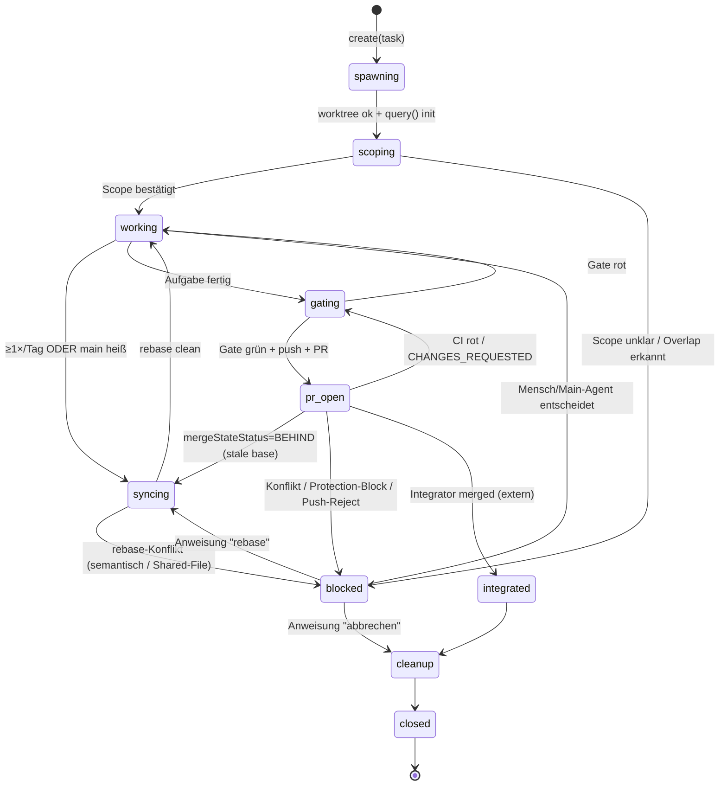
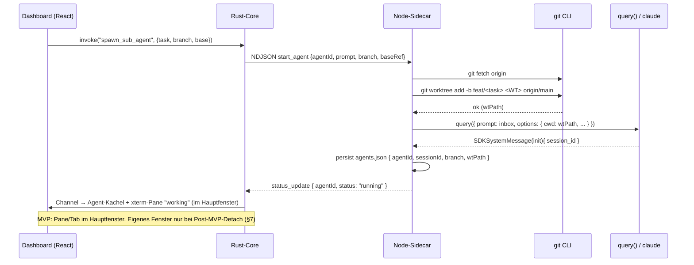

# 04 — Sub-Agents

> **Design-Dokument für mads.** Dieses Dokument spezifiziert den **Sub-Agent** als
> eigenständigen Entwicklungs-Stream: ein Claude-Code-Agent, der selbständig **eine**
> Aufgabe auf **einer** Branch in **einem eigenen Worktree** übernimmt, im **Hauptfenster
> als eigenes xterm-Pane/Tab** dargestellt wird (MVP; „Detach in eigenes Fenster" ist eine
> Post-MVP-Option, [[01-architecture]] §3.4), Rückfragen an den Menschen stellt, selbständig
> mit GitHub kommuniziert, sich bei Bedarf mit dem Main-Agent (Integrator) abgleicht und
> seine Branch nach Beendigung sauber schließt.
>
> Es **operationalisiert** Sektion 5 (Lebenszyklus) und Sektion 6 (Konfliktvermeidung)
> des bewährten Leitfadens [[_paix-multi-agent-reference]] und hält dessen drei
> Invarianten unverändert ein:
>
> 1. **Only `main` merges** — ein Sub-Agent landet **nie** selbst auf `main`.
> 2. **`main` is always runnable** — jeder Merge passiert grünes, deterministisches CI.
> 3. **Subs never self-merge** — außen-sichtbare Aktionen brauchen explizite Anweisung.
>
> Code/Identifier englisch, Fließtext deutsch.

---

## 0. Zusammenfassung & Einordnung in die Gesamtarchitektur

Ein **Sub-Agent** in mads ist genau **eine** `query()`-Session des Claude Agent SDK
([[claude-code-capabilities]] §9, [[sidecar-orchestration]] §1) im **Streaming-Input-Modus**,
gebunden an **ein** `cwd` = der Pfad eines dedizierten `git worktree`, mit **einer**
kurzlebigen Branch `feat/<task>` off `origin/main`. Er ist NICHT identisch mit einem
Claude-Code-internen „Subagent" (das `Agent`-Tool); diese Unterscheidung ist
load-bearing — siehe [[claude-code-capabilities]] §7 und die `AskUserQuestion`-Einschränkung
in [[sidecar-orchestration]] §9.2. mads modelliert „Sub-Agents 1..N" bewusst als **eigene
Top-Level-Sessions**, weil nur so jeder Agent (a) eine eigene Branch/Commits/PR fahren,
(b) `AskUserQuestion` nutzen und (c) eigene Permissions/MCP-Server haben kann.

Der Sub-Agent ist der **produzierende** Stream im paix-Modell (Referenz §2): Er *schlägt
vor* (PR), der Integrator *verfügt* (Merge). Dieses Dokument beschreibt seinen
Lebenszyklus als Zustandsmaschine, seinen technischen Start, das Rückfrage-Protokoll, die
GitHub-Interaktion, den Abgleich mit dem Main-Agent, seine Detailansicht (xterm-Pane im
Hauptfenster; Detach Post-MVP), sein Permission-/Sandbox-Modell und sein sauberes Schließen
samt Crash-Recovery.

**Querverweise auf die Gesamtarchitektur:**

| Thema | Dokument | Beziehung |
| --- | --- | --- |
| Multi-Agent-Invarianten, Worktree-Lifecycle, Konfliktvermeidung | [[_paix-multi-agent-reference]] | Normative Quelle. Sub-Agent operationalisiert §5/§6. |
| SDK-Fähigkeiten (`query()`, `canUseTool`, Hooks, stream-json, Permission-Modes) | [[claude-code-capabilities]] | Technische Primitive, auf denen der Sub-Agent läuft. |
| Sidecar-Orchestrierung (Pool, NDJSON-Protokoll, Worktree-Mgmt, Crash-Recovery) | [[sidecar-orchestration]] | Der Sidecar *hostet* den Sub-Agent; dieses Doc verfeinert die `AgentSession`. |
| GitHub-Mechanik (gh/Octokit, Eskalations-Signale, PR-Lifecycle, Auth) | [[github-multiagent]] | GitHub-Interaktion des Sub-Agents (§5 hier) baut darauf auf. |
| Tauri-Stack (Channels, Capabilities, optionales Multi-Window) | [[tauri2-stack]] | xterm-Pane im Hauptfenster; optionales Detach-Fenster Post-MVP (§7 hier). |
| Main-Agent / Integrator (Merge-Prozedur, Integrations-Reihenfolge) | [[03-main-agent]] | Gegenstück; Sub-Agent eskaliert an ihn (§6 hier). |
| Dashboard, Permission-Inbox, Notification-Routing | [[02-dashboard]] | UI-Senke für Rückfragen/Status (§4, §7 hier). |
| Datenmodell-Persistenz (`agents.json`, SQL-Historie) | [[01-architecture]] | Persistiert Sub-Agent-State (§8 hier). |

> **Abgrenzungs-Hinweis.** Wo dieses Dokument den Begriff „Sub-Agent" verwendet, ist immer
> der **eigene Worktree-Stream** (eigene `query()`-Session) gemeint. Der SDK-interne
> „Subagent" (über das `Agent`-Tool, gleiche Session, gleiches Verzeichnis) heißt hier
> durchgehend **„Helper-Subagent"** zur Disambiguierung.

---

## 1. Rolle & Verantwortlichkeiten (aus paix §2 abgeleitet)

| Der Sub-Agent DARF / SOLL | Der Sub-Agent DARF NICHT |
| --- | --- |
| Genau **eine** Aufgabe in **seinem** Worktree bearbeiten. | In einem fremden Worktree arbeiten oder dessen Branch berühren. |
| Kleine Commits auf **seiner** Branch `feat/<task>` machen (Ziel < ~200 LOC/PR, Referenz §5). | Auf `main` committen oder pushen. |
| Mindestens **täglich** `git rebase origin/main` (stale-base-Killer, Referenz §5). | Public/shared History rebasen, auf der andere bauen (Referenz §10). |
| Lokale Quality-Gates auf **neuer** Basis mit **frozen** Install fahren (Referenz §9). | Nicht-frozen Installs nutzen (bricht green-branch ⇒ green-main). |
| **Eigene** Branch pushen, **eigenen** PR öffnen, auf **eigenes** CI reagieren ([[github-multiagent]] §3). | **Niemals selbst nach `main` mergen** (Invariante 1+3). |
| Rückfragen an den Menschen stellen (Permission / `AskUserQuestion` / Notification, §4). | Riskante Aktionen außerhalb des Scopes ohne Freigabe ausführen. |
| Sich mit dem Main-Agent abgleichen bei Contract-/Shared-File-Themen (§6). | Eine geteilte Signatur/Schnittstelle still ändern (Referenz §8: Stop-the-world). |
| Nach Merge **seine** Branch + Worktree sauber schließen (§8). | Worktrees mit `rm -rf` löschen (Referenz §10). |

**Trigger-Prinzip (Referenz §2, Invariante 3):** Jede **außen-sichtbare** Aktion
(`git push`, `gh pr create`, `gh pr review`) wird nur auf **explizite Anweisung** ausgelöst
— entweder durch den Menschen (Dashboard), durch eine im Task-Brief vereinbarte Regel,
oder durch den Main-Agent. Der Sub-Agent „rennt" nicht von sich aus zum Merge.

---

## 2. Sub-Agent-Lebenszyklus als Zustandsmaschine

### 2.1 Zustände

Der Lebenszyklus verschränkt zwei Achsen: den **paix-Workflow-Zustand** (wo im
Branch-Lifecycle) und den **SDK-Laufzeit-Zustand** (kanonisches `AgentStatus`-Enum aus
[[01-architecture]] §5.1: `starting | running | waiting_input | paused | escalation | error |
done | queued`). Die folgende Maschine ist der **Workflow-Zustand**; der
Laufzeit-Zustand ist orthogonal und wird pro Workflow-Zustand mitgeführt.

```
LifecycleState =
  | "spawning"          # git worktree add läuft, query() noch nicht gestartet
  | "scoping"           # Contract/Scope bestätigen (vor erstem Code)
  | "working"           # kleine Commits, iterative Arbeit
  | "syncing"           # rebase onto origin/main
  | "gating"            # lokale lint/typecheck/test (frozen install)
  | "pr_open"           # gepusht + PR offen, wartet auf CI/Review/Integrator
  | "integrated"        # Integrator hat gemerged (extern beobachtet)
  | "cleanup"           # worktree remove + branch -d + prune + Fenster zu
  | "closed"            # Endzustand
  | "blocked"           # braucht menschliche/Main-Agent-Entscheidung (Eskalation)
```

### 2.2 Diagramm



### 2.3 Übergänge mit konkreten git/gh-Befehlen

Jeder Übergang ist eine der sechs idempotenten Sidecar-Operationen aus
[[github-multiagent]] §6 (`create / sync / gate / pr / integrate / cleanup`) — wobei
`integrate` **nicht** vom Sub-Agent, sondern vom Main-Agent ausgeführt wird (Invariante 1).
Alle Git-Befehle laufen als nativer Childprozess mit `git -C <WT_DIR>` bzw. `cwd = worktree`
([[sidecar-orchestration]] §6).

| Übergang | Operation | Konkrete Befehle (worktree = `<WT>` = `~/mads-worktrees/<repo-slug>/<agentId>`, AUSSERHALB des Repos — [[01-architecture]] §3.2) |
| --- | --- | --- |
| `[*] → spawning → scoping` | `create` | `git -C <repo> fetch origin`<br>`git -C <repo> worktree add -b feat/<task> <WT> origin/main`<br>`git config --local rerere.enabled true` *(falls noch nicht global, Referenz §9)* |
| `scoping` | Contract bestätigen | Liest Ownership-Map + ADRs (committete Artefakte, Referenz §8). Kein Git-Schreibbefehl; bei Overlap → `blocked` (§6). |
| `working` | kleine Commits | `git -C <WT> add <konkrete Dateien>` *(nie `git add -A` — Referenz §10)*<br>`git -C <WT> commit -m "<scope>: <änderung>"` |
| `working → syncing → working` | `sync` (stale-base-Killer) | `git -C <WT> fetch origin`<br>`git -C <WT> rebase origin/main`<br>*(bei Konflikt → rerere replayt; sonst → `blocked`)*<br>`git -C <WT> push --force-with-lease` *(NUR wenn Branch schon gepusht)* |
| `working → gating` | `gate` (neue Basis, frozen) | `cd <WT> && npm ci` *(bzw. `pnpm install --frozen-lockfile`)*<br>`npm run lint && npm run typecheck && npm test`<br>`cargo test` *(falls Rust-Anteil; `Cargo.lock` committet)* |
| `gating → pr_open` | `pr` | `git -C <WT> push -u origin feat/<task>` *(erster Push: plain)*<br>`gh pr create -R <owner>/<repo> --base main --head feat/<task> --fill --json url,number` *(`--draft`, solange unfertig)* |
| `pr_open` (warten) | Poll | GraphQL-Batch-Query ([[github-multiagent]] §4.1) + lokal `git rev-list --left-right --count origin/main...HEAD`. |
| `pr_open → integrated` | (extern) | Der **Main-Agent** führt `integrate` aus. Sub-Agent beobachtet `mergeStateStatus`/PR-State → `MERGED`. |
| `integrated → cleanup → closed` | `cleanup` | `git -C <repo> worktree remove <WT>`<br>`git -C <repo> branch -d feat/<task>`<br>`git -C <repo> worktree prune`<br>`git -C <repo> push origin --delete feat/<task>` *(falls `--delete-branch` nicht griff)* |

### 2.4 Cadence (Referenz §5)

| Aktivität | Frequenz | Auslöser in mads |
| --- | --- | --- |
| `sync` (rebase onto `origin/main`) | **≥ 1×/Tag**, mehr wenn `main` heiß | Sidecar-Scheduler (Timer) + sofort bei `mergeStateStatus == BEHIND`. |
| `gate` lokal | vor jedem `pr` und nach jedem `sync` mit Code-Drift | Workflow-Transition. |
| Branch-Lebensdauer | Ziel < 1 Tag, harte Decke wenige Tage | Dashboard-Warnung ab > 1 Tag (Branch-Alter-Badge). |
| Branch-Teardown | **sofort** nach Merge | Auto-`cleanup` getriggert durch beobachteten `MERGED`-State. |

> **mads-Automatik.** Der periodische `sync` läuft als Sidecar-Job, der eine
> `send_input`-Nachricht an den Sub-Agent stellt („Rebase jetzt auf origin/main; löse
> kleine Konflikte, eskaliere bei semantischen/Shared-File-Konflikten") — **nicht** ein
> blindes `git rebase` hinter dem Rücken des Agenten, damit der Agent den Konflikt im
> Kontext seiner offenen Arbeit lösen kann.

---

## 3. Technischer Start eines Sub-Agenten

### 3.1 Start-Sequenz (Sidecar)

Der Start ist die `create`-Operation + ein `query()`-Aufruf. Sequenz vom Dashboard bis
zum laufenden Agenten:



### 3.2 Konkreter `query()`-Aufruf

```typescript
import { query, type SDKUserMessage } from "@anthropic-ai/claude-agent-sdk";

async function startSubAgent(cfg: SubAgentConfig): Promise<AgentSession> {
  // 1) Worktree off frischem origin/main (paix §4/§5)
  await git(cfg.repoRoot, ["fetch", "origin"]);
  const wtPath = `${cfg.worktreeContainer}/${cfg.agentId}`;   // ~/mads-worktrees/<repo-slug>/<agentId> (außerhalb des Repos, [[01-architecture]] §3.2)
  await git(cfg.repoRoot, ["worktree", "add", "-b", cfg.branch, wtPath, cfg.baseRef ?? "origin/main"]);

  const inbox = new AsyncQueue<SDKUserMessage>();
  inbox.push(userMsg(cfg.taskBrief));            // erste Instruktion = Task-Contract

  const q = query({
    prompt: inbox,                               // AsyncIterable => Streaming Input Mode (Pflicht für canUseTool)
    options: {
      cwd: wtPath,                               // Sandbox: NUR der eigene Worktree
      additionalDirectories: [],                 // KEIN repoRoot-Schreibzugriff (Scope-Isolation, §9)
      model: cfg.model ?? "claude-opus-4-8",     // Sub-Tasks ggf. claude-sonnet-4-6 (Kosten)
      effort: cfg.effort ?? "high",
      permissionMode: "default",                 // Mensch behält Hoheit via canUseTool (§4, §9)
      allowedTools: SUB_AGENT_ALLOWED_TOOLS,     // siehe §9
      disallowedTools: SUB_AGENT_DENIED_TOOLS,   // siehe §9
      systemPrompt: { type: "append", text: buildSubAgentSystemPrompt(cfg) }, // §10
      includePartialMessages: cfg.focused,       // Token-Stream nur fürs fokussierte Pane (Backpressure)
      canUseTool: makeCanUseTool(cfg.agentId),   // §4.1 — Rückfragen an den Menschen
      hooks: makeSubAgentHooks(cfg.agentId),     // §4.3 — Notification/PreToolUse/PostToolUse
      mcpServers: { github: { type: "stdio", command: "gh-mcp" } }, // optional; gh primär als Bash
      sessionId: cfg.sessionId,                  // eigene UUID, persistiert
      resume: cfg.resumeSessionId,               // Crash-Recovery (§8.3)
      env: subAgentEnv(cfg),                     // §9: nur nötige Auth, kein ANTHROPIC_API_KEY-Leak
      stderr: (d) => logToStderr(cfg.agentId, d),
      maxBudgetUsd: cfg.budgetUsd,               // harter Kosten-Stopp pro Agent (optional)
    },
  });
  return registerSession(cfg, q, inbox, wtPath);
}
```

**Wesentliche Entscheidungen (mit Referenz):**

- **Eigene Session-ID** (`sessionId` als valide UUID) wird sofort persistiert
  ([[sidecar-orchestration]] §7.1) — Voraussetzung für Resume.
- **Streaming Input Mode** ist Pflicht, weil `canUseTool` sonst nicht funktioniert
  ([[claude-code-capabilities]] §5.2).
- **`cwd` = Worktree, `additionalDirectories` leer.** Der Sub-Agent darf per Default
  **nicht** repo-weit schreiben — das ist die mechanische Sandbox auf den eigenen Scope
  (§9; paix-Anti-Pattern „git add -A-Kontamination", Referenz §10). Lesezugriff auf
  Shared-Artefakte (ADRs, Ownership-Map) läuft über committete Dateien, die im Worktree
  ohnehin als Teil der Branch-History sichtbar sind.
- **System-Prompt via `append`**, nicht `replace` — der Default-Claude-Code-Prompt
  (Tool-Wissen, Sicherheit) bleibt erhalten; nur die Rollen-/Multi-Agent-Regeln werden
  angehängt (§10).

---

## 4. Rückfragen an den Menschen

Der Sub-Agent blockiert oder läuft weiter, je nach Rückfrage-Typ. Es gibt **drei**
Mechaniken, die alle in derselben **Dashboard-Inbox** landen (Routing über `agentId`).

### 4.1 Mechanik im Überblick

```
            Sub-Agent (claude)                Sidecar                 Dashboard-Inbox
            ─────────────────                 ───────                 ───────────────
(A) Tool-Permission "ask"  ──canUseTool──▶  PendingPermission   ──▶  permission_request  (BLOCKIERT)
(B) AskUserQuestion-Tool   ──canUseTool──▶  questions[]         ──▶  multiple-choice card (BLOCKIERT)
(C) Notification-Hook      ──hook────────▶  needs_input         ──▶  "wartet auf dich"   (NICHT blockierend bis Tool)
```

| Typ | SDK-Hebel | Blockiert die Ausführung? | UI-Darstellung |
| --- | --- | --- | --- |
| **(A) Tool-Permission** | `canUseTool`-Callback (bei „ask") | **Ja** — pausiert bis Antwort | Allow/Deny-Dialog + editierbarer Tool-Input |
| **(B) `AskUserQuestion`** | `canUseTool` mit `toolName === "AskUserQuestion"` → `input.questions` | **Ja** — pausiert bis Antwort | Multiple-Choice-Karte (Header, Optionen, multiSelect) |
| **(C) idle/notification** | `Notification`-Hook (`idle_prompt`, `permission_prompt`, `elicitation_dialog`) | **Nein** (reines Status-Signal); echte Blockade erst über (A)/(B) | „Agent X wartet auf dich"-Badge + macOS-Notification |

### 4.2 `canUseTool` → `permission_request` → `answer_permission` (Roundtrip)

Das ist das Herzstück des „Mensch + viele Agenten"-Modells
([[sidecar-orchestration]] §4a, §8). Der Callback bleibt **beliebig lange pending** — die
Ausführung des Agenten ist exakt an dieser Stelle eingefroren, bis der Mensch antwortet.

```typescript
function makeCanUseTool(agentId: string): CanUseTool {
  return (toolName, input, opts): Promise<PermissionResult> =>
    new Promise((resolve, reject) => {
      const requestId = randomUUID();
      session(agentId).pendingPermissions.set(requestId, { resolve, reject, toolName, input,
        kind: toolName === "AskUserQuestion" ? "ask_user_question" : "tool" });

      send({
        type: "permission_request", agentId, requestId, toolName, input,
        blockedPath: opts.blockedPath, decisionReason: opts.decisionReason,
        suggestions: opts.suggestions,
        questions: toolName === "AskUserQuestion" ? (input as any).questions : undefined,
      });
      send(statusUpdate(agentId, "waiting_input", `permission: ${toolName}`));

      // opts.signal feuert, wenn die Query gecancelt wird (Stop/Crash) → Promise auflösen
      opts.signal.addEventListener("abort", () => {
        session(agentId).pendingPermissions.delete(requestId);
        reject(new Error("aborted"));
      });
    });
}
```

Antwort des Menschen (Dashboard → Core → Sidecar `answer_permission`,
[[sidecar-orchestration]] §3.2):

```typescript
// HOST -> SIDECAR: answer_permission
const pending = session(agentId).pendingPermissions.get(requestId);
switch (decision.behavior) {
  case "allow":
    pending.resolve({ behavior: "allow", updatedInput: decision.updatedInput,
      updatedPermissions: decision.remember ? buildRememberRule(toolName) : undefined });
    break;
  case "deny":
    pending.resolve({ behavior: "deny", message: decision.message, interrupt: decision.interrupt });
    break;
  case "answer_questions": // AskUserQuestion
    pending.resolve({ behavior: "allow",
      updatedInput: { questions: pending.input.questions, answers: decision.answers, response: decision.response } });
    break;
}
session(agentId).pendingPermissions.delete(requestId);
send(statusUpdate(agentId, "running"));
```

### 4.3 Notification-Hook (nicht-blockierendes „wartet auf dich")

```typescript
function makeSubAgentHooks(agentId: string) {
  return {
    Notification: [{ hooks: [async (i: any) => {
      const reason = /waiting|idle/i.test(i?.message ?? "") ? "idle_prompt"
                   : /permission/i.test(i?.message ?? "") ? "permission_prompt" : "notification";
      send({ type: "needs_input", agentId, reason, message: i?.message });
      return {}; // {} = nicht blockieren
    }]}],
    PreToolUse:  [{ matcher: "Bash|Edit|Write", hooks: [trackStep(agentId)] }],      // §2: currentStep
    PostToolUse: [{ matcher: "Bash", hooks: [detectGitEscalation(agentId)] }],        // §5.4: push-reject etc.
  };
}
```

### 4.4 Blockieren vs. Weiterlaufen & Timeout-Verhalten

| Situation | Verhalten des Sub-Agenten |
| --- | --- |
| (A)/(B) Permission/Question offen | **Hart blockiert** an genau diesem Tool-Call. Andere Sub-Agenten laufen unbeeinflusst weiter (eigener Prozess). |
| (C) idle/notification | Agent wartet auf nächste `send_input` (sein „Zug"); kein Tool blockiert. |
| Mensch antwortet nicht (kurzfristig) | Bleibt blockiert. Dashboard zeigt „seit T blockiert". Kein automatisches Allow (Sicherheits-Default). |
| Mensch antwortet **sehr lange** nicht / App-Quit geplant | **`defer`-Strategie** ([[sidecar-orchestration]] §7.4): Ein `PreToolUse`-Hook kann `permissionDecision: "defer"` zurückgeben → beendet die Query sauber, Prozess kann exiten; später aus persistierter Session **resumen** (§8.3). Priorität: `deny > defer > ask > allow`. |
| Optionaler Soft-Timeout | mads kann pro Agent ein konfigurierbares „auto-defer nach N Minuten ohne Antwort" setzen (Default: **aus**). Niemals „auto-allow". |

> **ENTSCHIEDEN (Permission-Timeout-Policy, OE-19):** Default ist **sichtbar blockiert,
> unbegrenzt** — der Agent bleibt an der Permission stehen, das Dashboard zeigt „seit T
> blockiert", es gibt **kein** automatisches Allow. Als **optionaler** Mechanismus steht ein
> **Soft-Timeout → `defer`** bereit (unbeantwortete Permission nach N min → Session pausieren/
> resumen, spart Subprozess-RAM); er ist per Default **aus** und nie „auto-allow". Die
> konkrete Default-Schwelle N (falls aktiviert) bleibt empirisch zu kalibrieren.

> **OFFENE FRAGE — globale Permission-Defaults vs. „remember".** `canUseTool` kann mit
> `updatedPermissions` eine Regel „für diese Session immer erlauben" zurückgeben. Soll mads
> ein „remember"-Häkchen pro Tool/Pattern anbieten und wenn ja: nur session-scoped oder auch
> persistent in `.claude/settings.local.json` pro Worktree?

---

## 5. GitHub-Interaktion des Sub-Agenten

Baut vollständig auf [[github-multiagent]] auf. Der Sub-Agent nutzt `gh` als
Childprozess (Mutationen mit Auth) im `cwd = worktree`, das Dashboard-Polling läuft
zentral im Sidecar über Octokit GraphQL (nicht pro Agent — Rate-Limit, §5.5).

### 5.1 Was der Sub-Agent selbst DARF (autonom oder auf Anweisung)

| Aktion | Befehl | Trigger |
| --- | --- | --- |
| Eigene Branch pushen | `git -C <WT> push -u origin feat/<task>` | Workflow `gating → pr_open`; erste Push explizit angewiesen (Invariante 3). |
| Eigenen PR öffnen | `gh pr create -R <o>/<r> --base main --head feat/<task> --fill [--draft]` | Nach grünem lokalem Gate. `--draft`, solange unfertig (hält Required-Review/Queue fern, [[github-multiagent]] §3.1). |
| Auf eigenes CI reagieren | `gh pr checks <pr> --watch --interval 30` *(Exit 0/1/8)* | Nach Push; siehe §5.4. |
| PR aktualisieren | weitere Commits + `git push --force-with-lease` (nach Rebase) | Bei `CHANGES_REQUESTED` / CI rot. |
| PR aus Draft holen | `gh pr ready <pr>` | Wenn fertig + grün, auf Anweisung. |
| Eigene PR-Kommentare beantworten | `gh pr comment` / Review-Replies | Auf Review-Feedback. |

### 5.2 Was der Sub-Agent NIE darf

| Verbotene Aktion | Mechanische Absicherung |
| --- | --- |
| `gh pr merge` nach `main` (Invariante 1+3) | `disallowedTools` blockt das Pattern; zusätzlich Branch-Protection auf `main` (PR-only + required review, [[github-multiagent]] §2) macht Self-Merge serverseitig unmöglich. Selbst wenn der Agent es versuchte: `gh pr merge` schlägt mit Protection-Fehler fehl → Eskalation. |
| `gh pr merge --admin` (Gates umgehen) | In mads default verboten; nur auditierte Mensch-Aktion ([[github-multiagent]] §3.4). |
| `git push origin main` / Force auf `main` | Branch-Protection (`non_fast_forward` + `deletion`); `disallowedTools`-Pattern. |
| Fremde Branch/PR mergen oder reviewen | Scope-Sandbox (`cwd`), Task-Brief verbietet es (§10). |

> **Doppelte Absicherung (paix-Prinzip „Defense in Depth").** Die „nur Integrator
> merged"-Invariante wird **dreifach** durchgesetzt: (1) System-Prompt-Regel (§10),
> (2) `disallowedTools`-Pattern auf `gh pr merge*` (§9), (3) GitHub Branch-Protection
> serverseitig ([[github-multiagent]] §2). Keine Schicht allein ist ausreichend.

### 5.3 PR-Status & Eskalations-Signale (aus [[github-multiagent]] §4)

Das Dashboard pollt pro Sub-Agent diese Signale (ein GraphQL-Batch-Query für alle PRs,
[[github-multiagent]] §4.1) und mappt sie auf den Sub-Agent-Zustand:

| Signal | Quelle | Sub-Agent-Reaktion (Workflow) |
| --- | --- | --- |
| `statusCheckRollup.state ∈ {FAILURE, ERROR}` | GraphQL / `gh pr checks` Exit 1 | `pr_open → gating` (CI rot, §5.4) |
| `mergeable == CONFLICTING` **oder** `mergeStateStatus == DIRTY` | GraphQL | `pr_open → blocked` (Merge-Konflikt, eskalieren) |
| `mergeStateStatus == BEHIND` | GraphQL / lokal `git rev-list` | `pr_open → syncing` (stale base → rebase) |
| `reviewDecision ∈ {CHANGES_REQUESTED, REVIEW_REQUIRED}` | GraphQL | `pr_open → gating`/`working` (Feedback umsetzen) |
| `mergeStateStatus == BLOCKED` | GraphQL / `gh pr merge` stderr | `pr_open → blocked` (Gate offen) |
| Push rejected (non-fast-forward) | `git push` Exit ≠ 0 + stderr-Match | `blocked` (§5.4) |
| `mergeable/mergeStateStatus == UNKNOWN` | GraphQL | **kein** Alarm — lazy berechnet, kurzer Re-Poll ([[github-multiagent]] §3.5) |

### 5.4 Reaktion auf eigene CI-Fehler & Push-Reject

Es gibt **kein** dediziertes SDK-Event für `gh push rejected` oder CI-Fehler — diese
erscheinen als `tool_result` eines `Bash`/`gh`-Calls ([[sidecar-orchestration]] §4d, §9).
Erkennung über `PostToolUse`-Hook + zentrale Pattern-Tabelle:

```typescript
const GIT_ESCALATION_PATTERNS: Array<{ code: string; re: RegExp; recoverable: boolean }> = [
  { code: "git_push_rejected",   re: /! \[rejected\]|non-fast-forward|fetch first|stale info/i, recoverable: true },
  { code: "merge_conflict",      re: /CONFLICT|Automatic merge failed|merge conflict/i,         recoverable: true },
  { code: "ci_failed",           re: /checks? (have )?failed|conclusion.*failure/i,             recoverable: true },
  { code: "protection_blocked",  re: /protected branch|required status check|review required/i, recoverable: false },
  { code: "auth_required",       re: /gh auth login|HTTP 401|Bad credentials/i,                 recoverable: false },
];
```

**Reaktions-Strategie (im System-Prompt verankert, §10):**

- **CI rot (`ci_failed`)** → Der Sub-Agent ruft `gh run view <run-id> --log-failed`
  bzw. `gh pr checks <pr>` selbst auf, liest die Fehlerausgabe, fixt lokal, läuft das
  lokale Gate erneut (`gate`), committet und pusht `--force-with-lease`. **Autonom**,
  weil es seine eigene Branch betrifft (kein außen-sichtbarer neuer Zustand außer Push).
- **Push-Reject (`git_push_rejected`)** → fast immer stale base: `git fetch origin &&
  git rebase origin/main` (sync), dann `git push --force-with-lease`. Bei Rebase-Konflikt
  → siehe §6.
- **`protection_blocked` / `auth_required`** → **Eskalation** (`status = escalation`,
  `SidecarErrorMsg{ recoverable: false }`), Dashboard-Alarm, **kein** autonomer Workaround
  (insb. nie `--admin`).

### 5.5 Rate-Limit-Disziplin

Der Sub-Agent pollt **nicht selbst** in einer Schleife (das würde N× das Budget kosten).
`gh pr checks --watch` ist nur für ein **gezieltes, kurzlebiges** Warten auf das **eigene**
CI erlaubt; das Dashboard-Polling über alle PRs macht zentral der Sidecar mit einem
GraphQL-Batch-Query + adaptivem Intervall + Backoff/Jitter ([[github-multiagent]] §5).

---

## 6. Abgleich mit dem Main-Agent

Der Sub-Agent ist autonom auf **seiner** Branch — aber drei Klassen von Ereignissen
erzwingen Koordination mit dem Main-Agent (Integrator). Koordination läuft über
**committete Artefakte** (Referenz §8), nicht über Out-of-band-Chat, plus eine
Eskalations-Nachricht ans Dashboard/den Main-Agent.

### 6.1 Wann abgleichen

| Klasse | Auslöser | Protokoll |
| --- | --- | --- |
| **Contract-Änderung** | Der Sub-Agent merkt, dass er eine **geteilte Signatur/Schnittstelle** (API, DB-Schema, Event-Format) ändern muss. | **Stop-the-world** (Referenz §8): Der Sub-Agent ändert die Signatur **nicht** still. Er eskaliert → der Main-Agent updatet das ADR (`docs/decisions/`), benachrichtigt alle abhängigen Streams, re-baselined. Erst danach codet der Sub-Agent gegen den neuen Contract. |
| **Geteilte Datei / Region** | Der Sub-Agent muss eine Datei oder **Region** (Symbol/Pattern) berühren, die laut `CoordinationArtifact`/`CODEOWNERS` einem anderen Stream gehört oder ein Seam ist (lockfile, Registry, i18n). | **Shared-File-Protokoll** (Referenz §6): Option A (Main-Agent landet die geteilte Edit zuerst als winzigen PR, dann rebasen alle) **oder** Option B (genau ein Owner-Branch). Der Sub-Agent **wartet** bzw. **fordert an**, editiert nicht parallel. Mechanisch geprüft durch das Trespass-Self-Check vor jedem push/PR (§6.4, [[06-ownership-and-coordination]]). |
| **Semantischer Rebase-Konflikt** | `git rebase origin/main` führt zu einem Konflikt, dessen Auflösung **Domänen-Wissen** über fremden Code braucht. | Der Sub-Agent löst **mechanische** Konflikte selbst (rerere hilft). **Semantische** Konflikte → Eskalation; der Integrator entscheidet (Referenz §7: „der Integrator rät nicht"). |

### 6.2 Eskalations-Sequenz

```mermaid
sequenceDiagram
    participant Sub as Sub-Agent
    participant SC as Sidecar
    participant UI as Dashboard
    participant Main as Main-Agent (Integrator)

    Sub->>SC: tool_result enthält Konflikt / Sub erkennt Shared-File
    SC->>SC: classify → status=escalation, code=...
    SC-->>UI: error{ scope:"agent", code, recoverable } + status_update(blocked)
    UI->>Main: (Mensch oder Auto-Routing) "Sub-X braucht Entscheidung"
    Main->>Main: ADR updaten / Owner zuweisen / Integrations-Reihenfolge setzen
    Main-->>SC: send_input an Sub-X: "Contract v2; rebase; nur Datei Y editieren"
    SC->>Sub: send_input
    Sub->>Sub: weiter (working/syncing)
```

> **Invariante.** Der Abgleich ändert **nie** die paix-Topologie: Der Sub-Agent bleibt
> produzierend, der Main-Agent entscheidet/landet. Auch nach einem Abgleich merged der
> Sub-Agent nicht selbst (Invariante 1).

### 6.3 Kanal des Abgleichs

- **Committete Artefakte** (Source of Truth, Referenz §8): ADRs, `BACKLOG.md`/Task-State,
  `CODEOWNERS`. Diese werden vom **Main-Agent/Menschen** geschrieben; der Sub-Agent
  **liest** sie (Referenz §8: „Agenten lesen den Brief, schreiben ihn nicht um").
- **`send_input`** an die laufende Sub-Agent-Session für die operative Anweisung
  (rebase / Contract-Version / Owner) — nachdem das Artefakt aktualisiert ist.
- Append-Dateien (ADR-Liste, `BACKLOG.md`) sind selbst Shared-Files und folgen dem
  Shared-File-Protokoll (Referenz §8 Warnung) — daher schreibt sie der Integrator
  serialisiert, nicht N Sub-Agenten parallel.

### 6.4 Region-Ownership: Lesen, Scopen, Trespass-Self-Check

Der Sub-Agent verfeinert das datei-grobe Ownership zur **Region-Ownership** (vollständiges
Modell: [[06-ownership-and-coordination]]). Er ist hier **Leser**, nie Schreiber des
Koordinations-Artefakts:

- **Regionen lesen.** Beim `scoping` liest der Sub-Agent seine eigenen Regionen aus dem
  committeten `CoordinationArtifact` (`docs/coordination/<name>.md`, im Worktree als Teil
  der Branch-History sichtbar) und **scopt** seine Edits darauf.
- **Trespass-Self-Check vor push/PR.** Als Teil des **Pre-PR-Gates** (neben
  lint/typecheck/test, §5/§9) extrahiert mads aus `git diff --merge-base origin/main` die
  `ChangedRegion[]` (Datei + umgebende Symbole) und ruft `detectTrespass(changes, rules,
  self)`. Leeres Ergebnis = sauber → push/PR erlaubt.
- **Bei Trespass eskalieren.** Findet das Gate eine fremde Region, gibt es **kein** push/PR,
  sondern eine Eskalation `EscalationKind: "ownership_trespass"` (mit Befund: Datei, Symbol,
  Owner-Stream). Der Sub-Agent ändert die **fremde Naht NICHT heimlich** — Auflösung läuft
  über den Integrator: **Owner-Handoff** (Region wird neu zugewiesen) **oder** **land-first**
  (geteilte Änderung als winziger PR zuerst auf `main`, [[06-ownership-and-coordination]] §5.3).

> **Noch nicht im Prototyp verdrahtet** (Behavior ab Roadmap P3/P4, [[01-architecture]] §10);
> Typen (`OwnershipRule`/`CoordinationArtifact`/`ChangedRegion`) + `detectTrespass` existieren
> bereits in `shared/protocol.ts`/`shared/ownership.ts`.

---

## 7. Sub-Agent-Detailansicht (xterm-Pane im Hauptfenster; Detach Post-MVP)

**Verbindlich (MVP, [[01-architecture]] §3.4, OE-3):** Jeder Sub-Agent wird im **einen
Hauptfenster** als eigenes **xterm-Pane/Tab** dargestellt (Detailansicht für genau einen
Stream). Ein **eigenes** `WebviewWindow` mit Label `agent-<agentId>` ist eine **spätere
optionale** „Detach"-Aktion (Post-MVP, [[tauri2-stack]] §4). Die folgenden Inhalte gelten für
beide Darstellungen und spiegeln die Achsen aus [[claude-code-capabilities]] §12.

### 7.1 Inhalt der Detailansicht (Pane bzw. Detach-Fenster)

```
┌───────────────────── Agent-Detail "Agent 3 — feat/login" (Pane/Fenster) ─────┐
│  Titelzeile: Agent 3 · feat/login · ● working · $0.42 · 7 turns · ⟲ behind 0  │
├──────────────────────────────────────────────────────────────────────────────┤
│  [Aufgabe]  Task-Brief / Contract (read-only) + aktueller Schritt:            │
│             "Bash: npm test"                                                   │
├──────────────────────────────────────────────────────────────────────────────┤
│  [Terminal]  xterm.js — Live-stream-json (Token-Deltas wenn fokussiert)       │
│              gefiltert/gerendert: assistant_text, tool_use, tool_result       │
├──────────────────────────────────────────────────────────────────────────────┤
│  [Git/PR]   Branch: feat/login (ahead 4 / behind 0) · PR #12 ✓ CLEAN          │
│             CI: lint ✓  type-check ✓  test ⏳  · reviewDecision: REVIEW_REQUIRED │
├──────────────────────────────────────────────────────────────────────────────┤
│  [Offene Fragen]  ▸ Permission: Bash("rm -rf node_modules")  [Allow] [Deny]   │
│                   ▸ Question: "Welche Strategie? A/B/C"        [Antworten]     │
├──────────────────────────────────────────────────────────────────────────────┤
│  [Eingabe]  ⌨  Follow-up an Agent senden …                      [Senden]       │
└──────────────────────────────────────────────────────────────────────────────┘
```

| Panel | Quelle (Sidecar-Nachricht) |
| --- | --- |
| **Aufgabe / aktueller Schritt** | Task-Brief aus `start_agent`; `status_update.currentStep` (§2). |
| **Terminal** | `agent_event` (`assistant_text`, `assistant_delta`, `tool_use`, `tool_result`) über `Channel<AgentOutput>` ([[tauri2-stack]] §3.3). |
| **Git/PR-Status** | Sidecar-Poll-Ergebnis (§5.3) + lokales `git rev-list`. |
| **Offene Fragen** | `permission_request` / `needs_input` (§4). Beantwortung → `answer_permission`. |
| **Eingabe** | Frontend → Core `invoke` → Sidecar `send_input` (§6.3). |

### 7.2 Detach-Fenster erzeugen & adressieren (Rust, Post-MVP)

Nur für die **optionale Post-MVP-Detach-Aktion**: ein eigenes `WebviewWindow` mit Label
`agent-<agentId>`. Im MVP entfällt das — die Detailansicht ist ein Pane im Hauptfenster.

```rust
use tauri::{WebviewWindowBuilder, WebviewUrl, Manager};

fn open_agent_window(app: &tauri::AppHandle, agent_id: &str, branch: &str) -> tauri::Result<()> {
    let label = format!("agent-{agent_id}");
    if let Some(w) = app.get_webview_window(&label) { return w.set_focus(); } // idempotent
    WebviewWindowBuilder::new(app, &label, WebviewUrl::App("agent.html".into()))
        .title(format!("Agent {agent_id} — {branch}"))
        .inner_size(960.0, 680.0)
        .build()?;
    Ok(())
}
```

### 7.3 Verhältnis zum Dashboard

- Das **Dashboard** (Hauptfenster, [[02-dashboard]]) ist die **Übersicht**: alle
  Sub-Agent-Kacheln, die zentrale **Inbox** (alle offenen Fragen aller Agenten),
  Kosten-HUD, Branch-/PR-Matrix. Es ist auch der Spawn-/Stop-Steuerstand und enthält die
  Agent-Detail-Panes.
- Die **Agent-Detailansicht** ist der **Fokus** auf genau einen Stream (volles Terminal,
  Token-Stream nur für den fokussierten Agenten aktiv).
- **Routing-Regel (MVP, [[01-architecture]] §2.3, OE-5):** Der hochfrequente
  `Channel<AgentOutput>` (1 pro Agent) wird vom **Hauptfenster** via `invoke` aufgebaut → der
  Token-Stream landet dort. Aggregierte/seltene Signale (PR fertig, Eskalation, Kosten-Update)
  gehen als im Core koalesziertes Delta-Event bzw. über den separaten High-Prio-Kanal für
  input/escalation. Erst bei der **Post-MVP-Detach-Aktion** wird die Channel-Bindung ins
  Detach-Fenster verlegt (dann ggf. zusätzlich `emit_to(label,…)`, [[tauri2-stack]] §3.4).
- **Capabilities:** Im MVP reicht `core:default` + Plugin-Permissions fürs Hauptfenster. Erst
  Detach-Fenster brauchen das Wildcard-Label `agent-*` ([[tauri2-stack]] §5); in keiner
  Variante ein `shell`-Recht im Webview — der Sidecar wird aus Rust gespawnt.

> **ENTSCHIEDEN (Window-Modell / Multi-Window-Skalierung, OE-3):** MVP = **ein Hauptfenster**
> mit mehreren xterm-Panes/Tabs; „Detach in eigenes Fenster" ist eine **Post-MVP**-Aktion (je
> Detach eine eigene WKWebView, RAM/GPU-teuer — daher kein MVP-Default, [[tauri2-stack]] §4
> Caveat). Damit sind Channel-Routing und Capability-Layout für den MVP fixiert
> ([[01-architecture]] §3.4).

### 7.4 Einblick in Helper-Subagenten („Teil-Agenten")

Gemeint sind hier die **SDK-internen** Subagenten (Task/Agent-Tool, §0 Abgrenzungs-Hinweis) —
in der UI **Teil-Agenten** genannt —, nicht die Worktree-Streams. Das Panel im Inspector zeigt
sie je Stream, jede Zeile ist aufklappbar und enthält den **Mitschnitt** des Teil-Agenten:
Werkzeug-Aufrufe mit Kurz-Argument und Ergebnis (✓/✗), Denkschritte und Äusserungen.

**Zweck ist Nachvollziehbarkeit, nicht Steuerung.** Ein Teil-Agent läuft innerhalb der Session
seines Streams; von hier aus lässt er sich weder anhalten noch anweisen. Der Mitschnitt
beantwortet „was tut der gerade, und mit welchen Werkzeugen".

**Datenherkunft.** Alles wird aus dem SDK-Strom abgeleitet, es gibt keine zweite Quelle:
Nachrichten eines Teil-Agenten tragen `parent_tool_use_id` = die `tool_use_id` des
Task/Agent-Aufrufs, der ihn startete. Der Sidecar reicht dieses Feld auf **allen** Event-Arten
durch, die ein Teil-Agent erzeugen kann (`tool_use`, `tool_result`, `assistant_text`,
`thinking`, `system`). Trug — wie ursprünglich — nur `tool_use` das Feld, liess sich zwar
zählen, wie viele Teil-Agenten laufen, aber nicht, was sie tun: Ergebnisse blieben
unzuordenbar, und ihre Antworttexte landeten als vermeintliche Äusserungen des Hauptloops im
Stream-Verlauf.

Drei Eigenheiten, die das Datenmodell (`src/subAgents.ts`) bewusst abfängt:

| Eigenheit | Verhalten |
| --- | --- |
| **Bezeichnung** | `description` des Aufrufs → `subagent_type` → erster Satz des Prompts. Das Label wird **ausserhalb** des Eintrags gemerkt (`subAgentMeta`), sonst verliert ein im Hintergrund gestarteter Teil-Agent seinen Namen (s.u.). Reines „Teil-Agent" ist nur noch der Notnagel. |
| **Hintergrund-Läufe** | Ein im Hintergrund gestarteter Teil-Agent liefert sein `tool_result` (nur die Agent-ID) **sofort** und arbeitet danach weiter. Sein Eintrag gilt dann als abgeschlossen; spätere Aktivität führt ihn wieder als laufend. |
| **Abschluss** | Fertige Teil-Agenten werden **stillgesetzt, nicht gelöscht** (`settleAll`/`pruneFinished`, die jüngsten sechs bleiben). Sofortiges Löschen nahm den Mitschnitt genau dann weg, wenn man ihn lesen will. |

Werkzeug-Aufrufe eines Teil-Agenten bleiben zusätzlich in der Stream-Timeline, dort aber mit
der Marke `▸ <Label>` — ohne sie sähen sie aus wie Aufrufe des Streams selbst. Antworttext und
Denkschritte stehen **nur** im Mitschnitt; sein Schlussbericht kommt ohnehin als Ergebnis der
Agent-Karte in der Timeline an.

---

## 8. Sicherheit & Permissions pro Sub-Agent

### 8.1 Permission-Mode & Tool-Gating

| Einstellung | Wert für Sub-Agent | Begründung |
| --- | --- | --- |
| `permissionMode` | **`default`** (oder `acceptEdits` für reine Code-Iteration) | Mensch behält Hoheit über riskante Aktionen via `canUseTool`. **Nicht** `bypassPermissions`/`dontAsk` als Default ([[claude-code-capabilities]] §5). |
| `cwd` | Worktree-Pfad | Sandbox auf eigenen Scope. |
| `additionalDirectories` | **leer** (per Default) | **Kein** repo-weiter Schreibzugriff → verhindert Aktionen außerhalb des Scopes / `git add -A`-Kontamination (Referenz §10). |
| `allowedTools` | siehe unten | Was ohne Prompt läuft. |
| `disallowedTools` | siehe unten | Hartes Verbot (auch aus Kontext entfernt). |

```typescript
const SUB_AGENT_ALLOWED_TOOLS = [
  "Read", "Edit", "Write", "Glob", "Grep",
  "Bash(git add *)", "Bash(git commit *)", "Bash(git status *)", "Bash(git diff *)",
  "Bash(git fetch *)", "Bash(git rebase *)", "Bash(git push *)", "Bash(git log *)",
  "Bash(gh pr create *)", "Bash(gh pr checks *)", "Bash(gh pr view *)",
  "Bash(gh pr comment *)", "Bash(gh pr ready *)", "Bash(gh run view *)",
  "Bash(npm *)", "Bash(pnpm *)", "Bash(cargo *)",
  "AskUserQuestion",
];

const SUB_AGENT_DENIED_TOOLS = [
  "Bash(gh pr merge *)",        // Invariante 1: nie nach main mergen
  "Bash(git push * main*)",     // nie auf main pushen
  "Bash(git push --force *)",   // nur --force-with-lease (im allowed-Pattern erfasst)
  "Bash(gh * --admin*)",        // nie Gates umgehen
  "Bash(rm -rf /*)", "Bash(rm -rf ~*)", // Circuit-Breaker (auch Default geschützt)
];
```

> **Hinweis.** `--add-dir`/`additionalDirectories` aus paix/SDK ist hier bewusst **leer**:
> Der Sub-Agent ist auf seinen Worktree „eingesperrt". Braucht er **Lesezugriff** auf
> Shared-Artefakte außerhalb (selten — meist sind sie in der Branch), wird ein konkreter
> Pfad **read-only** ergänzt, nie der ganze Repo-Root mit Schreibrecht.

### 8.2 Auth-Isolation pro Agent

- **Claude-Auth:** `env` pro Agent kontrolliert; **kein versehentliches
  `ANTHROPIC_API_KEY`** (würde Subscription-OAuth überschreiben,
  [[claude-code-capabilities]] §10.2). Subscription via `CLAUDE_CODE_OAUTH_TOKEN` /
  Keychain.
- **GitHub-Auth:** Token aus macOS-Keychain via `gh auth token`
  ([[github-multiagent]] §7); nie in Repo/Logs/IPC loggen. Sub-Agent erbt dasselbe
  Token wie der Sidecar; Scopes `repo, workflow, read:org` (bzw. fine-grained Äquivalent).

### 8.3 Protected Paths

`.git`, `.claude` (außer `.claude/worktrees`), Shell-RC, `.mcp.json`, `.npmrc` u. a.
sind in allen Modes außer `bypassPermissions` **nie** auto-approved
([[claude-code-capabilities]] §5.1). mads' Worktrees liegen **außerhalb** des Repos unter
`~/mads-worktrees/<repo-slug>/<agentId>` ([[01-architecture]] §3.2) — kompatibel und
außerhalb der protected `.claude`-Pfade. (`<repo>/.mads/` enthält nur Laufzeit-Metadaten wie
`agents.json` und steht im `.gitignore`, NICHT die Worktrees.)

> **OFFENE FRAGE — `bypassPermissions` für CI-artige Hintergrund-Streams.** Für rein
> mechanische, vom Menschen vorab freigegebene Aufgaben (z. B. „nur Formatter laufen
> lassen") könnte ein restriktiver `bypassPermissions`-Agent in einem wegwerfbaren
> Worktree sinnvoll sein (weniger Prompt-Fatigue). Soll mads das als opt-in-Profil
> anbieten, und mit welchen harten Leitplanken (z. B. nur in Sandbox, nie `gh`-Mutationen)?

---

## 9. Sauberes Schließen & Crash-Recovery

### 9.1 Sauberes Schließen (`cleanup`)

Ausgelöst durch (a) beobachteten `MERGED`-PR-State (Auto), (b) explizites Dashboard-Stop,
oder (c) Abbruch einer Aufgabe. Sequenz:

```mermaid
sequenceDiagram
    participant UI as Dashboard
    participant SC as Sidecar
    participant SDK as query()
    participant Git as git CLI
    participant Core as Rust-Core

    UI->>SC: stop_agent { agentId, removeWorktree: true }
    SC->>SDK: q.interrupt()  (laufenden Turn stoppen)
    SC->>SDK: inbox.close(); q.close()
    SC->>Git: git -C <repo> worktree remove <WT>        (refuse bei dirty → siehe unten)
    SC->>Git: git -C <repo> branch -d feat/<task>       (safe: nur wenn merged)
    SC->>Git: git -C <repo> worktree prune
    SC->>SC: agents.json: status="closed", persist (atomar)
    SC-->>Core: agent_done / status_update(closed)
    Core->>Core: Agent-Pane/Tab im Hauptfenster schließen (bzw. Detach-Fenster, falls Post-MVP offen)
```

**Befehle (idempotent, [[github-multiagent]] §6 / Referenz §5):**

```bash
git -C <repo> worktree remove <WT>          # verweigert bei uncommitted; -f erzwingt (nur auf Anweisung)
git -C <repo> branch -d feat/<task>         # -d = safe (nur wenn merged); -D nur auf Anweisung
git -C <repo> worktree prune                # Geister-Metadaten weg
git -C <repo> push origin --delete feat/<task>   # falls --delete-branch beim Merge nicht griff
```

**Fehlerfälle beim Schließen:**

| Fall | Verhalten |
| --- | --- |
| Worktree **dirty** (uncommitted Changes) | `worktree remove` **verweigert** → Dashboard fragt: „uncommitted Changes verwerfen?" → erst nach Bestätigung `-f`. Nie blind verwerfen (Referenz §10: nie `rm -rf`). |
| Branch **nicht merged**, aber Abbruch gewollt | `branch -d` verweigert → explizite Bestätigung für `branch -D`. |
| Remote-Branch existiert noch | `git push origin --delete` (nur wenn der Sub-Agent „integrated" oder explizit abgebrochen). |
| Pane/Detach-Fenster bereits geschlossen | Pane-Unmount no-op; bei Post-MVP-Detach `get_webview_window` → `None`, no-op (idempotent). |

### 9.2 State-Persistenz

Nach jeder Zustandsänderung schreibt der Sidecar atomar (write-temp + rename) nach
`<repo>/.mads/agents.json` ([[sidecar-orchestration]] §7.1). Erweitertes Schema für den
Sub-Agent:

```typescript
interface PersistedSubAgent {
  agentId: string;
  sessionId: string;              // aus init/result — Voraussetzung für resume
  branch: string;                 // feat/<task>
  worktreePath: string;           // ~/mads-worktrees/<repo-slug>/<agentId>
  lifecycleState: LifecycleState; // §2.1
  status: AgentStatus;            // Laufzeit
  taskBrief: string;
  prNumber?: number;
  prUrl?: string;
  costUsd: number;
  numTurns: number;
  createdAt: number;
  updatedAt: number;
}
```

Strukturierte Historie (abgeschlossene Runs, Kosten, Branch/PR-Metadaten) zusätzlich in
SQLite via `tauri-plugin-sql` ([[tauri2-stack]] §6.2, Details [[01-architecture]]).

### 9.3 Crash-Recovery & Session-Resume

| Crash-Typ | Erkennung | Recovery |
| --- | --- | --- |
| **`claude`-Subprozess stirbt** | Spawn-/Exit-Fehler im SDK | `SidecarErrorMsg{ code:"spawn_failed", recoverable:true }`; Auto-Restart mit Backoff (max. Retries) via `resume: sessionId` → volle Konversation geladen ([[sidecar-orchestration]] §7.5). |
| **Sidecar crasht** | Rust-Core erkennt EOF auf stdout | Core startet Sidecar neu; Sidecar liest `agents.json`, sendet `sidecar_ready` mit `resumableAgents`; UI bietet Resume an (nicht auto-alle — Kostenrisiko). |
| **App-Neustart** | — | Pro Agent `start_agent` mit `resumeSessionId` (+ optional `forkSession`); Worktree bleibt auf Platte → einfach `cwd` wieder binden. |
| **Verwaiste Worktrees** | `git worktree list --porcelain` beim Start parsen | Mit `agents.json` abgleichen; nicht zuordenbare → anbieten zu recyceln/`prune`. |
| **Sehr lange Wartezeit** | Permission/Question offen bei Quit | `defer` → Query beendet sauber, später resume (§4.4, [[sidecar-orchestration]] §7.4). |

**Resume-Sequenz:**

```typescript
// Sidecar-Start nach Crash/Neustart
const persisted = readAgentsJson(repoRoot);
send({ type: "sidecar_ready", pid: process.pid, sdkVersion,
       resumableAgents: persisted.filter(a => a.lifecycleState !== "closed")
                                 .map(a => ({ agentId: a.agentId, sessionId: a.sessionId, branch: a.branch })) });
// auf Anweisung des Cores:
const q = query({ prompt: inbox, options: {
  cwd: a.worktreePath, resume: a.sessionId, forkSession: false, /* ...wie §3.2 */ } });
```

> **Caveat (SDK-Versionspflicht).** Verfügbarkeit/Feldnamen von `resume`, `forkSession`,
> `defer`, `Notification`-Subtypen variieren zwischen SDK-Releases
> ([[sidecar-orchestration]] §9, [[claude-code-capabilities]] §9.4). Vor Implementierung
> gegen `node_modules/@anthropic-ai/claude-agent-sdk/*.d.ts` der gepinnten Version prüfen.

---

## 10. System-Prompt-Skizze für einen Sub-Agenten

Wird via `systemPrompt: { type: "append", text: ... }` an den Default-Claude-Code-Prompt
angehängt (§3.2). Platzhalter `{{...}}` werden pro Spawn gefüllt.

```text
# ROLLE: mads Sub-Agent (produzierender Entwicklungs-Stream)

Du bist Sub-Agent "{{agentId}}" in mads. Du übernimmst SELBSTÄNDIG genau EINE Aufgabe
auf deiner eigenen Branch in deinem eigenen Worktree. Du bist NICHT der Integrator.

## DEINE AUFGABE (Contract)
{{taskBrief}}
Branch: {{branch}}   Worktree (dein cwd): {{worktreePath}}   Base: origin/main
Owned files (nur diese darfst du schreiben): {{ownedFiles}}
Eingefrorene Contracts/ADRs (nur lesen, nie ändern): {{frozenContracts}}

## HARTE REGELN (paix-Invarianten — NIE brechen)
1. ONLY MAIN MERGES: Du mergst NIEMALS selbst nach `main`. Kein `gh pr merge`,
   kein `git push` auf `main`, kein `--admin`. Du SCHLÄGST VOR (PR), der Integrator VERFÜGT.
2. MAIN IS ALWAYS RUNNABLE: Bevor du pushst/PR öffnest, MUSS dein lokales Gate grün sein
   (lint + type-check + test, mit FROZEN install: `npm ci` / `pnpm install --frozen-lockfile`).
3. SUBS NEVER SELF-MERGE: Außen-sichtbare Aktionen (push, PR, Review) nur auf EXPLIZITE
   Anweisung (Mensch oder Integrator) — nicht von dir aus.

## ARBEITSWEISE
- KLEINE Commits (Ziel < ~200 Zeilen/PR). Neue Dateien BEVORZUGEN statt geteilte zu ändern.
- NIE `git add -A`. Nur deine konkreten Dateien stagen.
- MINDESTENS täglich (und sofort wenn "behind"): `git fetch origin && git rebase origin/main`.
  Kleine, häufige Rebases = winzige Konflikte. Nach History-Rewrite: `git push --force-with-lease`.
- Berührst du eine GETEILTE Datei (lockfile, zentrale Registry, i18n, fremder Owner) oder
  musst du eine geteilte SIGNATUR/Schnittstelle ändern: STOPP. Ändere sie NICHT still.
  Eskaliere an den Integrator (nutze AskUserQuestion oder melde es klar im Output) und warte.
- Konflikte beim Rebase: MECHANISCHE löst du selbst; bei SEMANTISCHEN (Domänen-Wissen über
  fremden Code nötig) eskalierst du — du rätst nicht.

## GITHUB
- DU DARFST: deine Branch pushen, deinen PR öffnen (`gh pr create --base main --head {{branch}}
  --fill [--draft]`), auf DEIN CI reagieren (`gh pr checks`, `gh run view --log-failed`),
  Reviews beantworten, Commits nachschieben.
- DU DARFST NICHT: nach `main` mergen, fremde Branches/PRs anfassen, Gates umgehen.
- CI ROT → lies die Fehlerausgabe, fixe lokal, Gate erneut, commit, `push --force-with-lease`.
- PUSH REJECTED (non-fast-forward) → fast immer stale base: fetch + rebase origin/main, dann
  push --force-with-lease. Bei Protection-/Auth-Fehler: NICHT umgehen, sondern eskalieren.

## RÜCKFRAGEN AN DEN MENSCHEN
- Für Entscheidungen mit mehreren Optionen: nutze das AskUserQuestion-Tool (strukturiert).
- Riskante/unklare Aktionen lösen einen Permission-Prompt aus — das ist gewollt; warte ruhig
  auf die Antwort, du bist an dieser Stelle pausiert.

## FERTIG
Wenn Aufgabe erledigt + Gate grün + gepusht + PR offen: melde Zusammenfassung und WARTE.
Der Integrator merged. Du räumst NICHT selbst `main` auf und mergst NICHT selbst.
```

> **✅ ENTSCHIEDEN (OE-22) — Granularität von `ownedFiles`.** Statt einer festen Datei-Liste
> im Prompt (die veraltet) liest der Sub-Agent zur Laufzeit das committete
> `CoordinationArtifact` (`OwnershipRule[]` mit Symbol-/Pattern-Anker) und prüft sich vor
> push/PR mit `detectTrespass` (§6.4, [[06-ownership-and-coordination]]) — robuster gegen
> Drift und mechanisch erzwingbar. Voraussetzung: Die Map liegt committet im Worktree (gegeben).

---

## 11. Zusammenfassung der Sub-Agent-Operationen (Quick-Reference)

| Workflow-Transition | Sidecar-Op | Schlüssel-Befehl |
| --- | --- | --- |
| Spawn | `create` | `git worktree add -b feat/<task> <WT> origin/main` |
| Sync (stale-base-Killer) | `sync` | `git fetch origin && git rebase origin/main && git push --force-with-lease` |
| Gate | `gate` | `npm ci && npm run lint && npm run typecheck && npm test` |
| PR | `pr` | `git push -u origin feat/<task>; gh pr create --base main --head feat/<task> --fill` |
| (Integrator merged) | `integrate` | **nicht Sub-Agent** — Main-Agent: `gh pr merge --squash --delete-branch` |
| Cleanup | `cleanup` | `git worktree remove <WT>; git branch -d feat/<task>; git worktree prune` |

**Goldene Regeln (Referenz §11, hier auf den Sub-Agent gemünzt):**

- Nur der Integrator landet auf `main`. Der Sub-Agent merged **nie** selbst.
- „Grün auf meiner Branch" zählt erst nach rebase-onto-fresh-main + frozen-CI.
- Nie zwei Branches dieselbe Datei parallel editieren — eskalieren statt parallel.
- Eigene unshared Branch frei rebasen; nie History rebasen, auf der andere bauen.
- Außen-sichtbare Aktionen nur auf explizite Anweisung.
