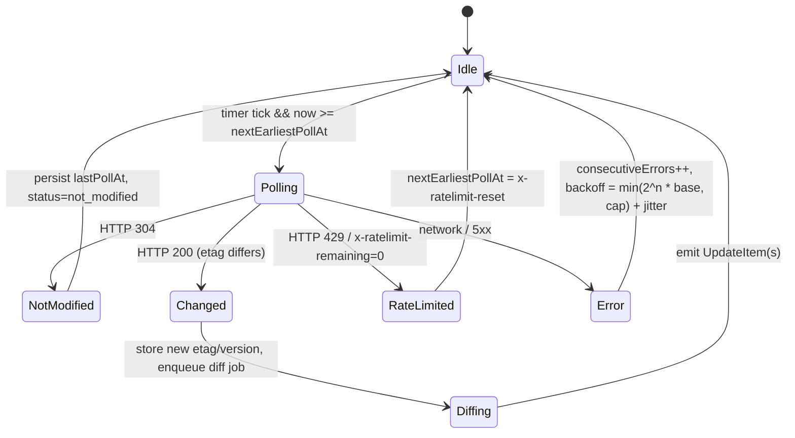
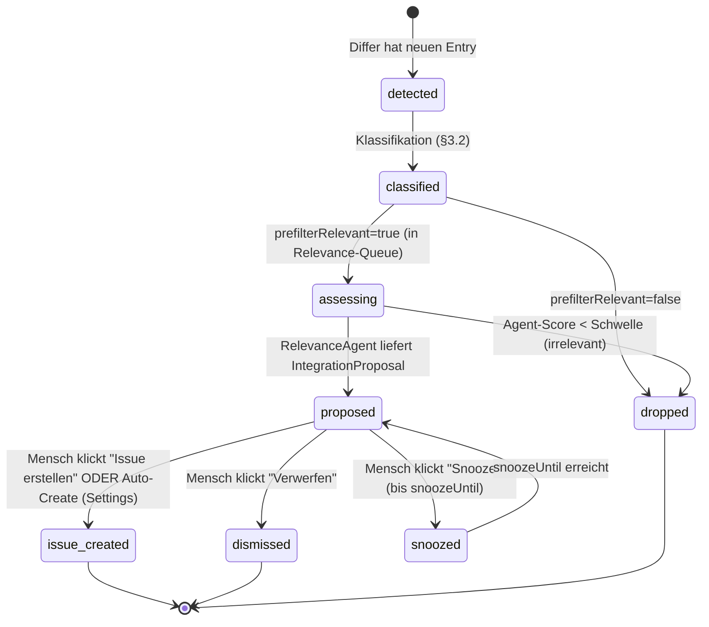
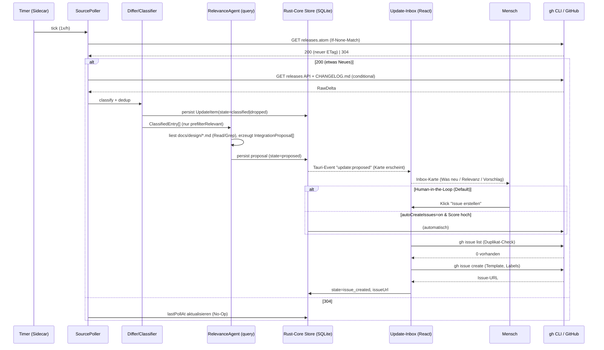

# 05 — Update-Bereich (Update Area)

> Design-Dokument für **mads** — native macOS-Desktop-App (Tauri 2 + React/TS, Rust-Core,
> Node-Sidecar mit dem offiziellen Claude Agent SDK). Stand: 2026-06-19.
> Code/Identifier in Englisch, Fließtext in Deutsch.
>
> **OFFENE FRAGE / OFFENE ENTSCHEIDUNG**-Punkte sind im Text markiert und am Ende gesammelt.

---

## 0. Zusammenfassung & Einordnung in die Gesamtarchitektur

Der **Update-Bereich** ist das Subsystem von mads, das **kontinuierlich überwacht, ob neue
Funktionen/Möglichkeiten von Claude Code** (CLI, Agent SDK, Skills, Hooks, MCP) verfügbar
werden, daraus einen **konkreten Integrations-Vorschlag** ("welche mads-Komponente, Aufwand,
Nutzen") synthetisiert und diesen als **GitHub-Issue ins konfigurierte Ziel-Repo**
(`project.remote = { owner, repo }`, [[01-architecture]] §5.1) einspeist. Sekundär behandelt
der Bereich das **Self-Update der mads-App selbst** (`tauri-plugin-updater`) und das
**Versions-Tracking/Pinning** der genutzten Claude-Code/SDK-Version.

> **Ziel-Repo (konfigurierbar, OE-30):** Das Issue-Ziel ist **nicht** hartkodiert, sondern der
> konfigurierbare `project.remote = { owner, repo }`. Für die mads-eigene Instanz ist dieser
> Wert per Default-Konfiguration auf `Hobbesch/mads` gesetzt (Beispiel/Default, **keine**
> Konstante im Code). In den `gh`-Snippets unten steht `${OWNER}/${REPO}` für genau diesen Wert.

Der Update-Bereich ist bewusst **kein** weiterer Entwicklungs-Stream. Er ist ein
**Read-mostly-Beobachter** mit genau **einer** schreibenden Außenaktion: dem Erstellen eines
GitHub-Issues (idempotent, dedupliziert). Er **respektiert die paix-Invarianten** und
operationalisiert sie für sich selbst:

| paix-Invariante (aus [[_paix-multi-agent-reference]]) | Operationalisierung im Update-Bereich |
|---|---|
| **Only `main` merges** (nur der Integrator landet) | Der Update-Bereich **merged nie**. Er erzeugt nur **Issues** (Vorschläge), keine PRs, keine Commits, keine Merges. Aus dem Issue entsteht später regulär ein Sub-Agent/Worktree, der dem normalen Lifecycle aus [[sidecar-orchestration]] folgt. |
| **Subs never self-merge** | Ein "Integrations-Vorschlag" ist ein Vorschlag — **die Entscheidung trifft der Mensch** (Issue annehmen → Worktree spawnen) oder der Integrator. |
| **Koordination über committete Artefakte** | Vorschläge landen als versioniertes Artefakt (GitHub-Issue) — nicht als Out-of-band-Chat. Versions-Pin liegt in einer committeten Datei (`mads-versions.lock`). |
| **Periodischer Upgrade-Job** (separater, gescheduleter Pfad statt pro-PR) | Das Upgraden der genutzten Claude-Code/SDK-Version ist eine **bewusste, getestete Aktion** über einen separaten Job (§7), nie ein stiller Auto-Bump. Spiegelt exakt den paix-"periodischen Upgrade-Job" für Lockfiles. |
| **`main` is always runnable** | Self-Update von mads selbst lädt nur **signierte, getestete Releases** (§6); ein Upgrade der eingebetteten CC/SDK-Version durchläuft erst die Test-Suite, bevor das `mads-versions.lock` bumpt. |

**Querverweise in die Gesamtarchitektur:**

- [[01-architecture]] — Gesamttopologie (Tauri-Core ↔ Node-Sidecar ↔ N Agenten).
- [[sidecar-orchestration]] — der Sidecar-Pool, der auch den
  Update-Monitor-Worker hostet; das NDJSON-stdio-Protokoll, über das Update-Events ins
  Frontend gelangen.
- [[02-dashboard]] / [[macos-design]] — das macOS-Sidebar/Content/Inspector-Layout, in
  das die **Update-Inbox** als eigene Sidebar-Sektion eingehängt wird.
- [[github-multiagent]] — die `gh`-CLI-Wrapper-Schicht
  (Auth via Keychain-Token), die der Update-Bereich für `gh issue create/list/comment`
  mitbenutzt.
- [[_paix-multi-agent-reference]] — Invarianten (s. Tabelle oben).
- [[claude-code-capabilities]] — die zu überwachenden Capabilities (CLI-Flags, SDK-API,
  Hooks, MCP); zugleich der Wissens-Korpus, den der Relevanz-Agent gegen das Changelog hält.

```
┌──────────────────────────────── mads ────────────────────────────────────────┐
│                                                                               │
│  React/TS Frontend                                                            │
│    └─ Update-Inbox (Sidebar-Sektion + Card-Feed + Inspector-Detail)           │
│         ▲ Tauri-Events  │ Tauri-Commands (accept/dismiss/snooze)              │
│  Rust-Core (tauri)      │                                                     │
│    ├─ update_state Store (SQLite)  ◀── persistiert UpdateItem/Proposal        │
│    ├─ tauri-plugin-updater  ── Self-Update der App (§6)                        │
│    └─ Sidecar-Bridge (NDJSON stdio)                                           │
│         ▲                                                                     │
│  Node-Sidecar                                                                 │
│    └─ UpdateMonitor-Worker (eigener Scheduler im selben Prozess)             │
│         ├─ SourcePoller (ETag/If-Modified-Since, Backoff)   → Fetch          │
│         ├─ Differ (Changelog/Version-Diff, Dedup)          → Diff/Classify   │
│         ├─ RelevanceAgent (ein query() mit mads-Arch-Kontext) → Proposal     │
│         └─ IssueWriter (gh issue create/list/comment)      → Issue           │
└───────────────────────────────────────────────────────────────────────────--┘
```

---

## 1. Zweck, Scope & Abgrenzung

**Zweck.** mads soll sich nicht von der schnellen Entwicklung von Claude Code abhängen
lassen. Neue CLI-Flags, neue SDK-Methoden, neue Hook-Events, neue Permission-Modes oder
MCP-Features erscheinen ~täglich (vgl. [[macos-design]] Teil E: `v2.1.183` am 2026-06-19,
davor `v2.1.181`, `v2.1.179`). Der Update-Bereich macht aus diesem Strom ein **kuratiertes,
mads-spezifisches Backlog**.

**In-Scope:**

1. Polling stabiler Primärquellen (§2).
2. Diffing + Klassifikation + Rauschunterdrückung (§3, §4).
3. LLM-Relevanzbewertung gegen die mads-Architektur-Docs (§4).
4. Konkreter Integrations-Vorschlag + Issue-Entwurf (§4, §5).
5. macOS-UI: Update-Feed/Inbox mit Karten + Aktionen (§3-UI in §8).
6. Idempotente Issue-Erstellung via `gh` (§5).
7. Self-Update von mads via `tauri-plugin-updater` (§6).
8. Versions-Tracking/Pinning + periodischer CC/SDK-Upgrade-Job (§7).

**Out-of-Scope (explizit):**

- Der Update-Bereich **implementiert** die vorgeschlagenen Integrationen nicht selbst.
  Er **schlägt vor** (Issue). Implementierung läuft über den normalen Multi-Agent-Lifecycle.
- Kein automatischer Bump der eingebetteten CC/SDK-Version ohne Test-Gate (§7).
- Kein Posten in fremde Repos. Nur in das konfigurierte `project.remote` (für die mads-eigene Instanz: `Hobbesch/mads`).

---

## 2. Überwachte Quellen & Poll-Strategie

### 2.1 Quellenkatalog (konkret & stabil)

Alle URLs sind in [[macos-design]] Teil E live verifiziert (2026-06-19). Pro Quelle ein
`source_id`, ein bevorzugter Conditional-Header und eine Klassen-Funktion.

| `source_id` | URL | Poll-Methode | Conditional | Rolle |
|---|---|---|---|---|
| `cc_releases_atom` | `https://github.com/anthropics/claude-code/releases.atom` | GET (auth-frei) | **`If-None-Match`** (ETag, `W/"…"`) | **Trigger** — "gibt es etwas Neues?" (kein Token nötig) |
| `cc_releases_api` | `https://api.github.com/repos/anthropics/claude-code/releases` | GET (Token bevorzugt) | `If-None-Match` (304 zählt **nicht** aufs Rate-Limit) | **Detail** — strukturierte Release-Objekte mit `body` |
| `cc_changelog_raw` | `https://raw.githubusercontent.com/anthropics/claude-code/main/CHANGELOG.md` | GET | `If-None-Match` | **Diff-Quelle** — voller Changelog-Text |
| `cc_npm_disttags` | `https://registry.npmjs.org/@anthropic-ai/claude-code?fields=dist-tags` | GET (leicht) | `If-None-Match` / `If-Modified-Since` | **Version-Quelle** — `stable`/`latest`/`next` |
| `sdk_npm_latest` | `https://registry.npmjs.org/@anthropic-ai/claude-agent-sdk/latest` | GET | `If-None-Match` | **SDK-Version** (das, was der Sidecar nutzt) |
| `sdk_releases_api` | `https://api.github.com/repos/anthropics/claude-agent-sdk-typescript/releases/latest` | GET | `If-None-Match` | **SDK-Release-Notes** |
| `local_cc_version` | lokal: `claude --version` bzw. gebündelte Binary-Version | exec | — | **Ist-Stand** (installiert vs. neueste) |

> **Docs-Changelog** (`https://code.claude.com/docs/en/changelog`) wird **aus der
> GitHub-CHANGELOG.md generiert** und hat **kein RSS/Atom** ([[macos-design]] E.1) → wird
> nur als **Menschen-Link** in das Issue gesetzt, **nicht** gepollt. `cc_changelog_raw`
> ist die kanonische Diff-Quelle.

> **OFFENE FRAGE (Quellen-Erweiterung):** Sollen zusätzlich `docs.claude.com`-Release-Notes
> für Skills/MCP-spezifische Ankündigungen gepollt werden (HTML-Scrape mit
> Content-Hash-Diff, da kein Feed)? Default-Vorschlag: **nein** zum Start (Rauschen,
> brüchiges Scraping); GitHub-CHANGELOG.md deckt die API-relevanten Änderungen ab.

### 2.2 Poll-Strategie (Intervall, ETag, Backoff)

**Grundregeln** (folgen [[macos-design]] E.2):

- **Intervall:** Default **1×/Stunde** pro Quelle (`pollIntervalMs = 3_600_000`). Releases
  kommen ~täglich; aggressiver wäre verschwendetes Quota. Konfigurierbar in den Settings.
- **Immer conditional:** Bei jedem Poll den gespeicherten `etag` als `If-None-Match`
  (bzw. `lastModified` als `If-Modified-Since`) mitschicken. **HTTP 304 → No-Op**,
  kein Quota-Verbrauch, kein Diff.
- **Atom zuerst:** Pro Zyklus zuerst `cc_releases_atom` (auth-frei) prüfen. Nur bei
  **HTTP 200** die teureren Detail-Quellen (`cc_releases_api`, `cc_changelog_raw`) ziehen.
- **GitHub-Rate-Limit:** unauth 60 req/h; 304 zählt nicht. Mit gh-Token (aus
  [[github-multiagent]], Keychain) deutlich mehr → Token verwenden, wenn vorhanden.
- **Backoff bei Fehlern:** exponentiell mit Jitter; HTTP 429/`x-ratelimit-remaining: 0`
  → bis `x-ratelimit-reset` warten. Siehe Zustandsmaschine §2.4.

**Conditional-Check (Referenz-Snippet, Sidecar nutzt `fetch` analog):**

```bash
# Trigger-Check — Atom-Feed (auth-frei). Nur bei 200 weiterverarbeiten.
ETAG=$(cat ~/.mads/state/cc_releases_atom.etag 2>/dev/null)
RESP=$(curl -s -D - -o /tmp/cc.atom \
  -H "If-None-Match: ${ETAG}" \
  https://github.com/anthropics/claude-code/releases.atom)
echo "$RESP" | grep -qi '^HTTP/.* 304' && exit 0           # nichts neu, No-Op
echo "$RESP" | grep -i '^etag:' | awk '{print $2}' | tr -d '\r' \
  > ~/.mads/state/cc_releases_atom.etag                    # neuen ETag persistieren
# -> /tmp/cc.atom enthält die neuen Releases; jetzt Detail-Fetch + Diff
```

### 2.3 Persistierter Poll-State (pro Quelle)

```typescript
interface SourceState {
  sourceId: string;            // "cc_releases_atom" | "cc_npm_disttags" | ...
  etag?: string;               // letzter ETag (für If-None-Match)
  lastModified?: string;       // RFC-1123 Datum (für If-Modified-Since)
  lastSeenVersion?: string;    // z.B. "2.1.183" (semver-vergleichbar)
  lastChangelogHash?: string;  // SHA-256 des zuletzt gesehenen Changelog-Texts (Dedup)
  lastPollAt: string;          // ISO-8601
  lastStatus: "ok" | "not_modified" | "rate_limited" | "error";
  consecutiveErrors: number;   // für Backoff
  nextEarliestPollAt: string;  // Backoff-Gate
}
```

Persistenz: SQLite-Tabelle `source_state` im **Rust-Core als einzigem Writer** der Update-DB
(konsistent mit OE-2/OE-27, [[01-architecture]] §5.3); der Sidecar liest/schreibt über
`update.*`-NDJSON-Commands. Siehe §9.

### 2.4 Poll-Zustandsmaschine (pro Quelle)



---

## 3. Verarbeitungs-Pipeline (Fetch → Diff → Classify → Relevance → Proposal → Issue)

```
 SourcePoller        Differ              Classifier         RelevanceAgent       IssueWriter
 (§2)                (§3.1)              (§3.2)             (§4, LLM)            (§5, gh)
   │ HTTP 200          │ neue Sektionen    │ ChangeKind        │ relevance score    │ create/comment
   ▼                   ▼                   ▼                   ▼                    ▼
 RawDelta ──────────► ChangelogEntry[] ─► classified[] ─────► IntegrationProposal ─► GitHub-Issue
                       (dedup via hash)    (drop noise)        (+ draft body)        (idempotent)
```

Jeder Pipeline-Schritt ist **idempotent** und **resümierbar**: zwischengespeicherte Artefakte
(SQLite) erlauben Neustart ohne Doppelarbeit. Ein `UpdateItem` durchläuft eine eigene
Zustandsmaschine (§3.3).

### 3.1 Fetch → Diff

1. **Versions-Diff:** `lastSeenVersion` (gespeichert) vs. neue Version (aus
   `cc_npm_disttags` oder höchstem Release-Tag). Bei einem Sprung über mehrere Versionen
   (z.B. `2.1.179 → 2.1.183`) **alle dazwischenliegenden Releases** sammeln
   (`cc_releases_api?per_page=N` ab letztem bekannten Tag).
2. **Changelog-Diff:** Aus `cc_changelog_raw` die **neuen Sektionen** extrahieren — alles
   zwischen der Überschrift `## <lastSeenVersion>` und dem Kopf der Datei. Pro Eintrag eine
   normalisierte `ChangelogEntry`.
3. **Dedup/Rauschunterdrückung:**
   - Pro `ChangelogEntry` `contentHash = sha256(normalize(text))` bilden. Bekannte Hashes
     (Tabelle `seen_changelog_entries`) → verwerfen. Schützt gegen Re-Emit bei
     Changelog-Reformatierung / re-tagged Releases.
   - `lastChangelogHash` (gesamter sichtbarer Changelog-Kopf) als zweite Stufe: identisch →
     gar kein Diff-Job.

```typescript
interface RawDelta {
  sourceId: string;
  fromVersion?: string;          // lastSeenVersion
  toVersion: string;             // neu erkannte Version
  releases: GitHubRelease[];     // strukturierte Release-Objekte (falls API-Quelle)
  changelogSection: string;      // roher Markdown-Block (neu seit fromVersion)
  fetchedAt: string;
}

interface ChangelogEntry {
  id: string;                    // ulid
  version: string;               // "2.1.183"
  text: string;                  // ein Bullet-Point / eine Zeile, normalisiert
  contentHash: string;          // sha256(normalize(text)) — Dedup-Schlüssel
  rawSourceUrl: string;          // Release/Changelog-Anker
}
```

### 3.2 Klassifikation (regelbasiert, vor dem LLM)

**Vor** dem teuren LLM-Schritt eine **billige, deterministische Vorklassifikation** —
sie filtert Rauschen und vergibt einen groben `ChangeKind` + `surface` (welche
mads-Oberfläche potentiell betroffen).

```typescript
type ChangeKind = "feature" | "breaking" | "bugfix" | "deprecation" | "docs" | "chore";

// Welche mads-Oberfläche eine Änderung berühren könnte
type AffectedSurface = "cli" | "sdk" | "hooks" | "mcp" | "skills"
                     | "permissions" | "session" | "models" | "unknown";

interface ClassifiedEntry extends ChangelogEntry {
  kind: ChangeKind;
  surfaces: AffectedSurface[];
  keywordHits: string[];         // welche Keywords gematcht haben (Erklärbarkeit)
  prefilterRelevant: boolean;    // false => Rauschen, LLM überspringen
}
```

**Klassifikations-Heuristik** (Keyword-Tabellen, aus [[macos-design]] E.3 +
[[claude-code-capabilities]]):

| Signal | Regel |
|---|---|
| `kind=breaking` | Zeile enthält `BREAKING`, `removed`, `renamed`, `no longer`, `dropped support`; oder Major/Minor-Sprung |
| `kind=feature` | `add`, `new`, `introduce`, `support for`, `now you can`, `--<new-flag>` |
| `kind=bugfix` | `fix`, `resolve`, `correct` |
| `kind=deprecation` | `deprecate`, `will be removed` |
| `surfaces` (relevant) | `SDK`, `agent`, `subagent`, `MCP`, `hook`, `permission`, `worktree`, `tool`, `streaming`, `session`, `resume`, `background agent`, `model`, `skill`, `canUseTool`, `stream-json`, `AskUserQuestion`, `partial`, `includePartialMessages` |
| **Rauschen** (`prefilterRelevant=false`) | rein Windows-/Linux-spezifische Fixes ohne API-Bezug, Telemetrie, Docs-Typos, kosmetische TUI-Fixes, Übersetzungs-Strings |

> **Wichtig:** Die Vorklassifikation ist **konservativ** — im Zweifel `prefilterRelevant=true`.
> Der LLM-Relevanz-Agent (§4) ist die eigentliche Instanz, die "betrifft mads konkret?"
> entscheidet. Die Vorklassifikation existiert nur, um offensichtliches Rauschen
> (z.B. "fix typo in German translation") gar nicht erst an den teuren LLM-Schritt zu geben.

### 3.3 `UpdateItem`-Zustandsmaschine

Jeder relevante (oder noch zu prüfende) Eintrag wird ein **`UpdateItem`** mit folgendem
Lebenszyklus:



> **Auto-Create vs. Human-in-the-Loop:** Default ist **Human-in-the-Loop** — ein
> `proposed`-Item erscheint in der Inbox und erst ein Klick erzeugt das Issue. Ein
> Settings-Toggle `autoCreateIssues` (Default **off**) kann `feature`/`breaking`-Items mit
> hohem Score automatisch in Issues überführen (immer dedupliziert, §5). Spiegelt die
> paix-Regel "der Trigger für eine außen-sichtbare Aktion ist eine explizite Anweisung"
> ([[_paix-multi-agent-reference]] §2): Default = explizit, Auto nur als Opt-in.

---

## 4. Relevanzbewertung & Integrations-Vorschlag (LLM-Agent)

### 4.1 Der RelevanceAgent

Der `RelevanceAgent` ist **ein `query()`-Aufruf aus dem Claude Agent SDK** (vgl.
[[claude-code-capabilities]] §9, [[sidecar-orchestration]]) — läuft **im selben
Node-Sidecar**, aber als **kurzlebige, read-only Session** (kein Worktree, keine Branch,
keine Schreib-Tools). Das ist bewusst **kein** Entwicklungs-Agent: er produziert nur Text.

| Aspekt | Wert | Begründung |
|---|---|---|
| `model` | `claude-sonnet-4-6` (Default) | Klassifikations-/Synthese-Task, kein Heavy-Coding; günstiger als Opus. Per Settings auf `claude-opus-4-8` hebbar. |
| `permissionMode` | `plan` | Nur Reads, **keine** Änderungen ([[claude-code-capabilities]] §5.1) — der Agent darf das Repo lesen, aber nichts schreiben. |
| `allowedTools` | `["Read", "Glob", "Grep"]` | Liest mads-Architektur-Docs (`docs/design/*.md`) als Grounding; keine `Bash`/`Edit`/`Write`. |
| `tools` | nur die o.g. (kein `Agent`, kein MCP) | Minimale Angriffsfläche, deterministischer. |
| `outputFormat` | `{ type: 'json_schema', schema: IntegrationProposalSchema }` | **Structured Output** — der Agent liefert validiertes JSON, kein Freitext-Parsing. ([[claude-code-capabilities]] §9.3, CLI-Flag `--json-schema`) |
| `maxTurns` | `8` | harte Decke gegen Ausreißer. |
| `maxBudgetUsd` | `0.25` pro Bewertungs-Batch (konfigurierbar) | Kostendeckel. |

**Grounding (Kontext-Injektion):** Der System-Prompt enthält (a) eine **kompakte
mads-Komponenten-Karte** (siehe §4.2) und (b) verweist auf die `docs/design/*.md`-Dateien,
die der Agent via `Read`/`Grep` selbst nachschlagen darf. Input = die `ClassifiedEntry[]`
eines Versions-Sprungs. Output = ein `IntegrationProposal` pro relevantem Cluster.

> **paix-Bezug:** Die Architektur-Docs sind das **human-curated, committete Artefakt**
> ([[_paix-multi-agent-reference]] §8). Der RelevanceAgent **liest** sie, **schreibt** sie
> nie — exakt die "Agents lesen den Brief, schreiben ihn nicht um"-Regel.

### 4.2 mads-Komponenten-Karte (Routing-Ziel im Vorschlag)

Damit der Vorschlag konkret "welche mads-Komponente" benennt, kennt der Agent eine feste
Enumeration der mads-Komponenten (deckt sich mit den Design-Docs):

```typescript
type MadsComponent =
  | "sidecar/orchestrator"      // Pool, AgentSession, Lifecycle  [[sidecar-orchestration]]
  | "sidecar/permission"        // canUseTool-Routing
  | "sidecar/hooks"             // Hook-Callback-Mapping
  | "sidecar/mcp"               // MCP-Server-Verwaltung pro Agent
  | "sidecar/update-monitor"    // dieses Subsystem selbst
  | "core/tauri"                // Rust-Core, IPC, Updater
  | "core/git-worktree"         // Worktree-Lifecycle  [[_paix-multi-agent-reference]] §4
  | "ui/dashboard"              // Agent-Grid, Status-Ampeln  [[02-dashboard]]
  | "ui/terminal"               // xterm.js-Panels
  | "ui/permission-dialog"      // Permission/AskUserQuestion-UI
  | "ui/update-inbox"           // dieses Subsystem (UI)
  | "github/integration"        // gh-Wrapper, PR/Issue  [[github-multiagent]]
  | "config/versions"           // mads-versions.lock, Pinning  (§7)
  | "unknown";
```

### 4.3 Datenmodell: `IntegrationProposal`

```typescript
interface IntegrationProposal {
  proposalId: string;            // ulid
  updateItemIds: string[];       // welche UpdateItems dieser Vorschlag bündelt
  version: string;               // betroffene CC/SDK-Version, z.B. "2.1.183"
  channel: "stable" | "latest" | "next";

  // Kern der Bewertung
  title: string;                 // prägnant, < 80 Zeichen — wird Issue-Titel
  summary: string;               // 2-4 Sätze: Was ist neu?
  whatChanged: string[];         // gefilterte, mads-relevante Bullet-Points (aus Changelog)
  kind: ChangeKind;

  // Konkrete Integration
  affectedComponents: MadsComponent[];   // welche mads-Komponente(n)
  proposal: string;              // der konkrete nächste Schritt (1 Absatz)
  effort: "trivial" | "small" | "medium" | "large";   // grobe Aufwandsschätzung
  benefit: "low" | "medium" | "high";                  // Nutzen für mads
  relevanceScore: number;        // 0..1 (Agent-Confidence, dass es mads betrifft)
  breaking: boolean;             // erfordert es eine Migration?

  // Provenienz / Links
  sources: { label: string; url: string }[];   // Release-/Changelog-/SDK-Links
  modelUsed: string;             // welches Modell die Bewertung erzeugt hat
  generatedAt: string;           // ISO-8601
}
```

### 4.4 Datenmodell: `UpdateItem` (Persistenz-Einheit)

```typescript
type UpdateItemState =
  | "detected" | "classified" | "assessing"
  | "proposed" | "issue_created" | "dismissed" | "snoozed" | "dropped";

interface UpdateItem {
  itemId: string;                // ulid
  sourceId: string;
  version: string;
  channel: "stable" | "latest" | "next";

  entry: ClassifiedEntry;        // der zugrunde liegende Changelog-Eintrag
  state: UpdateItemState;

  proposal?: IntegrationProposal;   // gesetzt ab state="proposed"
  issueNumber?: number;             // gesetzt ab state="issue_created"
  issueUrl?: string;

  snoozeUntil?: string;             // ISO-8601, nur bei state="snoozed"
  dismissedReason?: string;

  detectedAt: string;
  updatedAt: string;
}
```

### 4.5 RelevanceAgent — Aufruf (Sidecar)

```typescript
import { query } from "@anthropic-ai/claude-agent-sdk";

const SYSTEM_PROMPT = `Du bewertest neue Claude-Code/Agent-SDK-Changelog-Einträge
auf Relevanz für das Projekt "mads" (Tauri 2 + React/TS, Rust-Core, Node-Sidecar mit
dem Claude Agent SDK; Multi-Agent-Dashboard: Main-Integrator + Sub-Agents je eigener
Branch/Worktree). Lies bei Bedarf die Architektur-Docs unter docs/design/*.md.
Für JEDEN relevanten Cluster: nenne die betroffene mads-Komponente, einen KONKRETEN
Integrations-Schritt, grobe Aufwands- und Nutzeneinschätzung. Verwirf Rauschen
(plattform-spezifische Fixes ohne API-Bezug, Docs-Typos, Telemetrie).`;

async function assessRelevance(
  entries: ClassifiedEntry[],
  cwd: string,                        // mads-Repo-Root (read-only)
): Promise<IntegrationProposal[]> {
  const q = query({
    prompt: buildAssessmentPrompt(entries),   // String-Prompt (single-shot reicht)
    options: {
      cwd,
      model: "claude-sonnet-4-6",
      permissionMode: "plan",                 // nur Reads, keine Änderungen
      allowedTools: ["Read", "Glob", "Grep"],
      tools: ["Read", "Glob", "Grep"],
      maxTurns: 8,
      maxBudgetUsd: 0.25,
      systemPrompt: { type: "append", text: SYSTEM_PROMPT },
      outputFormat: { type: "json_schema", schema: IntegrationProposalArraySchema },
    },
  });

  let proposals: IntegrationProposal[] = [];
  for await (const msg of q) {
    if (msg.type === "result" && msg.subtype === "success") {
      proposals = JSON.parse(msg.result);     // schema-validiert
    }
    // result.total_cost_usd / usage -> Cost-HUD (vgl. [[sidecar-orchestration]])
  }
  return proposals;
}
```

> **Fehlerfälle (RelevanceAgent):**
> - **`error_max_budget_usd` / `error_max_turns`** → Item bleibt `assessing`, wird im
>   nächsten Zyklus mit kleinerem Batch erneut versucht (max. 3 Retries, dann `dropped`
>   mit Log + UI-Hinweis "Bewertung fehlgeschlagen").
> - **Schema-Validierung fehlgeschlagen** (Agent liefert kein valides JSON trotz
>   `json_schema`) → Fallback: ein **roher** `UpdateItem` mit `proposal=undefined` wird in
>   die Inbox gestellt, Karte zeigt "Vorschlag konnte nicht generiert werden — manuell
>   prüfen" + Roh-Changelog-Link.
> - **Auth/Subscription-Fehler** → §10.

---

## 5. Automatisierte Issue-Erstellung (`gh issue create`)

### 5.1 Idempotenz / Duplikat-Vermeidung (Pflicht)

**Vor jedem `create` wird nach einem existierenden Issue gesucht** ([[macos-design]] E.4).
Sonst entstehen bei jedem Poll Doppel-Issues.

- Label-Konvention: **`cc-update`** + **`automated`**.
- Versionsmarker **im Titel** (z.B. `… 2.1.183 …`) → maschinell auffindbar.
- Such-Query vor `create`:

```bash
# OWNER/REPO stammen aus project.remote ([[01-architecture]] §5.1); mads-Instanz: Hobbesch/mads
EXISTS=$(gh issue list --repo "${OWNER}/${REPO}" \
  --label "cc-update" --state all --search "in:title ${VERSION}" \
  --json number --jq 'length')
[ "$EXISTS" != "0" ] && { echo "Issue für ${VERSION} existiert bereits"; exit 0; }
```

> **Strategie-Wahl (zwei Modi, konfigurierbar):**
> - **Modus A — ein Issue pro Version** (Default). Klar, aber bei vielen Releases mehr
>   Issues.
> - **Modus B — ein "rolling" Issue pro Minor**, neue Versionen als **Kommentar**
>   (`gh issue comment`) — weniger Issue-Spam ([[macos-design]] E.4).
>
> **OFFENE FRAGE:** Default-Modus A oder B? Vorschlag: **A** für `breaking`/`feature`
> (verdienen eigene Tracking-Issues), **B** (rolling) als Fallback für reine
> Bugfix-Bündel. Hybrid muss im Review bestätigt werden.

### 5.2 Issue-Template

Der Body wird aus dem `IntegrationProposal` gerendert. Labels werden nach `kind` gesetzt.

```bash
VERSION="2.1.183"
TITLE="Claude Code ${VERSION}: ${PROPOSAL_TITLE}"

gh issue create --repo "${OWNER}/${REPO}" \
  --title "$TITLE" \
  --label "cc-update,automated,${KIND_LABEL}" \
  --body "$(cat <<EOF
## Neue Claude-Code/SDK-Version erkannt

- **Version:** ${VERSION} (npm \`${CHANNEL}\`; stable=${STABLE_VERSION})
- **SDK (Sidecar):** @anthropic-ai/claude-agent-sdk ${SDK_VERSION}
- **Art:** ${KIND}   ·   **Aufwand:** ${EFFORT}   ·   **Nutzen:** ${BENEFIT}
- **Betroffene mads-Komponente(n):** ${AFFECTED_COMPONENTS}

### Was ist neu (gefiltert, mads-relevant)
${WHAT_CHANGED_BULLETS}

### Integrations-Vorschlag (auto-generiert, zu prüfen)
${PROPOSAL_TEXT}

### Quellen
${SOURCE_LINKS}

---
> Automatisch erstellt vom mads Update-Monitor am ${DATE} (Modell: ${MODEL_USED}).
> relevanceScore=${SCORE}. Dieser Vorschlag ist ein Vorschlag — Implementierung läuft
> über den normalen Worktree/PR-Lifecycle; **nur der Integrator merged**.
EOF
)"
```

**Label-Mapping `kind` → GitHub-Label:**

| `kind` | zusätzliches Label | Auto-Create-Default |
|---|---|---|
| `breaking` | `breaking-change`, `priority:high` | ja (wenn `autoCreateIssues`) |
| `feature` | `enhancement` | ja (wenn `autoCreateIssues` & Score ≥ 0.6) |
| `deprecation` | `tech-debt` | nein (nur Inbox) |
| `bugfix` | — | nein (nur Inbox, ggf. rolling-Comment) |
| `docs`/`chore` | — | wird i.d.R. vorher als Rauschen gedroppt |

### 5.3 IssueWriter-Implementierung (Sidecar, via `gh`)

mads spricht `gh` als Childprozess (Auth "kostenlos" via Keychain-Token,
[[github-multiagent]] §1). cwd des `gh`-Aufrufs ist der **Main-Checkout** (nicht ein
Worktree) — der Update-Bereich berührt keine Branches.

```typescript
import { execa } from "execa";

async function createIssueIfAbsent(
  p: IntegrationProposal,
  remote: { owner: string; repo: string },   // project.remote ([[01-architecture]] §5.1); mads-Instanz: { owner: "Hobbesch", repo: "mads" }
): Promise<IssueResult> {
  const { owner, repo } = remote;
  // 1) Duplikat-Check
  const { stdout: existing } = await execa("gh", [
    "issue", "list", "--repo", `${owner}/${repo}`,   // project.remote (für mads-Instanz: Hobbesch/mads)
    "--label", "cc-update", "--state", "all",
    "--search", `in:title ${p.version}`,
    "--json", "number", "--jq", "length",
  ]);
  if (existing.trim() !== "0") {
    return { skipped: true, reason: "duplicate", version: p.version };
  }

  // 2) Create
  const labels = ["cc-update", "automated", ...labelsForKind(p.kind)].join(",");
  const { stdout } = await execa("gh", [
    "issue", "create", "--repo", `${owner}/${repo}`,   // project.remote (für mads-Instanz: Hobbesch/mads)
    "--title", `Claude Code ${p.version}: ${p.title}`,
    "--label", labels,
    "--body", renderIssueBody(p),
  ]);
  // gh gibt die Issue-URL auf stdout; Nummer daraus parsen
  return { created: true, issueUrl: stdout.trim(), version: p.version };
}
```

> **Fehlerfälle (IssueWriter):**
> - **`gh` nicht authentifiziert** (Exit 4) → UpdateItem bleibt `proposed`; Inbox-Karte
>   zeigt "GitHub-Login erforderlich" + Button, der den `gh auth login`-Flow aus
>   [[github-multiagent]] anstößt.
> - **Label existiert nicht im Repo** → IssueWriter legt fehlende Labels beim ersten Lauf
>   an (`gh label create cc-update --color ...`), idempotent.
> - **Rate-Limit / Netzwerk** → Retry mit Backoff; bei dauerhaftem Fehler Item bleibt
>   `proposed`, Toast im UI.
> - **Race (zwei mads-Instanzen)** → der Duplikat-Check + ein eindeutiger
>   Versionsmarker-Titel macht ein Doppel-Issue unwahrscheinlich; bei Kollision gewinnt
>   das zuerst erstellte, das zweite `create` wird beim nächsten Such-Check als Duplikat
>   erkannt. **OFFENE FRAGE:** Lokales Advisory-Lock nötig? Für Single-User-Desktop-App
>   vermutlich nein.

### 5.4 Sequenzdiagramm: Detektion → Issue



---

## 6. Self-Update der mads-App (`tauri-plugin-updater`)

Separater, **verwandter** Punkt: nicht das Beobachten von Claude Code, sondern das
**Aktualisieren von mads selbst**. Verifiziert gegen die aktuelle Tauri-2-Updater-Doku.

### 6.1 Mechanismus

- Plugin **`tauri-plugin-updater`** (kein Built-in-Flag mehr in v2;
  [[tauri2-stack]] §"Updater"). Verlangt **Rust ≥ 1.77.2**.
- **Signierte Update-Artefakte** mit einem **eigenen Updater-Keypair**, **zusätzlich** zum
  Apple-Codesigning/Notarization ([[tauri2-stack]] §7). Zwei getrennte Signing-Welten:
  1. **Apple Developer ID** (Gatekeeper/Notarization) — für die Installation überhaupt.
  2. **Tauri-Updater-Keypair** (minisign) — für die Authentizität des Update-Pakets.

**Schlüssel generieren** (einmalig, privater Key NIE ins Repo):

```bash
npm run tauri signer generate -- -w ~/.tauri/mads.key
# erzeugt ~/.tauri/mads.key (privat, geheim halten!) und mads.key.pub (public)
```

**`tauri.conf.json`** (Public-Key + Endpoints):

```jsonc
{
  "bundle": {
    "createUpdaterArtifacts": true        // baut Update-Artefakte (.app.tar.gz + .sig)
  },
  "plugins": {
    "updater": {
      "pubkey": "<INHALT VON mads.key.pub>",   // KEIN Pfad — der Key-Inhalt selbst
      "endpoints": [
        // Self-Update-Quelle der mads-App selbst = das mads-Release-Repo (Default-Konfig Hobbesch/mads)
        "https://github.com/Hobbesch/mads/releases/latest/download/latest.json"
      ]
    }
  }
}
```

**Rust-Builder:**

```rust
fn main() {
    tauri::Builder::default()
        .plugin(tauri_plugin_updater::Builder::new().build())
        .plugin(tauri_plugin_process::init())   // für relaunch()
        // ...
        ;
}
```

### 6.2 `latest.json` (Update-Manifest, signiert)

Wird in der mads-Release-CI erzeugt und ans GitHub-Release angehängt. Die `signature` ist
die minisign-Signatur des jeweiligen Artefakts (mit dem **privaten** Updater-Key in der CI,
als Secret).

```json
{
  "version": "0.4.0",
  "notes": "Update-Inbox: rolling-Issue-Modus, schnelleres Polling.",
  "pub_date": "2026-06-19T10:00:00Z",
  "platforms": {
    "darwin-aarch64": {
      "signature": "<minisign-Signatur des .app.tar.gz>",
      "url": "https://github.com/Hobbesch/mads/releases/download/v0.4.0/mads_0.4.0_aarch64.app.tar.gz"
    },
    "darwin-x86_64": {
      "signature": "<...>",
      "url": "https://github.com/Hobbesch/mads/releases/download/v0.4.0/mads_0.4.0_x64.app.tar.gz"
    }
  }
}
```

> mads ist macOS-only → nur `darwin-aarch64` (Apple Silicon) und optional `darwin-x86_64`
> (Intel). **OFFENE FRAGE:** Universal-Binary (eine darwin-Plattform) vs. zwei getrennte
> Artefakte — abhängig von der Build-Strategie in [[tauri2-stack]] §7 (Universal-`.app`
> empfohlen, dann reicht ein `darwin-*`-Eintrag pro Arch oder ein Universal-Eintrag).

### 6.3 JS-API: Check & Install (mit Fortschritt)

```ts
import { check } from "@tauri-apps/plugin-updater";
import { relaunch } from "@tauri-apps/plugin-process";

async function checkForMadsUpdate(onProgress: (p: UpdateProgress) => void) {
  const update = await check();          // fragt endpoints; validiert Signatur
  if (!update?.available) return { upToDate: true };

  // UI: "Update auf <version> verfügbar" mit Release-Notes (update.body) anzeigen,
  // erst nach User-Bestätigung herunterladen (kein silent auto-install).
  let downloaded = 0, contentLength = 0;
  await update.downloadAndInstall((event) => {
    switch (event.event) {
      case "Started":  contentLength = event.data.contentLength ?? 0; break;
      case "Progress": downloaded += event.data.chunkLength;
                       onProgress({ downloaded, contentLength }); break;
      case "Finished": onProgress({ downloaded, contentLength, done: true }); break;
    }
  });
  await relaunch();                      // App neu starten in neuer Version
  return { installed: true, version: update.version };
}
```

### 6.4 UX & Policy

- **Check-Intervall:** beim App-Start + 1×/Tag (separater, leichter Timer als die
  CC-Quellen-Polls). Manueller "Auf Updates prüfen"-Menüpunkt unter dem App-Menü
  ([[macos-design]] A.9).
- **Kein Silent-Auto-Install.** macOS-Konvention: Nutzer entscheidet. Update-Banner /
  Sheet mit Release-Notes (`update.body`) + Buttons "Jetzt aktualisieren" / "Später"
  (HIG: Default-Button rechts, Akzentfarbe; [[macos-design]] C.5).
- **Reduced-State-Sicherheit:** Wenn Agenten laufen, vor `relaunch()` warnen ("3 Agenten
  aktiv — wirklich neu starten?") und idealerweise die Sessions persistieren
  (`sessionId`/`resume`, [[claude-code-capabilities]] §9) für Reconnect nach Neustart.
- **Sidecar-Caveat:** Der gebündelte Node-Sidecar (`externalBin`) braucht **Hardened
  Runtime + Entitlements** (`com.apple.security.cs.allow-jit`,
  `allow-unsigned-executable-memory`), sonst scheitert Notarization (GitHub-Issue #11992,
  [[tauri2-stack]] §7) — gilt für die App selbst, ist aber bei jedem Self-Update-Artefakt
  erneut relevant. **Früh in signierter CI testen.**

---

## 7. Versions-Tracking & Pinning (eingebettete CC/SDK-Version)

### 7.1 Warum gepinnt?

Das TS-SDK **bündelt ein natives Claude-Code-Binary** als optionale Dependency
([[claude-code-capabilities]] §1/§9.1). Welche CC/SDK-Version mads tatsächlich fährt, ist
damit eine **Eigenschaft des mads-Builds**, nicht eine separat installierte Version. Ein
unkontrollierter Bump kann das stream-json-Event-Schema, Flags oder Permission-Semantik
verändern ([[claude-code-capabilities]] §3/§12 warnt explizit vor Schema-Drift).

→ Das Upgraden der eingebetteten Version ist eine **bewusste, getestete Aktion** —
exakt die paix-"periodischer Upgrade-Job"-Regel ([[_paix-multi-agent-reference]] §9):
*"Frozen-CI heißt nicht nie upgraden. Ein separater, gescheduleter Job löst neu auf, lässt
die volle Test-Suite laufen, öffnet einen PR."*

### 7.2 `mads-versions.lock` (committetes Artefakt)

Eine committete Datei dokumentiert die **tatsächlich genutzten** Versionen — Single-Source
für "was läuft" vs. "was ist neu":

```json
{
  "claudeAgentSdk": "0.3.183",
  "bundledClaudeCodeBinary": "2.1.183",
  "ghCli": "2.95.0",
  "channel": "latest",
  "pinnedAt": "2026-06-19",
  "lastUpgradePr": "https://github.com/Hobbesch/mads/pull/57",
  "notes": "Auf latest gepinnt; nächster Upgrade-Review geplant."
}
```

Der `local_cc_version`-Poll (§2.1) vergleicht **die im Build eingebettete** Version (aus
`mads-versions.lock` bzw. `claude --version` der gebündelten Binary) gegen die neueste
veröffentlichte. **Differenz** = ein eigenes `UpdateItem` der Art "neue gebündelte
SDK/Binary-Version verfügbar" mit `affectedComponents: ["config/versions"]`.

### 7.3 Periodischer Upgrade-Job (separat vom pro-PR-Pfad)

```mermaid
flowchart TD
    A[Geschedulter Upgrade-Job<br/>z.B. wöchentlich] --> B{neue SDK/Binary-Version?}
    B -- nein --> Z[No-Op]
    B -- ja --> C[Worktree feat/upgrade-sdk<br/>off origin/main]
    C --> D[package.json bump<br/>npm install + lockfile]
    D --> E[Full Test-Suite<br/>+ smoke: query() init/result parse]
    E -- rot --> F[Issue 'SDK-Upgrade rot':<br/>Schema-/Flag-Drift untersuchen]
    E -- grün --> G[mads-versions.lock bumpen]
    G --> H[PR gegen main, Label 'sdk-upgrade']
    H --> I[Integrator reviewt & merged<br/> nur der Integrator merged]
```

- **Smoke-Test** (Pflicht im Upgrade-Job): einen Mini-`query()` gegen ein Dummy-Repo
  fahren, `system/init`- und `result`-Event **defensiv parsen** und gegen die erwarteten
  Shapes prüfen ([[claude-code-capabilities]] §3/§12: Schema ist nicht erschöpfend
  dokumentiert → Drift-Erkennung gehört in den Upgrade-Gate).
- **Determinismus:** committetes `package-lock.json`, CI mit `npm ci` (frozen install,
  [[_paix-multi-agent-reference]] §9). Ein SDK-Bump ist ein **geteilter Datei-Edit**
  (`package.json` + Lockfile) → folgt dem Shared-File-Protokoll: **zuerst landen** (winziger
  PR) oder Single-Owner.
- Der Job läuft **nicht** im pro-PR-Pfad → der reguläre Multi-Agent-Betrieb bleibt
  deterministisch.

> **Verhältnis Update-Monitor ↔ Upgrade-Job:** Der Update-Monitor (§2-5) **erkennt** und
> **schlägt vor** (Issue). Der Upgrade-Job (§7.3) **führt** den Versions-Bump **getestet
> aus** (PR). Beide sind getrennt: Erkennen ≠ Anwenden. Das ist die Trennung
> "Vorschlag (Sub) vs. Verfügung (Integrator)" auf die Versionspflege angewandt.

> **OFFENE FRAGE:** Wird der Upgrade-Job **in-app** (mads-eigener Scheduler triggert einen
> Worktree-Agenten) oder **als GitHub-Action** (Cron) realisiert? In-app passt zur
> mads-Philosophie (alles im Dashboard sichtbar), GitHub-Action ist robuster gegen
> "Laptop zu". Vorschlag: **GitHub-Action als Default** für den getesteten PR-Pfad,
> in-app-Trigger als Komfort-Button. Review klärt.

---

## 8. UI im Dashboard (macOS-Stil): Update-Inbox

Folgt dem Sidebar/Content/Inspector-Muster und den Material-/A11y-Regeln aus
[[macos-design]] (Teil A/C/D).

### 8.1 Platzierung & Navigation

- **Sidebar-Sektion `Updates`** (eigenes Item unter `Agents`, `Worktrees`, `Activity`;
  [[macos-design]] A.2). Material: `NSVisualEffectMaterial::Sidebar`.
- **Badge** am Sidebar-Item = Anzahl `proposed`-Items, die noch keine Aktion erfahren
  haben (analog "Needs attention", [[macos-design]] C.2). Bei 0 kein Badge.
- Klick → Content-Bereich zeigt den **Card-Feed**; Klick auf eine Karte → **Inspector**
  (rechte Spalte) mit Volldetail.

```
┌──────────────────────────────────────────────────────────────────────────┐
│ ●●●  Updates                                   [Filter ▾] [Auf Updates prüfen]│
├───────────────┬───────────────────────────────────────┬────────────────────┤
│ SIDEBAR       │  CONTENT: Update-Feed (Karten)         │ INSPECTOR (Detail)  │
│ ▸ Agents      │ ┌───────────────────────────────────┐ │  Claude Code 2.1.183│
│ ▸ Worktrees   │ │ ● Feature · 2.1.183   [Aufwand: S]│ │  ───────────────────│
│ ▸ Activity    │ │ Neues SDK: q.rewindFiles()        │ │  Was ist neu:       │
│ ▸ Updates (2) │ │ → sidecar/orchestrator            │ │  • File-Checkpoint…│
│ ▸ Settings    │ │ Vorschlag: Rewind-Button pro Agent│ │                     │
│               │ │ [Issue erstellen][Snooze][✕]      │ │  Vorschlag:         │
│               │ └───────────────────────────────────┘ │  Inspector-Action…  │
│               │ ┌───────────────────────────────────┐ │  ───────────────────│
│               │ │ ▲ Breaking · 2.1.183  [Nutzen: H] │ │  Quellen:           │
│               │ │ permissionMode 'auto' GA          │ │  • Release v2.1.183 │
│               │ │ [Issue erstellen][Snooze][✕]      │ │  • CHANGELOG        │
│               │ └───────────────────────────────────┘ │  [Issue erstellen]  │
└───────────────┴───────────────────────────────────────┴────────────────────┘
```

### 8.2 Update-Karte (`UpdateCard`)

Jede Karte rendert ein `UpdateItem` mit `state ∈ {proposed, snoozed}`:

| Element | Inhalt | HIG-Detail ([[macos-design]]) |
|---|---|---|
| **Kind-Indikator** | Farbe **+ Icon + Label** (nie Farbe allein) | A11y "Differentiate Without Color" (D) |
| Titel | `proposal.title` | Headline-Textstil |
| Quelle/Version | `version` + `channel`-Badge | Caption, sekundär |
| Relevanz | `relevanceScore` als kleiner Indikator + `benefit`/`effort`-Chips | dezent |
| Vorschlag (Kurz) | erster Satz von `proposal.proposal` + Ziel-Komponente | Body, 1-2 Zeilen, Rest im Inspector |
| Aktionen | **Issue erstellen** · **Snooze ▾** · **Verwerfen (✕)** | bordlose Symbol-Buttons + Tooltip |

**Kind → Farbsemantik** (an [[macos-design]] C.1 angelehnt):

| `kind` | Farbe | Icon (Lucide-Analog) |
|---|---|---|
| `feature` | Akzent-Blau | `sparkles` / `plus-circle` |
| `breaking` | Rot/Warn | `alert-triangle` |
| `deprecation` | Gelb/Orange | `clock` |
| `bugfix` | Grau | `bug` |

### 8.3 Aktionen (Tauri-Commands)

| Aktion | Tauri-Command | Effekt | Zustand danach |
|---|---|---|---|
| **Issue erstellen** | `update_create_issue(itemId)` | IssueWriter (§5), Duplikat-Check → `gh issue create` | `issue_created` (Karte verschwindet aus Feed, erscheint in "Erledigt"-Filter mit Issue-Link) |
| **Verwerfen** | `update_dismiss(itemId, reason?)` | Item ausblenden, Entry-Hash bleibt in `seen` (kein Re-Emit) | `dismissed` |
| **Snooze** | `update_snooze(itemId, until)` | Karte bis `snoozeUntil` ausblenden; Re-Emit danach | `snoozed` → später `proposed` |
| **Auf Updates prüfen** | `update_poll_now()` | manueller Poll aller Quellen (überspringt Backoff-Gate, respektiert ETag) | — |
| **Issue öffnen** | (Frontend, kein Command) | `open` der `issueUrl` extern | — |

**Snooze-Optionen** (Dropdown): `1 Tag`, `1 Woche`, `bis nächste Major/Minor`.

> Live-Aktualisierung: Der Sidecar emittiert bei neuem `proposed`-Item ein
> **Tauri-Event** `update:proposed`; das Frontend prependet die Karte und zeigt eine
> **dezente native Notification** ([[macos-design]] B.3) **nur** bei `kind ∈
> {breaking, feature}` mit hohem Score (Anti-Noise/Coalescing wie C.2: "2 neue
> Update-Vorschläge" statt N Pings).

### 8.4 Settings (Update-Bereich)

| Setting | Typ | Default | Wirkung |
|---|---|---|---|
| `pollIntervalMs` | number | `3_600_000` | Poll-Intervall pro Quelle |
| `channel` | `stable\|latest\|next` | `latest` | welcher npm-dist-tag als "neueste" gilt |
| `autoCreateIssues` | bool | `false` | Auto-Issue für hoch-bewertete feature/breaking |
| `autoCreateMinScore` | number | `0.6` | Schwelle für Auto-Create |
| `issueMode` | `per-version\|rolling` | `per-version` | §5.1 |
| `relevanceModel` | model-id | `claude-sonnet-4-6` | RelevanceAgent-Modell |
| `notifyOn` | enum[] | `[breaking, feature]` | wann native Notification |
| `madsSelfUpdateCheck` | `startup-daily\|manual` | `startup-daily` | §6.4 |

---

## 9. Persistenz, Prozess-Hosting & NDJSON-Nachrichten

### 9.1 Wo läuft der Monitor?

Der `UpdateMonitor`-Worker läuft **im bestehenden Node-Sidecar** ([[sidecar-orchestration]]),
als eigener Scheduler neben dem Agenten-Pool — **kein** zusätzlicher Prozess. Er teilt sich
den einen stdio-NDJSON-Kanal zum Rust-Core.

> **ENTSCHIEDEN (Persistenz-Ownership, OE-27):** Der **Rust-Core besitzt die Update-DB**
> (`source_state`, `update_items`, `seen_changelog_entries`) als **einziger Writer** —
> konsistent mit OE-2 ([[01-architecture]] §5.3: die Update-DB gehört dem Core, ein Writer),
> überlebt Sidecar-Neustarts. Der Sidecar liest/schreibt über `update.*`-NDJSON-Commands. Die
> dadurch etwas chattigere Sidecar-Logik wird bewusst in Kauf genommen.

### 9.2 NDJSON-Nachrichten (Sidecar ↔ Core), Update-Subset

Folgt dem Message-Schema aus [[sidecar-orchestration]] (`type`-getaggte Union).

```typescript
// Sidecar -> Host (Core)
type UpdateSidecarMessage =
  | { type: "update.itemDetected"; item: UpdateItem }
  | { type: "update.itemProposed"; item: UpdateItem; proposal: IntegrationProposal }
  | { type: "update.pollStatus"; sourceId: string; status: SourceState["lastStatus"] }
  | { type: "update.issueCreated"; itemId: string; issueUrl: string; issueNumber: number }
  | { type: "update.error"; scope: "poll"|"assess"|"issue"; sourceId?: string; message: string };

// Host (Core) -> Sidecar
type UpdateHostMessage =
  | { type: "update.pollNow"; sourceIds?: string[] }   // manueller Poll
  | { type: "update.createIssue"; itemId: string }
  | { type: "update.dismiss"; itemId: string; reason?: string }
  | { type: "update.snooze"; itemId: string; until: string }
  | { type: "update.setConfig"; config: Partial<UpdateConfig> };
```

---

## 10. Auth, Sicherheit & Fehlerfälle (gesammelt)

| Fall | Erkennung | Verhalten |
|---|---|---|
| GitHub-Rate-Limit (Polling) | `x-ratelimit-remaining: 0` | bis `x-ratelimit-reset` warten; Atom-Feed (auth-frei) als Fallback |
| `gh` nicht eingeloggt | Exit 4 | Issue-Erstellung pausiert; UI-Hinweis + Login-Trigger ([[github-multiagent]]) |
| RelevanceAgent über Budget/Turns | `result.subtype=error_max_*` | kleinerer Batch-Retry (max 3), dann `dropped` + Log |
| RelevanceAgent kein valides JSON | Schema-Validation-Fehler | Roh-Item in Inbox ("manuell prüfen") |
| Subscription-/Auth-Lizenz | — | RelevanceAgent läuft mit der **Nutzer-eigenen** Auth (kein zusätzlicher Key); **Lizenz-Caveat** aus [[claude-code-capabilities]] §10.2 (Subscription-Login für angebotenes Produkt) gilt für mads gesamt — **vor Release rechtlich klären** |
| Self-Update-Signatur ungültig | Plugin lehnt ab | kein Install; Fehler-Toast; manuell prüfen |
| stream-json-Schema-Drift nach SDK-Bump | Smoke-Test im Upgrade-Job (§7.3) | Upgrade-PR bleibt rot → Issue "Schema-Drift untersuchen" |
| Doppel-Issue-Race | Duplikat-Check (§5.1) | zweites `create` wird als Duplikat erkannt |

**Sicherheits-Prinzipien:**

- Der RelevanceAgent läuft **read-only** (`permissionMode: "plan"`, nur `Read/Glob/Grep`)
  — kein Schreibzugriff auf das Repo, keine `Bash`, kein MCP. Selbst bei Prompt-Injection
  aus einem fremden Changelog-Text kann er **nichts** mutieren.
- Der Update-Bereich hat **genau eine** schreibende Außenwirkung: `gh issue create`
  (+ optional `gh issue comment`/`gh label create`). **Keine** Commits, PRs, Merges.
- Updater nutzt **Signatur-Validierung** (minisign) — kein Install ohne gültige Signatur.

---

## 11. Offene Fragen (für den Review)

1. **Quellen-Erweiterung (§2.1):** Soll `docs.claude.com`-Release-Notes per HTML-Hash-Diff
   zusätzlich gepollt werden (kein Feed)? Default-Vorschlag: nein.
2. **Issue-Modus (§5.1):** Default `per-version` (Modus A) oder `rolling` (Modus B)?
   Vorschlag: A für breaking/feature, B (rolling-Comment) für Bugfix-Bündel — Hybrid
   bestätigen.
3. **Self-Update-Artefakte (§6.2):** Universal-`.app` (ein darwin-Eintrag) vs. getrennte
   `darwin-aarch64`/`darwin-x86_64`-Artefakte — abhängig von der Build-Strategie in
   [[tauri2-stack]].
4. **Upgrade-Job-Hosting (§7.3):** In-app-Scheduler vs. GitHub-Action-Cron für den
   getesteten SDK/Binary-Bump-PR? Vorschlag: GitHub-Action als Default, in-app als Komfort.
5. **Persistenz-Ownership (§9.1):** Rust-Core-besitzt-DB (ein Writer, via NDJSON) vs.
   Sidecar-eigene DB? Vorschlag: Rust-Core besitzt die DB.
6. **Doppel-Issue-Race (§5.3):** Lokales Advisory-Lock nötig, oder reicht der
   Duplikat-Check für die Single-User-Desktop-Annahme?
7. **Auto-Create-Policy (§3.3/§8.4):** Soll `autoCreateIssues` jemals Default-on sein, oder
   bleibt Human-in-the-Loop dauerhaft Pflicht (strengere Auslegung der paix-"explizite
   Anweisung"-Regel)?
8. **Lizenz-Caveat (§10):** Subscription-Auth für die RelevanceAgent-Nutzung im Rahmen
   eines distribuierten Produkts — juristisch vor Release zu klären
   ([[claude-code-capabilities]] §10.2).
