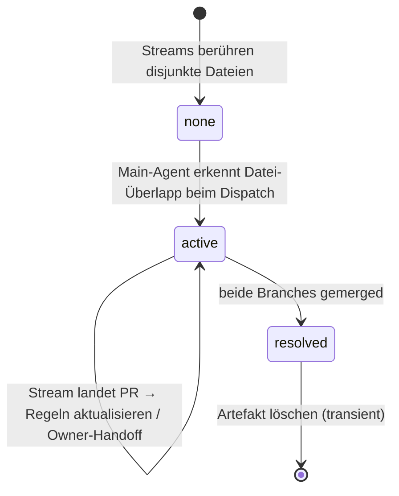
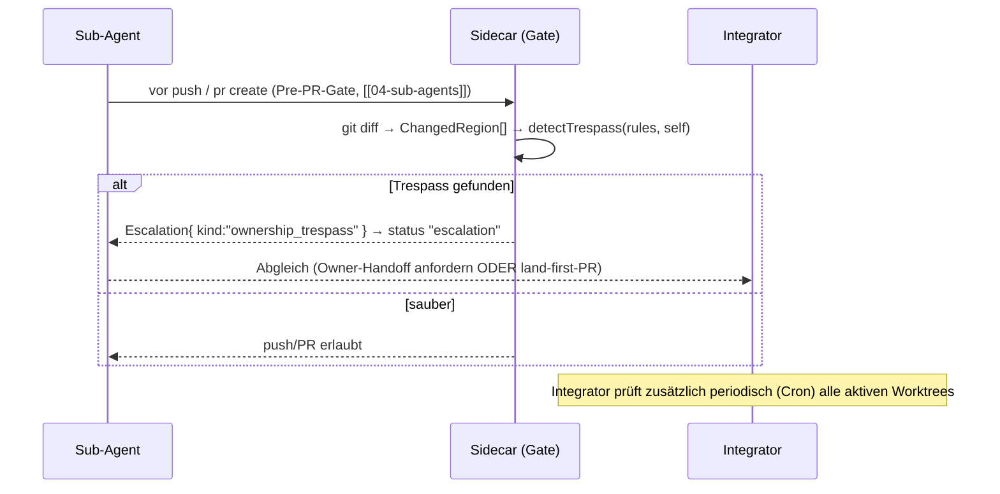

# 06 — Region-Ownership & Koordination (mads)

> Status: Design, implementierungsreif. Stand: 2026-06-19.
> Sprache: Deutsch (Code/Identifier englisch).
> Quellen: [[_paix-multi-agent-reference]] §6 (Konfliktvermeidung by Design) und
> [[_paix-ownership-reference]] (das reale `mail-parallel-ownership.md`-Artefakt).

## 0. Zusammenfassung & Einordnung

Dieses Dokument schließt eine Lücke, die [[01-architecture]] §5.1 offen ließ
(`Task.ownedFiles: string[]` war **datei-grob**; OFFENE FRAGE OE-22 / Gap
„Ownership-Map-Format undefiniert"). Es führt **Region-Ownership** ein: Ownership auf
**Sub-Datei-Ebene** (Funktionen/Symbole, Regionen, Glob-Pfade), maschinenlesbar, mit einem
**Trespass-Gate**, das mechanisch erkennt, wenn ein Sub-Agent eine Region editiert, die einem
**anderen** Stream gehört — und das als **Eskalation** (`ownership_trespass`) sichtbar macht,
**bevor** daraus ein harter Merge-Konflikt wird.

Damit hebt mads das paix-Koordinations-Artefakt von einem **narrativen** Dokument auf eine
**mechanisch erzwingbare** Eigenschaft — exakt mads' Leitlinie: paix-Disziplin → erzwungene,
im UI sichtbare Invariante.

**Die Kernregel (der eigentliche Mehrwert):**

> Dieselbe Datei + **verschiedene** Symbole ⇒ **kein** Konflikt (erlaubt).
> Dieselbe Datei + **fremdes** Symbol/Pattern/ganze fremde Datei ⇒ **Trespass** (Eskalation).

| Dokument | Beziehung |
|---|---|
| [[01-architecture]] | Datenmodell-Erweiterung (`OwnershipRule`, `CoordinationArtifact`), `EscalationKind: "ownership_trespass"` |
| [[03-main-agent]] | Der Integrator **erzeugt & pflegt** das Koordinations-Artefakt und **erzwingt** das Trespass-Gate |
| [[04-sub-agents]] | Der Sub-Agent **liest** seine Regionen, **scopt** Edits, **self-checkt** vor PR |
| [[02-dashboard]] | `ownership_trespass` erscheint als Eskalation + optionales Koordinations-Panel |

Typen: `shared/protocol.ts` (`OwnershipRule`, `OwnershipKind`, `CoordinationArtifact`,
`ChangedRegion`). Logik: `shared/ownership.ts` (`detectTrespass`, `pathMatches`).

---

## 1. Das Problem: datei-grobes Ownership reicht nicht

Der dokumentierte Fehler-Fall ([[_paix-multi-agent-reference]] §6): zwei Branches editieren
dasselbe geteilte Modul → stale base + Datei-Überlapp → harter, rot-CI Merge. Die naive
Abhilfe „jede Datei gehört genau einem Stream" (CODEOWNERS) ist oft **zu grob**: im realen
paix-Fall mussten **beide** Streams `mail.py` und `mail.html` anfassen — aber in
**verschiedenen Funktionen/Regionen**. Datei-Ownership hätte die Parallelität unnötig
serialisiert; **keine** Koordination hätte einen Konflikt riskiert.

Die Lösung von paix: Ownership **pro Region** vergeben (Funktion, CSS-Selektor-Block,
Route-Bereich), Anker = **Symbol-/Dateiname, nicht Zeile** (Zeilen driften beim Editieren).
mads macht genau dieses Modell maschinenlesbar und prüfbar.

---

## 2. Das Ownership-Modell

### 2.1 Drei Konfliktvermeidungs-Klassen (`OwnershipKind`)

| Klasse | Bedeutung | Regel |
|---|---|---|
| **`exclusive`** | Gehört einem Stream allein — ganze Datei (`symbols` leer) oder benannte Symbole | Nur der Owner editiert. Andere Streams: nie anfassen. |
| **`shared_seam`** | Geteilte Region (beide *könnten* hier editieren), **genau einem** Owner zugewiesen | Der Nicht-Owner fasst die Naht **nicht** an; braucht er eine Änderung, fordert er sie an oder wartet. |
| **`land_first`** | Unvermeidbarer geteilter Edit | **Nicht** im Feature-Branch ändern → als *winziger eigenständiger* PR **zuerst auf `main`** ([[_paix-multi-agent-reference]] §6, Option A), dann rebasen beide. |

### 2.2 Maschinenlesbar (`shared/protocol.ts`)

```typescript
type OwnershipKind = "exclusive" | "shared_seam" | "land_first";

interface OwnershipRule {
  id: string;
  path: string;                 // Datei oder Glob: "src/mail/pst/**" | "src/mail/mail.py"
  symbols?: string[];           // Funktions-/Symbol-Anker (bevorzugt vor lineHint)
  pattern?: string;             // Regex-Heuristik (z.B. "is_pst"-Branches)
  lineHint?: [number, number];  // optional, DRIFTET, nur informativ fürs UI
  ownerAgentId?: string;        // Single-Owner-Stream (undefined = frei)
  ownerBranch?: string;
  kind: OwnershipKind;
  note?: string;
}

interface CoordinationArtifact {
  id: string;
  projectId: string;
  path: string;                 // committet unter docs/coordination/<name>.md (transient)
  streams: string[];            // teilnehmende agentIds/branches
  baseCommit: string;           // Branch-Punkt-Anker (alle Streams branchen von hier)
  rules: OwnershipRule[];
  status: "active" | "resolved";
  createdAt: number;
}
```

> Das `CoordinationArtifact` ist **doppelt repräsentiert**: als committete Markdown-Datei
> (mensch-lesbar, auditierbar, [[_paix-multi-agent-reference]] §8) **und** als geparste
> `rules[]` (maschinen-prüfbar). Single Source of Truth ist die committete Datei; mads parst
> sie (Front-Matter/Tabelle → `OwnershipRule[]`). So bleibt das Format mit dem bewährten
> paix-Workflow kompatibel und wird zusätzlich erzwingbar.

---

## 3. Anker-Strategie (Symbol > Pattern > Zeile)

| Anker | Robustheit | Nutzung |
|---|---|---|
| **`symbols`** (Funktions-/Klassennamen) | hoch — überlebt Editieren oberhalb | **Primär.** git liefert das umgebende Symbol gratis (Hunk-Header, §5). |
| **`pattern`** (Regex) | mittel — bricht bei Umbenennung | Für „alle `is_pst`-Branches"-artige Regionen, die kein einzelnes Symbol sind. |
| **`lineHint`** | niedrig — driftet sofort | **Nie** als Entscheidungsgrundlage; nur als UI-Hinweis („~2450–2580"). |

`detectTrespass` (siehe §5) entscheidet **nie** anhand von `lineHint`.

---

## 4. Das Koordinations-Artefakt: Lifecycle



- **Erzeugung (Main-Agent, [[03-main-agent]]).** Beim Dispatch paralleler Streams baut der
  Integrator die Ownership-Map *bevor* Code geschrieben wird ([[_paix-multi-agent-reference]]
  §6): Tasks entlang Datei-/Symbol-Grenzen zerschneiden, Überlappungen identifizieren,
  geteilte Nähte **genau einem** Owner geben, `docs/coordination/<name>.md` committen.
- **Single-Writer.** Nur der Integrator schreibt das Artefakt (kohärent mit OE-14:
  Append-/Koordinations-Dateien sind Single-Owner). Sub-Agents **lesen** es.
- **Transient.** Lifecycle-Hinweis im Kopf der Datei; nach Merge beider Streams `status:
  "resolved"` → Datei löschen. Nie ein veraltetes Artefakt herumliegen lassen.
- **Anker = `baseCommit`.** Alle Streams branchen vom selben Commit; Regionen sind relativ
  dazu beschrieben.

---

## 5. Trespass-Erkennung (das Gate)

### 5.1 Von git-Diff zur `ChangedRegion`

git liefert das **umgebende Symbol** pro Hunk frei Haus — der Hunk-Header zeigt den Kontext
(z.B. `@@ -120,7 +120,9 @@ def folder_tree_partial(`). Daraus extrahiert mads pro geänderter
Datei die berührten Symbole:

```bash
# Geänderte Dateien + umgebende Funktion je Hunk (gegen die Merge-Basis):
git -C <worktree> diff --merge-base origin/main --unified=0
# Hunk-Header `@@ ... @@ <enclosing symbol>` → ChangedRegion{ path, symbols[] }
```

> Für Sprachen ohne gute git-`xfuncname`-Defaults kann ein `.gitattributes`
> (`*.py diff=python`, `*.ts diff=...`) die Symbol-Erkennung verbessern. Fällt die
> Symbol-Extraktion aus, degradiert mads sicher: Datei-Treffer ohne Symbol ⇒ konservativ
> als möglicher Trespass markieren (lieber einmal zu viel eskalieren).

### 5.2 Die Entscheidung (`shared/ownership.ts`)

```typescript
detectTrespass(changes: ChangedRegion[], rules: OwnershipRule[], actingAgentId: string)
  : TrespassFinding[]
```

Logik pro (Änderung × Regel) bei passendem Pfad:

| Regel-Fall | Ergebnis |
|---|---|
| `kind === "land_first"` | **immer** flaggen (`reason: "land_first"`) — gehört auf einen eigenen PR |
| anderer Owner, `symbols` gesetzt, **eigenes** Symbol berührt | Trespass (`owned_symbol`) |
| anderer Owner, `symbols` gesetzt, **anderes** Symbol berührt | **kein** Trespass (erlaubt!) |
| anderer Owner, `pattern` matcht ein berührtes Symbol | Trespass (`owned_pattern`) |
| anderer Owner, weder `symbols` noch `pattern` (ganze Datei) | Trespass (`exclusive_file`) |
| eigener Owner / kein Owner | kein Trespass |

Leeres Ergebnis = sauber. Das implementiert exakt die Kernregel aus §0.

### 5.3 Wann das Gate läuft



- **Sub-Agent Pre-PR-Gate** ([[04-sub-agents]]): Teil der Vor-PR-Prüfkette (neben
  lint/type/test). Trespass ⇒ kein push/PR, sondern Eskalation.
- **Integrator periodisch** ([[03-main-agent]] Cron): scannt alle aktiven Worktrees gegen das
  Artefakt → früh warnen, noch bevor der Sub-Agent pushen will.
- **Auflösung:** (a) der Stream entfernt die fremde Änderung; (b) **Owner-Handoff** — der
  Integrator weist die Region neu zu (Artefakt-Update); (c) **land-first** — geteilte Änderung
  als winziger PR zuerst auf `main`, dann rebasen ([[_paix-multi-agent-reference]] §6 Option A).

---

## 6. Rollen

| Rolle | Aufgabe |
|---|---|
| **Integrator** ([[03-main-agent]]) | Ownership-Map **erzeugen** (beim Dispatch), Artefakt committen (Single-Writer), Trespass periodisch prüfen, Owner-Handoff verfügen, Artefakt nach Merge **löschen**. |
| **Sub-Agent** ([[04-sub-agents]]) | Eigene Regionen aus dem Artefakt **lesen**, Edits darauf **scopen**, vor jedem push/PR `detectTrespass` **self-checken**, bei Trespass eskalieren (nicht heimlich die fremde Naht ändern). |
| **Dashboard** ([[02-dashboard]]) | `ownership_trespass` als Eskalation (rote Spalte/Banner) mit Befund (Datei, Symbol, Owner-Stream) + empfohlener Aktion (Handoff / land-first); optional ein **Koordinations-Panel**, das das aktive Artefakt + „wer besitzt was" + Trespass-Marker zeigt. |

---

## 7. Worked Example (das paix-Beispiel als mads-Regeln)

Das reale `mail-parallel-ownership.md` ([[_paix-ownership-reference]]) als
`CoordinationArtifact.rules` (Auszug):

```jsonc
{
  "path": "docs/coordination/mail-parallel-ownership.md",
  "streams": ["agent-postfach", "agent-pst"],
  "baseCommit": "e04367b",
  "status": "active",
  "rules": [
    // Exklusiv — kein Konflikt möglich:
    { "id": "r1", "path": "src/paix/mail/pst/**", "kind": "exclusive",
      "ownerAgentId": "agent-pst", "note": "alle PST-Module" },
    { "id": "r2", "path": "src/paix/mail/mail.py", "kind": "exclusive",
      "ownerAgentId": "agent-pst",
      "pattern": "^_pst_|_pst$|is_pst", "note": "alle _pst_-Helfer + is_pst-Branches" },
    { "id": "r3", "path": "src/paix/templates/partials/_mail_account_switcher.html",
      "kind": "exclusive", "ownerAgentId": "agent-postfach",
      "note": "NEUE Partial → null Konflikt (Prinzip: neue Dateien bevorzugen)" },
    // Geteilte Naht → Single-Owner:
    { "id": "r4", "path": "src/paix/mail/mail.py", "kind": "shared_seam",
      "ownerAgentId": "agent-postfach", "symbols": ["mail_account_view"],
      "lineHint": [2406, 2442], "note": "die Account-Render-Route" },
    { "id": "r5", "path": "src/paix/static/app.css", "kind": "shared_seam",
      "ownerAgentId": "agent-postfach", "pattern": "mail-folder-tree-account-badge",
      "note": "Account-Header-CSS" }
  ]
}
```

Daraus folgt mechanisch:
- `agent-pst` ändert `_pst_move_targets` in `mail.py` → `r2` ist *eigener* Owner ⇒ **erlaubt**.
- `agent-postfach` ändert `mail_account_view` in `mail.py` → `r4` ist *eigener* Owner ⇒ **erlaubt**.
- `agent-pst` ändert versehentlich `mail_account_view` → `r4` gehört `agent-postfach`
  ⇒ **`ownership_trespass`** (reason `owned_symbol`), Eskalation **vor** dem Merge.
- Beide ändern *verschiedene* Funktionen derselben `mail.py` ⇒ **kein** Konflikt — genau das
  Ziel.

---

## 8. Verhältnis zu CODEOWNERS und `Task.ownedFiles`

| Mechanismus | Granularität | Wirkzeitpunkt | Rolle in mads |
|---|---|---|---|
| **`Task.ownedFiles`** ([[01-architecture]] §5.1) | Datei | Planung | grobe Erst-Zuordnung beim Task-Schnitt; verfeinert zu `OwnershipRule[]` |
| **CODEOWNERS** (`.github/`) | Datei/Glob | PR-Review (GitHub) | **komplementär**: Review-Routing/Required-Reviewer — kann **keine** Sub-Datei-Regionen und **keine** Edit-Zeit-Erkennung |
| **`OwnershipRule` + `detectTrespass`** (dieses Dok) | **Region (Symbol/Pattern)** | **Edit-/Pre-PR-Zeit** | die eigentliche Konflikt-Vermeidung *vor* dem Merge |

CODEOWNERS bleibt für Review-Pflichten sinnvoll; es ersetzt das Region-Gate **nicht**.

---

## 9. Roadmap-Einordnung & offene Punkte

- **Jetzt im Prototyp:** Typen (`OwnershipRule`/`CoordinationArtifact`/`ChangedRegion`),
  `EscalationKind: "ownership_trespass"` und die reine Logik `detectTrespass` (`shared/ownership.ts`,
  unit-testbar). **Noch nicht verdrahtet** (kein Behavior-Change), da Worktrees/git-Diff erst ab
  Roadmap **P3** existieren ([[01-architecture]] §10).
- **P3/P4:** `git diff`-→-`ChangedRegion`-Extraktion im Sidecar; Pre-PR-Gate im Sub-Agent;
  Markdown-Artefakt-Parser (Tabelle → `rules[]`); Integrator-Cron-Scan; Dashboard-Surfacing.
- **Offene Punkte:**
  - **Artefakt-Parsing vs. -Generierung:** schreibt der Integrator strukturiertes Front-Matter
    *zusätzlich* zur Tabelle (robustes Parsen), oder parst mads die Tabelle? (Vorschlag:
    Front-Matter `rules:` als Quelle, Tabelle als gerenderte Sicht.)
  - **Symbol-Extraktions-Qualität** pro Sprache (`.gitattributes`/`xfuncname`); sicheres
    Degradieren auf Datei-Granularität, wenn Symbole fehlen.
  - **Owner-Handoff-Protokoll:** wie ein Stream eine Naht „abgibt" (Artefakt-Update + Benachrichtigung).
