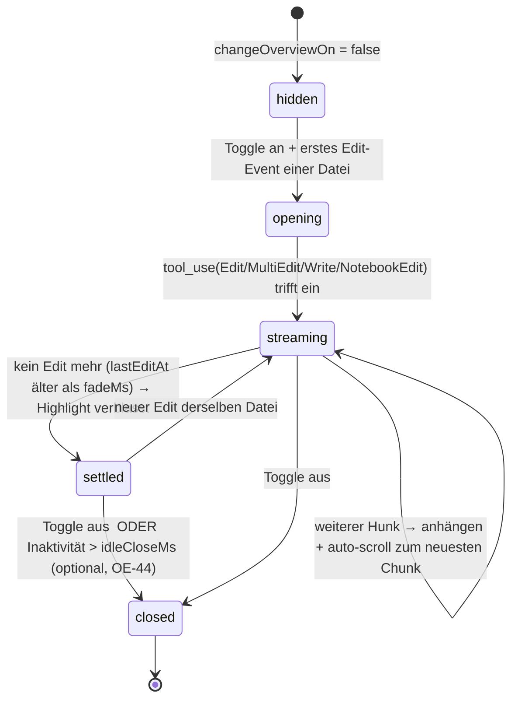

# 09 — Change-Overview (Live-Diff-Panes) (mads)

> Status: Design, implementierungsreif. Stand: 2026-06-22.
> Sprache: Deutsch (Code/Identifier englisch).
> Quellen: [[_paix-multi-agent-reference]] §6 (Konfliktvermeidung by Design), `shared/protocol.ts`
> (`AgentEvent.tool_use`-Payload als Datenquelle), [[06-ownership-and-coordination]]
> (`Collision`/`detectTrespass`-Overlay). Versionsbezüge (z.B. `@codemirror/merge`) sind gegen die
> installierten Pakete zu verifizieren (siehe [[tauri2-stack]] / `package.json`).

---

## 0. Zusammenfassung & Einordnung

Die **Change-Overview** ist eine **toggle-bare Spezialfunktion**: einmal aktiviert, öffnet sie
**automatisch für jede Datei, die ein Agent gerade editiert**, eine **Live-Diff-Pane** und zeigt
visuell, was der Agent dort *in diesem Moment* verändert — Additions grün, Löschungen rot
durchgestrichen — und **scrollt immer automatisch an die Edit-Position**. Im Extremfall öffnen
sich dutzende Panes gleichzeitig (eine pro aktiv editierter Datei). **Ein zweiter Klick auf die
Funktion schließt alle wieder** (Toggle an/aus). Sie ist die **räumliche, datei-zentrierte
Ergänzung** zur chronologischen `MessageTimeline` des Dashboards ([[02-dashboard]] §6): die Timeline
fragt *„was tat Agent X nacheinander?"*, die Change-Overview fragt *„welche Dateien ändern sich
gerade — und wer kollidiert?"*.

Die Datenquelle existiert bereits **vollständig auf dem Draht**: der Sidecar forwarded den
`tool_use`-Block der vier Edit-Tools **verbatim und ungekürzt** (`session.ts` → `AgentEvent`
in `shared/protocol.ts` — die Union §214–220, das `tool_use`-Member auf §218). Für `Edit`/`MultiEdit` ist `old_string`/`new_string` ein
**self-contained, exakter Hunk** → ein präziser Live-Diff ist **ohne jeden Datei-/git-Zugriff**
renderbar. Optionale Kontextzeilen kommen — falls gewünscht — **durch den Rust-Core** via
`tauri-plugin-fs` (scoped capabilities), niemals aus der WebView direkt.

mads ist eine **reine Anzeige-/Steuer-Schicht** (CLAUDE.md §„Schichten"): `src/` rendert State und
sendet Intent, fasst aber **keine** Prozesse, Secrets, git/gh oder die Platte direkt an. Die
Change-Overview operationalisiert die drei paix-Invarianten, ohne ihnen zu widersprechen — sie ist
**read-only**:

- **Only `main` merges.** Die Change-Overview **zeigt** Diffs; sie hat **keine** push/commit/merge-
  Aktion. Außen-sichtbare Aktionen bleiben den Karten ([[04-sub-agents]]) bzw. dem Integrator-Panel
  ([[03-main-agent]]) vorbehalten. (paix §2, Invariante 1)
- **`main` is always runnable.** Kein Diff-Pane löst je einen Merge aus; die Funktion verändert
  **nichts** am Repo-Zustand. (paix §2)
- **Subs never self-merge.** Eine Pane visualisiert nur die *in-flight*-Edits eines Streams in
  **seinem eigenen** Worktree (`AgentVM.worktreePath`, Invariante 3); sie greift nie über. (paix §2)

**Querverweise (andere Design-Docs):**

| Dokument | Beziehung |
|---|---|
| [[02-dashboard]] | Die Change-Overview ist die **räumliche** Ergänzung zur chronologischen `MessageTimeline` (§6 dort); Einstieg über einen Toggle in der Toolbar/Activity-Rail. |
| [[10-navigation-toolbar]] | Liefert den **Toggle-Einstieg** (Activity-Rail-Button „Changes" + Toolbar-Pill). **Layout-Kontrakt:** Es gibt **keine** persistente Stream-Sidebar mehr; die Change-Overview ist **kein** Primary-Panel in der Mittel-Spalte, sondern — per OE-41 (§1.4) — ein `position: fixed`-**Overlay über `.app`** (letztes Kind), das den `changeOverviewOn`-Toggle nutzt, **nicht** `activeView`. Sie koexistiert daher mit **jeder** View (Default-Streams-Grid wie File-/Settings-Panel), ohne eine Spalte zu beanspruchen. |
| [[06-ownership-and-coordination]] | Liefert das **Kollisions-/Trespass-Overlay** (`Collision[]` aus `shared/collision.ts`, `detectTrespass` aus `shared/ownership.ts`) — Pane-Rahmen-Hervorhebung. |
| [[07-file-explorer]] | **Komplementäre Stream×Datei-Sicht:** 09 *zeigt* live, **welche** Dateien ein Stream gerade ändert (read-only, eine Pane pro Stream×Datei); 07 lässt dieselben Dateien **pro Stream öffnen/editieren** (`FileExplorer`-Root-Switcher / Worktree-Browsing). Beide Seiten benutzen **dieselbe Stream-Identität** — der Pane-Key `${agentId}::${path}` und der `StatusDot`/`STATUS_META`-Farbcode (`src/status.ts`) sind exakt die, mit denen 07s In-Panel-Kontext-Selektor seine Streams aus `order.map(id => agents[id])` rendert; kein eigener Farb-/Identitäts-Begriff. Geteilt außerdem: **die eine `tauri-plugin-fs`-Capability `mads-fs`** (in 07 definiert) **+ der `mads_read_file`-Command** — Doc 09 legt **keine** zweite `capabilities/fs.json` an; die optionale Kontextzeilen-Lesung ist **read-only** und nutzt nur die Lese-Teilmenge von 07s gescoptem Pfad-Gate (§4.3). |
| [[08-markdown-editor]] | **Teilt den CodeMirror-6-/`@codemirror/merge`-Stack** (eine Diff-/Editor-Engine, OE-42); ein im Markdown-Editor gespeichertes, noch un-committetes `.md` taucht hier als `dirty`-Pane auf und nutzt dieselbe `shared/`-Kollisions-/Trespass-Logik (§5). |
| [[03-main-agent]] | Der Integrator ist ein Stream wie jeder andere; seine Edits erscheinen als Panes mit eigener Stream-Farbe. |
| [[04-sub-agents]] | Sub-Agent-Edits sind die Hauptquelle der Panes; ein Worktree pro Stream (Invariante 3). |
| [[01-architecture]] | Event-Topologie (Sidecar → Core → Frontend), in der der `tool_use`-Payload bereits ankommt. |
| [[sidecar-orchestration]] | NDJSON-Message-Set; bestätigt, dass `AgentEvent` der Träger ist und der Core roh forwarded. |

Typen: `shared/protocol.ts` (optionale `FileDiffMsg`-Ergänzung, §4). Logik/State: `src/store.ts`
(derived `editsByFile`-Slice). Rendering: neue Komponenten unter `src/components/` (§2).

---

## 1. UX & Interaktionsdesign

### 1.1 Das Toggle-Verhalten (Kern-Interaktion)

Die Change-Overview ist ein **globaler An/Aus-Schalter** (kein Per-Datei-Öffnen durch den Nutzer):

```
                 ┌─────────────────────────────────────────────┐
   1. Klick  ──► │ changeOverviewOn = true                      │
                 │ → für JEDE Datei mit laufendem Edit öffnet   │
                 │   sich automatisch eine Diff-Pane            │
                 │ → neue Edit-Files erscheinen live als Pane   │
                 └─────────────────────────────────────────────┘
                 ┌─────────────────────────────────────────────┐
   2. Klick  ──► │ changeOverviewOn = false                     │
                 │ → ALLE Panes verschwinden sofort (trivial:   │
                 │   ein Overlay unmounten, kein Per-Pane-Close)│
                 └─────────────────────────────────────────────┘
```

Der „**ein Toggle schließt alles trivial**"-Vorteil ist genau der Grund für das In-App-Overlay-Grid
statt echter OS-Fenster (§1.4, OE-41): Aus ist `changeOverviewOn = false` → das Overlay-Root wird
unmounted; bei dutzenden OS-`WebviewWindow`s müsste man jedes Fenster einzeln schließen.

### 1.2 Pane-Lifecycle (eine Pane pro aktiv editierter Datei)



- **Öffnen:** beim **ersten** `tool_use` einer Datei (bei aktivem Toggle).
- **Streamen:** jeder weitere Hunk derselben `file_path` hängt an; die Pane **auto-scrollt zum
  neuesten Chunk** (`@codemirror/merge` `goToNextChunk` / `EditorView.scrollIntoView`, §2.3).
- **Highlight-Fade:** das frischeste geänderte Chunk wird kurz akzentuiert (CSS-Transition,
  `prefers-reduced-motion`-fest, §8) und verblasst nach `fadeMs`.
- **Schließen:** Toggle aus (alle) oder — optional, konfigurierbar — nach `idleCloseMs` ohne Edit
  (OE-44, Default: **kein** Auto-Close, nur Toggle).

### 1.3 Layout-Skizze (In-App-Overlay-Grid, macOS-HIG)

Das Overlay liegt als **letztes Kind von `.app`** über dem Dashboard (Muster der bestehenden
`.modal-overlay`/`.perm-overlay`, `position: fixed`, `App.css` §1531/§1331). Es ist **opak, kein
Vibrancy** unter den Diff-Flächen (Lesbarkeit, `macos-design.md` A.5 — wie das Live-Terminal).

```
┌───────────────────────────────────────────────────────────────────────────────────────┐
│ ◀ Change-Overview · 7 Dateien · 4 Streams   [⌕ filter] [□ split/inline] [⇲ detach*] [✕]│ ← Overlay-Header (drag-region)
├──────────────────────────────────────┬────────────────────────────────────────────────┤
│ ⬤ auth  ·  src/auth/login.ts     ↕   │ ⬤ payments · src/api/charge.ts             ↕   │
│ ──────────────────────────────────── │ ────────────────────────────────────────────── │
│  12  const token = await verify(req) │  45   def charge(amount):                       │
│  13 -  return null                   │  46 -   gateway.send(amount)        ← rot/strike │
│  13 +  return { token, exp }   ←grün │  46 +   gateway.send(amount, idem)  ← grün      │
│  14    log.info("ok")                │  47    audit(amount)                            │
│        ▲ auto-scroll: neuester Hunk  │        ▲ auto-scroll: neuester Hunk             │
├──────────────────────────────────────┼────────────────────────────────────────────────┤
│ 🔴 search ·  src/db/index.ts     ↕   │ 🔴 docs   · src/db/index.ts                ↕   │ ← KOLLISION: gleiche
│   ⚠ Region-Kollision mit „docs":     │   ⚠ Region-Kollision mit „search":             │   Datei+Symbol → roter
│     queryUsers()  (06: severity      │     queryUsers()                               │   Pane-Rahmen, Rivale
│ ──────────────────────────────────── │ ────────────────────────────────────────────── │   benannt (§5/§06)
│  88 -  SELECT * FROM users           │  88 -  SELECT * FROM users                      │
│  88 +  SELECT id,name FROM users     │  88 +  SELECT id FROM users WHERE active         │
├──────────────────────────────────────┴────────────────────────────────────────────────┤
│ … 3 weitere Panes ausgeblendet (Deckel bei 8 sichtbaren) — [Alle anzeigen]              │ ← Cap sichtbar gemacht (§6)
└───────────────────────────────────────────────────────────────────────────────────────┘
  * [⇲ detach] = „In OS-Fenster lösen" — Post-MVP (OE-41)
```

**HIG-Regeln (aus `macos-design.md`):** Overlay als opake Fläche; Header mit
`data-tauri-drag-region`; jede Pane trägt **Stream-Farbe (StatusDot) + Agent-Label + Dateipfad** als
Titelzeile — Farbe **nie allein** (A11y, §8); Schließen rechts (**✕** / **⎋**).

**Gruppierung & Stream-Identität (Layout-Kontrakt):** Panes gruppieren **nach Stream** — der
Pane-Key `${agentId}::${path}` (§3.2) bestimmt Zugehörigkeit, die Titelzeile trägt die Stream-Farbe
über `StatusDot`/`STATUS_META` (`src/status.ts`). Das ist **dieselbe Stream-Identität und derselbe
Farbcode**, mit denen [[07-file-explorer]]s In-Panel-Kontext-Selektor seine Streams aus
`order.map(id => agents[id])` listet (Single Source of Truth: `selectedId`/`selectAgent`). Es gibt
**keine** persistente Stream-Sidebar, an der die Overview sich ausrichtet — das Overlay liest die
Streams direkt aus dem Store und ist von der gewählten View unabhängig.

### 1.4 Architektur-Entscheidung: In-App-Grid statt OS-Multi-Window

> **ENTSCHIEDEN (Multi-Window vs. In-App-Grid, OE-41):** Die „dutzende Fenster"-Anforderung wird
> als **In-App-Overlay-Grid aus virtualisierten Diff-Panes in EINEM Fenster** umgesetzt — nicht als
> echte OS-`WebviewWindow` pro Datei. Begründung: (a) **OE-3 hat „MVP = ein Hauptfenster"
> entschieden** ([[01-architecture]] §3.4); (b) ein Toggle schließt alle Panes **trivial**
> (Overlay unmounten) — bei N OS-Fenstern müsste jedes einzeln geschlossen/positioniert werden;
> (c) **Fokus/Performance**: ein Renderer, eine `@codemirror/merge`-Instanz-Pool-Verwaltung,
> gemeinsame Virtualisierung, keine N WebView-Prozesse; (d) **Konsistenz** mit dem
> Lazy-Mount-/Ring-Buffer-Modell der Terminals ([[02-dashboard]] §6/§8). **Optionales
> „Detach in OS-Fenster"** (ein Pane → eigenes `WebviewWindow`) ist **Post-MVP** und spiegelt die
> bereits in [[02-dashboard]] §9.1 vorgesehene Detach-Mechanik (Karte `⛶`).

---

## 2. Komponenten-Architektur

Alle neuen Komponenten leben unter `src/components/`, sind **pure UI** (rendern Store-State,
emittieren Intent) und mounten als **letztes Kind von `.app`** (neben `<PermissionDialog/>` /
`<ParallelDialog/>` in `App.tsx`).

### 2.1 Mount-Punkt in `App.tsx`

```tsx
// src/App.tsx — neben den bestehenden Overlays (letzte Kinder von .app)
{showNew && <NewStreamDialog onClose={() => setShowNew(false)} />}
{showAbout && <AboutDialog onClose={() => setShowAbout(false)} />}
<PermissionDialog />
<ParallelDialog />
<ChangeOverlay />        {/* NEU — self-hides, wenn changeOverviewOn === false */}
```

Wie `PermissionDialog`/`ParallelDialog` **self-hidet** `<ChangeOverlay/>` über den Store
(`if (!changeOverviewOn) return null`) — keine Prop-Drilling-Conditional in `App.tsx` nötig.

### 2.2 Komponenten-Baum & Verantwortlichkeiten

| Komponente | Props | Verantwortung |
|---|---|---|
| **`ChangeOverlay`** | — (liest Store) | Root des Overlays; self-hides bei `!changeOverviewOn`; rendert Header (Datei-/Stream-Zähler, Filter, split/inline-Toggle, ✕→`toggleChangeOverview()`), virtualisiertes Grid aus `DiffPane`, Cap-Hinweis (§6). `Esc`/✕ → Toggle aus. |
| **`DiffPaneGrid`** | `panes: PaneVM[]` | CSS-Grid (`repeat(auto-fill, minmax(…))`, Idiom wie `.grid` im `.center`); **virtualisiert** (nur sichtbare Panes mounten ihre `@codemirror/merge`-Instanz, §6). |
| **`DiffPane`** | `pane: PaneVM` | Eine Datei: Titelzeile (`<StatusDot status=…>` + Agent-Label + `pane.path`), Kollisions-Marker (§5), **die `ops[]`→Sub-View-Reduktion (§2.4)**, Auto-Scroll-zum-neuesten-Sub-View (§2.3). Hält den **Reducer** `opsToSubViews(pane)`; jede entstehende `DiffSubView` bekommt **ein eigenes** `MergeDiffView`. |
| **`DiffPaneHeader`** | `pane: PaneVM` | Stream-Farbe (wiederverwendet `StatusDot`/`STATUS_META`), Pfad (mono, geclippt von links), `behind/ahead/dirty`-Mini-Badges via `agentBadges(a)` (`derive.ts`), Kollisions-Badge. |
| **`MergeDiffView`** | `oldDoc: string; newDoc: string` | Dünner React-Wrapper um **ein** `@codemirror/merge`-`unifiedMergeView` für **genau ein** old/new-Paar (= ein Hunk/eine Op, oder — mit `contextDoc` — die volle Datei, §2.4). **Kein** `revealRange`-Prop (verworfen, §2.4): Auto-Scroll läuft ausschließlich über `goToNextChunk` im Effect. **Einziger** Ort, der CodeMirror berührt. |

`PaneVM` ist die View-Projektion eines `editsByFile`-Eintrags (siehe §3). Die Wiederverwendung von
`StatusDot`/`STATUS_META` (`src/status.ts`) und `agentBadges` (`src/derive.ts`) ist Pflicht —
keine eigene Farb-/Badge-Logik (DRY, Theme-Korrektheit).

### 2.3 Rendering-Stack (REACT UI TECH BRIEF, verbatim)

> **ENTSCHIEDEN (Diff-Renderer, OE-42):** Die Diff-Panes nutzen **`@codemirror/merge@6.12.2`** —
> konsistent mit der projektweiten CodeMirror-6-Wahl für Editor (07/08) und Diff (09). Inline:
> `unifiedMergeView({ original: oldStr })` als Extension auf einer `EditorView`, deren Doc = `newStr`
> → Additions grün, Löschungen rot + Durchstreichung **out of the box** (`.cm-changedLine` /
> `.cm-deletedChunk`). Split: `new MergeView({ a:{doc:oldStr}, b:{doc:newStr}, parent })`.
> **Scroll-to-Range (Schlüssel-API):** `goToNextChunk(view)` bewegt+scrollt zum nächsten Chunk;
> für einen konkreten Bereich `getChunks(state)` → `view.dispatch({ effects:
> EditorView.scrollIntoView(chunk.fromB, { y: "center" }) })`. `react-diff-viewer-continued` und
> Monaco-Diff sind **verworfen** (React-19-Fork-Zwang bzw. Bundle-/Worker-Last).

```tsx
// src/components/MergeDiffView.tsx (Skelett) — der EINZIGE Ort, der CodeMirror anfasst
import { useEffect, useRef } from "react";
import { EditorView } from "@codemirror/view";
import { unifiedMergeView, goToNextChunk } from "@codemirror/merge";

export function MergeDiffView({ oldDoc, newDoc }: { oldDoc: string; newDoc: string }) {
  const host = useRef<HTMLDivElement>(null);
  const view = useRef<EditorView>();
  useEffect(() => {
    const v = new EditorView({
      doc: newDoc,
      extensions: [unifiedMergeView({ original: oldDoc }) /* + macOS-Theme via EditorView.theme(...) */],
      parent: host.current!,
    });
    view.current = v;
    goToNextChunk(v); // initial: an den ersten/neuesten geänderten Chunk scrollen
    return () => v.destroy();
  }, []);
  // Live-Updates: bei neuem newDoc dispatchen + erneut goToNextChunk(view.current!) (auto-scroll, §1.2)
  return <div ref={host} className="diff-pane-cm" />;
}
```

Für `Write` (Full-File) ohne Vorzustand: `oldDoc = ""` → reine Additions-Sicht (§3.3). Für
`Edit`/`MultiEdit` ist `oldDoc`/`newDoc` aus dem Hunk **direkt** synthetisierbar (§3.3) — kein Read.
**`MergeDiffView` rendert immer genau ein old/new-Paar**; wie die **N** Ops/Hunks einer Datei auf
diese Paare abgebildet werden, spezifiziert §2.4 (kein verstecktes Zusammenfalten im Wrapper).

### 2.4 `ops[]` → was CodeMirror bekommt (die Hunk-Reduktion)

Der State akkumuliert **pro Datei ein Array** `FileEditEntry.ops` (§3.2), und `MultiEdit` ist
**selbst** ein Array von Hunks. Eine einzelne `unifiedMergeView` braucht aber **genau ein**
old/new-Paar. Naiv „nur die letzte Op rendern" verlöre frühere Hunks; rohe, nicht-zusammenhängende
Hunk-Spans zu **einem** synthetischen Dokument zu konkatenieren erzeugte gefälschte Zeilennummern
und Nachbarschaften. Daher gilt **explizit** — die Reduktion lebt im `DiffPane` (Reducer
`opsToSubViews(pane): DiffSubView[]`), **nicht** in `MergeDiffView`:

> **ENTSCHIEDEN (Op→Dokument-Reduktion; Teil von OE-42):** Es gibt **zwei** Modi, gewählt pro Pane
> nach Verfügbarkeit von `contextDoc`:
>
> - **Ohne `contextDoc` (MVP, zero-read):** **eine Sub-View pro Hunk/Op**. `DiffPane` rendert einen
>   **vertikalen Stack** aus `MergeDiffView`s — jede ein self-contained `{ oldDoc, newDoc }`-Paar
>   (`Edit` → 1 Sub-View; `MultiEdit` → 1 pro `edits[]`-Eintrag; `Write` → 1 mit `oldDoc=""`;
>   `NotebookEdit` → 1 pro Zelle). Das ist **ehrlich** darüber, dass es disjunkte Spans ohne echte
>   Datei-Adjazenz sind (kein erfundener Zeilenraum); chronologische Reihenfolge bleibt sichtbar.
> - **Mit `contextDoc` (Option C, §4.3):** die Ops werden **auf den echten Datei-Inhalt angewandt**
>   (`applyOps(contextDoc, ops)` → `newDoc`), was **ein einziges, echtes** old/new-Paar
>   (`oldDoc = contextDoc`) mit korrekten Zeilennummern und Kontextzeilen ergibt — **eine**
>   Sub-View über die ganze Datei.

```typescript
// src/components/DiffPane.tsx — der Reducer (pur, testbar; KEIN CodeMirror hier)
type DiffSubView = { key: string; oldDoc: string; newDoc: string; label?: string };

function opsToSubViews(pane: PaneVM): DiffSubView[] {
  // Option C: echter Vorzustand vorhanden → ein einziges echtes old/new-Paar
  if (pane.contextDoc !== undefined) {
    return [{ key: "full", oldDoc: pane.contextDoc, newDoc: applyOps(pane.contextDoc, pane.ops) }];
  }
  // MVP zero-read: eine Sub-View pro Hunk/Op (disjunkte Spans, ehrlich gestapelt)
  return pane.ops.flatMap((op, i) => {
    switch (op.tool) {
      case "Edit":         return [{ key: `e${i}`, oldDoc: op.oldStr, newDoc: op.newStr }];
      case "MultiEdit":    return op.edits.map((e, j) => ({ key: `m${i}.${j}`, oldDoc: e.oldStr, newDoc: e.newStr }));
      case "Write":        return [{ key: `w${i}`, oldDoc: "", newDoc: op.content, label: "neue/überschriebene Datei" }];
      case "NotebookEdit": return [{ key: `n${i}`, oldDoc: "", newDoc: op.newSource, label: op.cellId }];
    }
  });
}
```

`DiffPane` mappt das Ergebnis auf je ein `<MergeDiffView key={sv.key} oldDoc={sv.oldDoc}
newDoc={sv.newDoc} />`; der Auto-Scroll-zum-neuesten-Hunk zielt auf die **letzte** Sub-View im
Stack (bzw. den letzten Chunk im Option-C-Single-View). `applyOps` ist eine **pure** Funktion
(`Edit`/`MultiEdit` = sequentielles String-Replace in `ops`-Reihenfolge, exakt die Claude-Code-
Semantik; `Write`/`NotebookEdit` = Vollersetzung) und wird in §9 unit-getestet.

---

## 3. State & Datenfluss

### 3.1 Das Kernproblem heute: der Payload kommt an, der Store wirft ihn weg

`store.ts` §307–325 reduziert jeden Nicht-`TodoWrite`-`tool_use` auf eine dünne `kind:"tool"`-Karte
und ruft `toolCommand(ev.input)` — das extrahiert **nur** `command ?? path ?? file_path ?? pattern`
(`toolText.ts` §15–21). **`old_string`/`new_string`/`content`/`edits[]` werden empfangen, aber nie
in den State persistiert.** Die Change-Overview braucht daher **eine zusätzliche Store-Ableitung**,
die `ev.input` für die vier Edit-Tools behält. **Kein** Protokoll-/Sidecar-/Rust-Change nötig — die
Daten sind bereits da (PROTOCOL MAP §1/§3 Option A).

### 3.2 Neue Store-Felder & Action-Signaturen (`src/store.ts`)

```typescript
// --- NEU in MadsState ---
type EditOp =
  | { tool: "Edit"; oldStr: string; newStr: string; replaceAll?: boolean }
  | { tool: "MultiEdit"; edits: Array<{ oldStr: string; newStr: string; replaceAll?: boolean }> }
  | { tool: "Write"; content: string }
  | { tool: "NotebookEdit"; cellId?: string; newSource: string; editMode?: string };

interface FileEditEntry {
  agentId: string;
  path: string;                 // file_path bzw. notebook_path aus dem tool_use-Input
  ops: EditOp[];                // chronologisch; spätere Edits sehen frühere angewandt
  toolUseIds: string[];         // Korrelation mit tool_result (completeTool, store.ts §182)
  status: "applying" | "applied" | "failed";  // via tool_result umgeschaltet
  firstEditAt: number;
  lastEditAt: number;           // treibt Highlight-Fade + optionalen idle-close (§1.2)
  contextDoc?: string;          // optional: durch Core gelesener Vorzustand (§4), sonst undefined
}

interface MadsState {
  // … bestehende Felder …
  changeOverviewOn: boolean;                 // der globale Toggle (§1.1)
  editsByFile: Record<string, FileEditEntry>; // Key: `${agentId}::${path}` (eine Pane pro Stream×Datei)

  toggleChangeOverview: () => void;          // 1./2. Klick (§1.1)
  requestFileContext: (key: string) => Promise<void>; // optional: Vorzustand über Core lesen (§4)
}
```

**Key-Wahl `${agentId}::${path}`** (nicht nur `path`): zwei Streams, die dieselbe Datei editieren,
bekommen **zwei** Panes (das ist gewollt — so wird die Kollision *räumlich* sichtbar, §5). Das
Kollisions-Overlay joint sie anschließend über den gemeinsamen `path` (wie `detectCollisions`,
`shared/collision.ts`).

### 3.3 Befüllung im bestehenden `case "agent_event"`

Direkt neben dem vorhandenen `tool_use`-Zweig (`store.ts` §307) — additiv, ohne die Timeline-Karte
zu ändern:

```typescript
// in handleSidecarMessage, case "agent_event", ev.kind === "tool_use":
const EDIT_TOOLS = new Set(["Edit", "MultiEdit", "Write", "NotebookEdit"]);
if (EDIT_TOOLS.has(ev.name)) {
  const path = (ev.input?.file_path ?? ev.input?.notebook_path) as string | undefined;
  if (path) upsertEdit(msg.agentId, path, ev.toolUseId, toEditOp(ev.name, ev.input ?? {}));
}
// … bestehender pushEvent({ kind:"tool", … }) bleibt unverändert (Timeline) …
```

```typescript
// Hunk → renderbarer Diff OHNE Datei-/git-Zugriff (PROTOCOL MAP §2):
function toEditOp(name: string, input: Record<string, unknown>): EditOp {
  switch (name) {
    case "Edit":      return { tool: "Edit", oldStr: String(input.old_string ?? ""), newStr: String(input.new_string ?? ""), replaceAll: !!input.replace_all };
    case "MultiEdit": return { tool: "MultiEdit", edits: ((input.edits as any[]) ?? []).map(e => ({ oldStr: String(e.old_string ?? ""), newStr: String(e.new_string ?? ""), replaceAll: !!e.replace_all })) };
    case "Write":     return { tool: "Write", content: String(input.content ?? "") };
    default:          return { tool: "NotebookEdit", cellId: input.cell_id as string|undefined, newSource: String(input.new_source ?? ""), editMode: input.edit_mode as string|undefined };
  }
}
```

`completeTool` (`store.ts` §182, korreliert per `toolUseId`) wird um ein Spiegeln auf
`FileEditEntry.status` ergänzt: gefundenes `tool_result` mit `ok:false` → `status: "failed"`
(roter Pane-Hinweis), sonst `"applied"`.

### 3.4 Datenfluss-Diagramm (read-only, keine neue Außenwirkung)

```
 Node-Sidecar          Rust-Core (thin)        React-Frontend (src/store.ts)
 ────────────          ────────────────        ─────────────────────────────
 query() tool_use  ──► forwarded raw line  ──► handleSidecarMessage("agent_event")
   {Edit/MultiEdit/    (KEIN Parsen,            ├─ pushEvent(kind:"tool")  → MessageTimeline (unverändert)
    Write/NotebookEdit  KEIN fs)                └─ upsertEdit()            → editsByFile  → ChangeOverlay
    full input}                                                              │ (nur sichtbar, wenn changeOverviewOn)
                                                                            ▼
 (optional Kontext)  ◄── tauri-plugin-fs ◄──── requestFileContext(key)  (READ-ONLY, scoped, §4)
```

Der Live-Pfad ist **rein Frontend-derived** — er erzeugt **keine** neuen Außenwirkungen, keinen
git-Poll, keine Außen-Aktion (paix §2, Invariante 1 bleibt mechanisch unberührt).

---

## 4. Protokoll- & Core-Anbindung

### 4.1 MVP: keine Protokoll-Änderung (Option A)

Der Live-Diff (Auto-Open beim Edit) braucht **keine** Ergänzung in `shared/protocol.ts`, **kein**
Sidecar-Change, **kein** Rust-Change: `AgentEvent.tool_use.input` trägt die vollständigen
Edit-Schemas bereits (§3.1). Das ist der empfohlene MVP.

### 4.2 Optional/Post-MVP: `FileDiffMsg` für den committeten Kontext-Diff (Option B)

Wenn die Pane den **committeten/on-disk-Zustand mit Zeilennummern und Kontextzeilen** zeigen soll
(statt nur des in-flight-Hunks), wird der vom Sidecar im `collisionPass` bereits berechnete
`git diff` **weitergeleitet** statt verworfen (`orchestrator.ts` `git diff --merge-base
origin/<default> --unified=0`). `shared/protocol.ts` ist die SSOT — der Typ lebt dort, beide Seiten
importieren ihn; der Rust-Core forwarded die Zeile wie jede andere (bleibt dünn):

```typescript
// shared/protocol.ts — additiv zur SidecarMessage-Union (§187)
export interface FileDiffMsg extends BaseMsg {
  type: "file_diff";
  agentId: string;
  path: string;
  unifiedDiff: string;   // git-diff-Ausgabe, im collisionPass ohnehin erzeugt
  baseRef: string;       // z.B. "origin/main"
}
// → in `export type SidecarMessage = … | FileDiffMsg;` aufnehmen
// → neuer `case "file_diff":` in store.ts: contextDoc/unifiedDiff dem editsByFile-Eintrag beilegen
```

### 4.3 Optional/Post-MVP: Vorzustand & Kontextzeilen über `tauri-plugin-fs` (Option C)

Für `Write`/`NotebookEdit`-**Vorzustand** und **N Kontextzeilen** um einen Hunk muss die Datei
gelesen werden. **Hard layer invariant** (CLAUDE.md §„Schichten"): `src/` ist **reines UI** —
**keine** direkte Platten-Zugriffe. **Aller Datei-Zugriff geht durch den Rust-Core** via
`tauri-plugin-fs` mit **gescopten Capabilities** (TAURI FS TECH BRIEF).

> **Keine zweite Capability-Datei — der Read-Pfad reitet auf der Capability von
> [[07-file-explorer]].** Doc 09 **definiert keine** eigene `src-tauri/capabilities/fs.json`: das
> wäre eine **Datei-Kollision** mit [[07-file-explorer]] (gleicher Dateiname, andere `identifier`/
> Scope → wer zuletzt landet, klobbert den anderen — nicht vom paix-Shared-File-Protokoll für
> Lockfiles abgedeckt). Stattdessen gilt, was die §0-Querverweis-Zeile bereits zusagt: die
> Change-Overview **teilt sich die eine Capability `mads-fs`** (definiert in [[07-file-explorer]],
> `identifier: "mads-fs"`) **und** den first-party `#[tauri::command] mads_read_file`. Der
> read-only Kontext-Fetch braucht **keine** neuen Berechtigungen über das hinaus, was 07 ohnehin
> grantet — er nutzt nur die **Lese-Teilmenge** der mads-eigenen FS-Commands (Read/Write/Walk laufen
> über `#[tauri::command]`s, **nicht** über Plugin-Permissions; nur `watch` ist plugin-basiert,
> OE-31/OE-32):

| FS-Oberfläche (Owner: [[07-file-explorer]]) | Von Change-Overview genutzt |
|---|---|
| `mads_read_file` (Core-Command) | ✅ Vorzustand/`content` lesen (Option C), inkl. mtime im `FileRead` |
| `mads_read_dir` / `mads_write_file` (Core-Commands) | ✘ (nur File-Explorer/Editor) |
| `fs:allow-watch` (einzige Plugin-Permission der `mads-fs`-Capability) | ✘ (nur File-Explorer-Live-Reload) |

Das **Scope-Modell ist exakt das von 07** und wird **nicht** dupliziert: statischer Scope =
`$HOME/mads-worktrees/**` (Agent-Worktrees); der **beliebige, erst zur Laufzeit bekannte
`repoRoot`** wird **nicht** statisch in `$HOME/**` gegrantet, sondern nach `open_project` per
`FsExt` **dynamisch** ergänzt (`app.fs_scope().allow_directory(&repoRoot, true)`) — so bleibt die
Build-Zeit-Angriffsfläche minimal. Die `deny`-Liste von 07 (`.git/**`, `.env`/`.env.*`, `.ssh/**`,
`.aws/**`, `node_modules/**`, `target/**`) gilt unverändert mit, ebenso die 07-Config
`{ "plugins": { "fs": { "requireLiteralLeadingDot": true } } }` (Dotfile-Globs literal halten,
Secrets nie per `*` erfassbar). Doc 09 verändert an `tauri.conf.json` **nichts**.

> **Was der Rust-Core minimal exponiert (thin):** Da der zu öffnende Projekt-Root erst zur Laufzeit
> bekannt ist, erweitert der Core das fs-Scope nach `open_project` per `FsExt`
> (`app.fs_scope().allow_directory(&repoRoot, true)`) — **statt** `repoRoot` statisch in der
> Capability zu granten. Empfehlung (TAURI FS TECH BRIEF §5):
> Lesen über den (von [[07-file-explorer]] §4.2 bereitgestellten) **first-party
> `#[tauri::command] mads_read_file(path) -> Result<FileRead, String>`** (`FileRead` = das
> diskriminierte `Text`/`Binary`-Resultat aus 07; 09 nutzt nur den `Text`-Zweig für Kontextzeilen)
> mit der Allow-List `ensure_in_scope` (Pfad `canonicalize()` + Prefix-Check gegen
> `repoRoot`/`~/mads-worktrees`), damit die mads-Policy an **einem** Chokepoint sitzt — gespiegelt
> zum bestehenden `sidecar.rs`.
> Der Sidecar bleibt **außen vor** (stdout ist NDJSON-only). Sollte je doch eine **eigene**
> Capability nötig werden (z.B. abweichende Window-Bindung), bekäme sie einen **distinkten
> Dateinamen** (`capabilities/fs-change-overview.json`) und würde als geteilter Datei-Edit mit
> [[07-file-explorer]] koordiniert — nie ein zweites `capabilities/fs.json`. Der Lockfile-Bump
> (`Cargo.lock`/`package-lock.json`, falls 07 das Plugin noch nicht eingeführt hat) ist ein
> geteilter Datei-Edit → paix Land-first/Single-Owner (CLAUDE.md „Build & Gates").

---

## 5. Synergie: Kollisions- & Ownership-Overlay

Die Change-Overview ist datei-keyed, [[06-ownership-and-coordination]] ebenso → der Overlay ist ein
**Join auf `path`** (PROTOCOL MAP §5). Beide Modelle leben in `shared/` und sind **pur** — die
Pane ruft sie direkt auf, statt Überlapp-Logik neu zu erfinden (SSOT für „kollidieren diese Edits
wirklich").

| Quelle | Mechanik | Pane-Wirkung |
|---|---|---|
| **`Collision[]`** (`store.collisions`, läuft bereits über `collision_warning`) | Pane-`path` gegen `collisions` matchen | `severity:"region"` (gleiches Symbol) → **roter Pane-Rahmen** + Rivale benannt (`labelA`/`labelB`) + Symbol; `severity:"file"` → **amber** „möglicher Überlapp". |
| **`detectTrespass`** (`shared/ownership.ts`, pur) | client-seitig, wenn `OwnershipRule[]` geladen | `owned_symbol`/`owned_pattern`/`exclusive_file` → **rot** „Region gehört Stream X"; `land_first` → **amber** „erst auf main landen". |

**Wichtige paix-Nuance (`collision.test.ts`):** *gleiche Datei + disjunkte Symbole = keine
Kollision*. Die Change-Overview darf also **nicht** „2 Agenten berührten diese Datei" pauschal rot
färben — sie spiegelt exakt die `detectCollisions`-Entscheidung. Konsistenz-Pflicht: dieselbe
`ChangedRegion = { path, symbols }`-Modellierung (`shared/protocol.ts` §446) wie der
`collisionPass`, damit Pane-Flag und `collision_warning` denselben Join-Key benutzen. Symbole für die
**live**-Pane werden billig aus `new_string`/`content` via `extractSymbol`-Stil (`collision.ts` §32)
abgeleitet; der **committete** Diff (§4.2) ist die zuverlässigere Quelle.

> **ENTSCHIEDEN (Kollisions-Visualisierung, OE-43):** Eine Pane, deren `path` in einem aktiven
> `Collision` (oder `TrespassFinding`) auftaucht, erhält einen **hervorgehobenen Rahmen** (rot bei
> `region`/Trespass, amber bei `file`/`land_first`) plus eine Marker-Zeile, die den **Rivalen-Stream
> und das geteilte Symbol** nennt. Damit verschmilzt die räumliche Diff-Sicht mit dem
> Koordinations-Modell aus [[06-ownership-and-coordination]] — die Eskalation ist *vor* dem Merge
> an genau der Stelle sichtbar, an der editiert wird.

---

## 6. Performance & Skalierung

Bei vielen parallelen Edit-Strömen können dutzende Panes anfallen. Drei Mechanismen, jede **Deckelung
sichtbar gemacht** (nie still abschneiden, CLAUDE.md-Prinzip):

| Mechanismus | Regel | Surface |
|---|---|---|
| **Sichtbare Panes deckeln** | max. `maxVisiblePanes` (Default **8**, OE-45) gemountete `@codemirror/merge`-Instanzen | Footer-Zeile „… N weitere Panes ausgeblendet — [Alle anzeigen]" (§1.3); kein stilles Verschlucken. |
| **Schnelle Edits koaleszieren** | `upsertEdit` puffert Hunks pro Datei in einem **~50 ms**-Fenster, dann ein Re-Render (in Anlehnung an das in [[02-dashboard]] §8 **vorgeschlagene** `agent:update`-Coalescing — dort als Design, hier eigenständig im Store-Slice) | — (intern); verhindert Re-Layout-Sturm. |
| **Virtualisieren** | nur sichtbare Panes mounten CodeMirror; Off-Screen-Panes als leichte Platzhalter (Pfad+Status, kein Editor) — wie das Lazy-Mount der Terminals (§6 dort) | Platzhalter zeigen Stream-Farbe + Pfad. |

- **Ring-Buffer-Schutz:** `editsByFile` wird auf `maxFiles` (Default **200**, OE-45) gedeckelt;
  ältester `lastEditAt` zuerst geräumt — als Hinweis im Header gezählt, nicht still.
- **Hunk-Größe:** sehr große `Write.content` werden in der Pane mit dem etablierten Clamp/Expand-
  Idiom (`.tl-io-content.clamped` + „mehr anzeigen", `App.css` §1022 / `MessageTimeline`) dargestellt
  statt vollständig im CodeMirror gerendert, bis der Nutzer expandiert.
- **`debugLog`-Spur:** jede Deckelung (Panes/Files) wird zusätzlich einmal in `debugLog`
  (`store.ts`) protokolliert — kein stilles Truncating.

---

## 7. Edge-Cases & Fehlerzustände

| Fall | Verhalten |
|---|---|
| **`tool_result` mit `ok:false`** | `FileEditEntry.status = "failed"` → Pane behält Diff, zeigt roten „Edit fehlgeschlagen" (der Hunk wurde *vorgeschlagen*, aber nicht angewandt). |
| **`Edit.replace_all: true`** | Pane zeigt den Hunk an der ersten Fundstelle ohne Read; Marker „gilt an mehreren Stellen" (volle Fan-out nur mit Datei-Read, §4.3). |
| **`Write` ohne Vorzustand** | reine Additions-Sicht (`oldDoc = ""`); Marker „neue/überschriebene Datei"; echter Before/After erst mit Option C. |
| **`MultiEdit` mit überlappenden Edits** | Ops chronologisch rendern (spätere sehen frühere angewandt) — exakt die Claude-Code-Semantik. |
| **Datei-Read scheitert (Option C)** | sicher degradieren: in-flight-Hunk-Sicht ohne Kontext + dezenter „Kontext nicht verfügbar"-Hinweis; **nie** leere/falsche Pane. |
| **Pfad außerhalb des Scopes** | Read wird vom Core-Prefix-Check abgelehnt → Hunk-only-Sicht (kein Crash, kein Leak). |
| **Agent gestoppt während aktiver Pane** | Der bestehende `stopAgent`-Reducer (`store.ts` §557) löscht heute nur `agents[id]`/`events[id]` und filtert `order` — er **kennt `editsByFile` nicht** (der Slice existiert noch nicht). Er ist daher **additiv zu erweitern**: zusätzlich zu `agents`/`events`/`order` auch **alle `editsByFile`-Keys mit Prefix `${id}::`** löschen. Das fällt **nicht** automatisch an. Danach verschwinden die Panes des Agenten. (Unit-Test in §9.) |
| **Toggle aus bei laufenden Edits** | Overlay sofort unmounten; `editsByFile` bleibt erhalten (Wieder-Anschalten zeigt aktuellen Stand) — **trivialer** Single-State-Switch (§1.1). |
| **Mock-Agent / kein Worktree** | Live-Diff funktioniert (rein aus dem Payload); Option-C-Read entfällt mangels Worktree-Pfad. |
| **NotebookEdit `edit_mode: "delete"`** | Pane zeigt die Zelle als reine Löschung (rot/strike), `newSource` leer. |

---

## 8. Barrierefreiheit & Tastatur

Aus `macos-design.md` Teil D (wie [[02-dashboard]] §11):

- **Farbe nie allein:** jede Pane trägt Stream-Farbe **+ `StatusDot`-`title` + Agent-Label-Text**;
  Add/Delete zusätzlich durch CodeMirrons Strukturmarker (Durchstreichung/+/-), nicht nur Farbe.
- **Reduced Motion:** `prefers-reduced-motion: reduce` → Highlight-Fade und Auto-Scroll-Animation
  durch sofortiges Setzen (kein Smooth-Scroll, kein Pulse) ersetzt; `scrollIntoView` ohne
  Smooth-Behavior.
- **Reduced Transparency / Contrast:** Overlay ist ohnehin opak; bei `prefers-contrast: more`
  Pane-Borders (inkl. Kollisions-Rahmen) verstärken.
- **Fokus & Tab-Reihenfolge:** Overlay-Header → Filter → Pane-Liste (Pane für Pane) → ✕. Jede Pane
  ist eine fokussierbare Region mit `aria-label` „Diff <Datei>, Stream <Label>, Status <…>".
- **Live-Region:** ein `aria-live="polite"`-Element kündigt „N Dateien werden editiert" / neue
  Kollision an (nicht pro Hunk — sonst Sprech-Flut).
- **Shortcuts** (HIG, kollidieren nicht mit System; in der Menüleiste sichtbar, [[10-navigation-toolbar]]):

| Shortcut | Bedeutung |
|---|---|
| **⇧⌘D** | Change-Overview an/aus (der Toggle) |
| **⎋** | Overlay schließen (= Toggle aus) |
| **⌘F** | Pane-Filter (nach Datei/Stream) |
| **⌃⇥ / ⌃⇧⇥** | nächste/vorige Pane fokussieren |
| **⌥⌘\\** | inline ↔ split-Diff umschalten |

---

## 9. Tests

Vitest-Stil wie `shared/collision.test.ts` (pure Funktionen zuerst):

- **`toEditOp` (unit):** `Edit`/`MultiEdit`/`Write`/`NotebookEdit`-Inputs → korrekte `EditOp`; fehlende
  Felder → leere Strings (kein Crash).
- **`opsToSubViews` + `applyOps` (unit, §2.4):** ohne `contextDoc` → **eine** Sub-View pro Hunk
  (`MultiEdit` mit 3 `edits[]` → 3 Sub-Views; `Write` → 1 mit `oldDoc=""`); mit `contextDoc` → **ein**
  echtes old/new-Paar, `applyOps` wendet die Ops chronologisch an (spätere sehen frühere) und trifft die
  Claude-Code-Semantik (`replace_all`, sequentielle `MultiEdit`-Hunks).
- **`editsByFile`-Reducer (unit):** Sequenz aus `tool_use`-Events erzeugt korrekte Keys
  (`${agentId}::${path}`), hängt Ops chronologisch an, `tool_result(ok:false)` → `status:"failed"`.
- **`stopAgent`-Erweiterung (unit, §7):** der additiv erweiterte Reducer (`store.ts` §557) löscht
  zusätzlich zu `agents`/`events`/`order` **alle `editsByFile`-Keys mit Prefix `${id}::`** — Regression-
  Schutz, dass die neue Aufräum-Zeile nicht vergessen/entfernt wird.
- **Coalescing (unit, mit Fake-Timer):** N schnelle Hunks innerhalb 50 ms → ein Re-Render-Tick.
- **Cap-Surfacing (unit):** > `maxVisiblePanes`/`maxFiles` → sichtbarer Footer-Hinweis **und**
  `debugLog`-Eintrag (nie still).
- **Kollisions-Join (unit):** Pane-`path` × `Collision[]`/`detectTrespass` → korrekte Rahmen-Tönung;
  insbesondere *gleiche Datei, disjunkte Symbole ⇒ kein Rahmen* (der paix-`mail.py`-Fall).
- **`MergeDiffView` (component/integration):** mountet/destroyt die `@codemirror/merge`-Instanz,
  `goToNextChunk` wird bei neuem `newDoc` aufgerufen (auto-scroll); Render unter `jsdom` mit
  gemocktem CodeMirror, falls nötig.
- **Toggle (integration):** `toggleChangeOverview` zeigt/versteckt `<ChangeOverlay/>`; bei `off`
  bleibt `editsByFile` erhalten.

---

## 10. Roadmap

Konsistent mit der P-Roadmap ([[01-architecture]] §10) und **OE-3 (MVP = ein Hauptfenster)**:

| Phase | Inhalt |
|---|---|
| **MVP** | `changeOverviewOn`-Toggle + `editsByFile`-Slice (Option A, **kein** Protokoll-/Rust-Change); `ChangeOverlay`/`DiffPane`/`MergeDiffView` mit `@codemirror/merge` (inline), Auto-Open beim Edit, Auto-Scroll zum neuesten Hunk, Stream-Farbe + Label + Pfad; Caps sichtbar (§6); Kollisions-Rahmen aus dem bereits fließenden `Collision[]` (§5). |
| **Post-MVP A** | Kontextzeilen/Vorzustand über `tauri-plugin-fs` + first-party `mads_read_file` (Option C, §4.3); committeter Diff via `FileDiffMsg` (Option B, §4.2); split-View-Toggle. |
| **Post-MVP B** | „Detach in OS-Fenster" pro Pane (OE-41, spiegelt [[02-dashboard]] §9.1 Detach); optionaler Inaktivitäts-Auto-Close (OE-44); Ownership-Rule-Overlay, sobald `CoordinationArtifact` im Frontend geladen wird. |

---

## 11. Offene Entscheidungen (dieses Dokument)

Die folgenden OEs sind in README konsolidiert (Gruppe `### Change-Overview (Doc 09)`):

- **OE-41 ✅ ENTSCHIEDEN — In-App-Grid statt OS-Multi-Window:** Die „dutzende Fenster" werden als
  In-App-Overlay-Grid virtualisierter Panes in **einem** Fenster umgesetzt (Toggle schließt alle
  trivial; Fokus/Performance besser; OE-3-konform). „Detach in OS-Fenster" ist Post-MVP. (§1.4)
- **OE-42 ✅ ENTSCHIEDEN — Diff-Renderer `@codemirror/merge`:** `unifiedMergeView` (inline) /
  `MergeView` (split) mit `goToNextChunk` für Auto-Scroll; konsistent mit der CodeMirror-6-Wahl
  für 07/08. Schließt die **Op→Dokument-Reduktion** ein: `MergeDiffView` rendert genau **ein**
  old/new-Paar, die `ops[]`→Sub-View-Abbildung lebt im `DiffPane`-Reducer `opsToSubViews`
  (eine Sub-View pro Hunk im zero-read-MVP; ein echtes Single-Paar mit `contextDoc`). (§2.3/§2.4)
- **OE-43 ✅ ENTSCHIEDEN — Kollisions-/Trespass-Overlay auf Panes:** Pane-Rahmen rot (region/Trespass)
  / amber (file/land_first) + Rivalen-Stream & Symbol; Join auf `path`, Logik aus `shared/`. (§5)
- **OE-44 Inaktivitäts-Auto-Close** *(offen; Default gesetzt)*. **Default: kein Auto-Close — nur der
  Toggle schließt.** Soll eine Pane nach `idleCloseMs` ohne Edit automatisch verschwinden, oder bis
  zum Toggle-off stehen bleiben? (§1.2)
- **OE-45 Pane-/File-Caps** *(offen; Default gesetzt)*. **Default: `maxVisiblePanes = 8`,
  `maxFiles = 200`.** Sind diese Deckel sinnvoll, oder soll der Nutzer sie konfigurieren? Jede
  Deckelung wird sichtbar gemacht + in `debugLog` protokolliert. (§6)
- **OE-46 Live- vs. committeter Diff als Default.** Soll die Pane primär den **in-flight**-Hunk
  (Option A, zero-read, „was tut der Agent JETZT") oder den **committeten** Diff (Option B,
  Zeilennummern/Kontext) zeigen? (Vorschlag: in-flight als Default, committet als optionaler
  Header-Toggle.) (§4.1/§4.2)
- **OE-47 FS-Zugriff: first-party Command vs. Plugin-Bridge.** Geht der optionale Kontext-Read über
  ein first-party `mads_read_file` (mads-Policy am Chokepoint, spiegelt `sidecar.rs`) oder direkt
  über die `tauri-plugin-fs`-Command-Bridge? (Vorschlag: first-party Command für Reads, Plugin nur
  für `watch`.) (§4.3)
- **OE-48 Symbol-Quelle für den Kollisions-Join.** Werden Symbole für die **live**-Pane billig aus
  `new_string`/`content` (`extractSymbol`) abgeleitet, oder erst aus dem committeten
  `parseDiffRegions`-Output (zuverlässiger, aber verzögert)? (Vorschlag: live aus dem Payload, beim
  Vorliegen des committeten Diffs überschreiben.) (§5)

---

## Offene Fragen (für den Review gesammelt)

1. ✅ **ENTSCHIEDEN — In-App-Grid** (§1.4, OE-41): virtualisierte Panes in einem Fenster, Detach
   Post-MVP.
2. ✅ **ENTSCHIEDEN — `@codemirror/merge`** (§2.3, OE-42) als Diff-/Scroll-Engine.
3. ✅ **ENTSCHIEDEN — Kollisions-Overlay** (§5, OE-43): Pane-Rahmen + Rivale aus `shared/collision`
   / `shared/ownership`.
4. **Auto-Close bei Inaktivität?** (§1.2, OE-44) — Default „nur Toggle"; Review bestätigt.
5. **Pane-/File-Caps** (§6, OE-45) — Default 8/200; konfigurierbar machen?
6. **Live- vs. committeter Diff als Default** (§4, OE-46) — in-flight (Empfehlung) vs. committet.
7. **FS-Read: first-party Command vs. Plugin-Bridge** (§4.3, OE-47) — Empfehlung first-party.
8. **Symbol-Quelle für den Join** (§5, OE-48) — live-Payload (Empfehlung) vs. committeter Diff.
